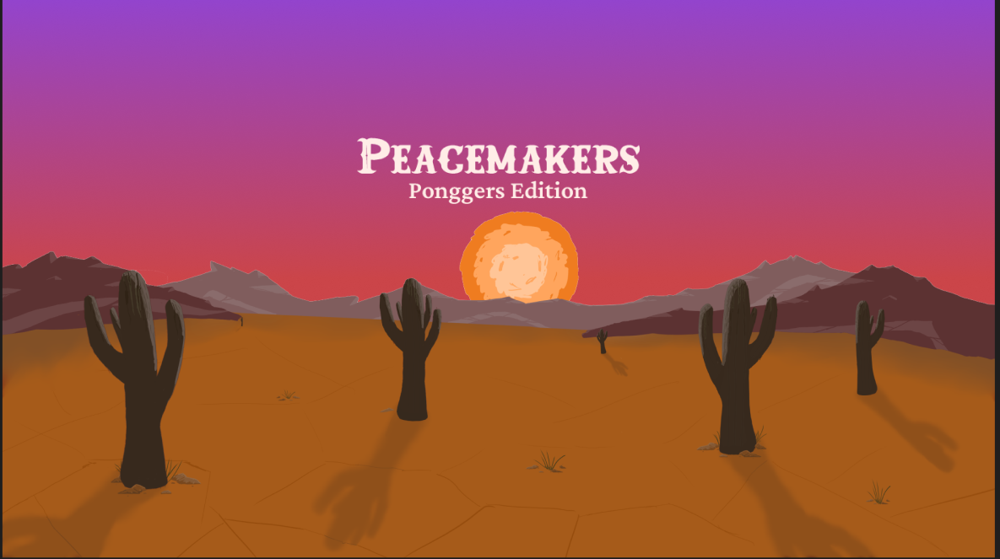

# Peacemakers Ponggers Edition - ft_transcendence
[Still on working]   
Real-time multiplayer PONG Game built as a Single Page Application, developed by five students during 42 school curriculum.
This project combines authentication, live gameplay, chat, and 3D rendering using modern web technologies.

## Usage
🛠️👷🏻‍♂️

## Features
🛠️👷🏻‍♂️
### User management
- Secure registration with validation and connection using JWT
- Remote Authentication (OAuth 2.0) with 42 and GitHub profiles
- Multi-factor authentication with code sent by email
- User profile page including customizable avatar and Game stat (win/loss rate, duel history, Elo change chart, best/worst opponents)

### Game
- Local game
- AI opponent
- Remote players
- Game customization
- Game worker
- 3D graphics and rendering

### Chat and WebSocket communication
- Direct messages one on one
- User blocking system
- Game invitation
- Notifications (new messgaes, new friends, game invitation, tournament related notifications) 

### Other
- Containerized environment using DOcker
- Responsive design
- Google Chrome Compatibility

## Technologies
🛠️👷🏻‍♂️
### Front-end
- Vanilla JavaScript
- Bootstrap
- WebSocket
- Vite
- Jest and Vitest (testing)

### Game
- Three.js
- Blender (3D modeling)

### Back-end
- Django
- Django Ninja for API
- Django Channel, WebSocket
- Redis
- Crontab

### Data base
- PostgreSQL

### DevOps
- Docker
- Nginx

### UI design
- Figma

## Documentation
🛠️👷🏻‍♂️
- Architecture
  
### Front-end
- [Web component](/doc/front/Component.md)
- [Router](doc/front/Router.md)
- [WebScoket manager](doc/front/SocketManager.md)
- [API request](doc/front/ApiRequest.md)
- [Components](/doc/front/components/)

### Server
- [Multi-factor authentication](/doc/server/DOC_mfa.md)
- [Remote Authentication (OAuth 2.0)](/doc/server/DOC_oauth2.md)

### Database

### Protocol
- [Live chat modules (Chat, notifications, Game invitation)](/doc/protocol/livechatModuleProtocol.md)

## Contributors
[emuminov](https://github.com/emuminov)   
[melobern](https://github.com/melobern)   
[Fanny_BOUSSARD](https://github.com/faboussard)   
[Celiastral](https://github.com/Celiastral)   
[Yuko SENGOKU](https://github.com/ysengoku)  

## License
This project is for educational purposes only — not licensed for commercial use.

