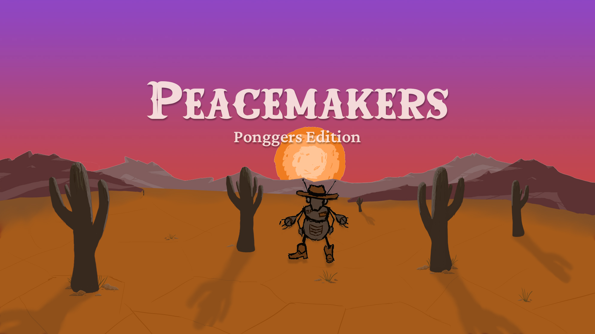
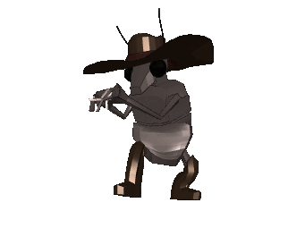
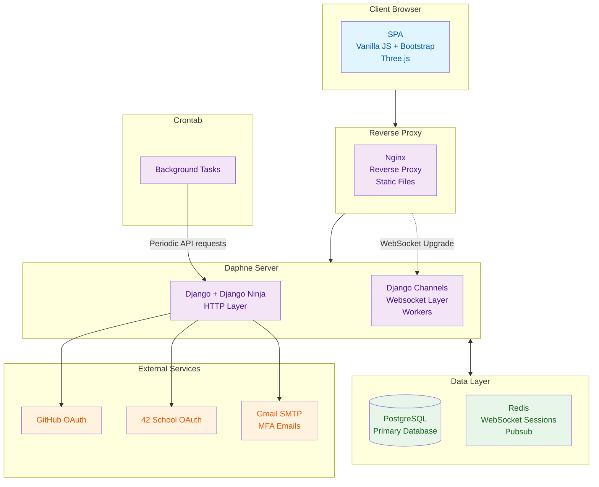
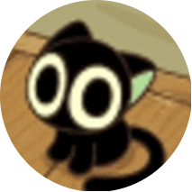

<picture>
  <source srcset="./assets/peacemakers-cover.webp" type="image/webp">
  
</picture>

<div align="center">
  
  
  
  
  
  <br>
  
  
  &nbsp
  
</div>
<br>

Welcome to the saloon, partner.   
I hope that you are ready for the epic shootout... **IN PONG**!!
**Peacemakers: Ponggers Edition** is a pong platform with elements of social networking and (awesome) cowboy-robot bug theme. Here in the Wild West we are outlaws fighting for fun and glory. But mostly fun.
In this very comptetive game you play for elo, participate in tournaments and meet new friends. Think of it as [chess.com](https://www.chess.com/), but instead of chess we are playing pong on the postapocaliptic desolate waste of the Wild West. Totally easy to imagine, I guess.

It is a collaborative project of students from [42 Lyon](https://42lyon.fr/), an awesome & free (and also competetive and hard) programming school. Our team was aiming for a very specific set of features. Some of them were chosen by us (and since we like suffering, we chose a lot of them), and some were mandatory to implement. The features are:

## Features

- **General**
  - Dynamic [Single Page Application](https://en.wikipedia.org/wiki/Single-page_application)
  - Google Chrome as first-class browser, Firefox in good company
  - Made primarly with Django, PostgreSQL, vanilla JS and [Bootstrap](https://getbootstrap.com/)
  - Runs in docker-compose
  - Responsive UI (but the game can't run on mobile... yet. sowwy!)
  - Secure and works with HTTPS
 
- **User Management System**
  - Authentication system based on [JWT](https://en.wikipedia.org/wiki/JSON_Web_Token)
  - Sign up, sign in normally...
  - ...or with [OAuth](https://en.wikipedia.org/wiki/OAuth), using 42 or Github
  - Have [MFA](https://en.wikipedia.org/wiki/Multi-factor_authentication) for security! Nobody can hack you
  - Password restoration using Gmail
  - User profiles with game statistics, hand coded graphs (no libraries!)
  - User settings, profile picture (express yourself)

- **Pong Game**
  - 3D graphics with [Three.js](https://threejs.org/) (**with handmade 3D models!!!** using [Blender](https://en.wikipedia.org/wiki/Blender_(software)))
  - Game customization with game settings
  - Optional fun gameplay features that enchance basic pong (don't worry, you can play vanilla pong too)
  - Ranked games with elo system
  - Play locally against another player or AI
  - Multiplayer, ability to play from different computers (convenient!)
  - Game invitation system, play with your friends
  - Automatic matchmaking system, play with randoms
  - Tournament system, play with lots of friends and/or randoms

- **Chat & Live Events**
  - Friendship system, befriend people you like
  - Block system, block people you hate (or for fun hehe)
  - Notification system, be notified of the cool stuff going on
  - Online presence system, so you can see who is procrastinating playing pong
  - And last but not least... chat!! Stay in contact with other outlaws. You can send, receive and like messages

- **Misc**
  - Handdrawn background images, beautiful animations and more. All made with 💖 Love 💖.
  - Dark & Light color schemes
  - Find other users through search feature

<p align="center">
  <br/>
  <em>Hope that you will have and find our project interesting!</em>
</p>
<br />

## Project Walkthrough  

https://github.com/user-attachments/assets/03d67b91-a39e-428a-ad39-6dcc6a32af07

<br />

## Get Started

1. Clone the repository:
   ```bash
   git clone https://github.com/ysengoku/42-ft_transcendence.git
   cd 42-ft_transcendence
   ```
2. Prepare environment:   
    ```bash
    cp .env.example .env
    # Make sure to set the required variables.
    ```
3. Run:
    ```bash
    make dev   # development - including hot reload and debug log
    make prod  # production
    ``` 
4.  Open in Chrome or Firefox:
- On the same machine: `https://localhost:1026`
- From another device in the same local network: `https://<your-local-ip>:1026`

<br />

**Required:** Docker 20.10+ and Docker Compose 2.4+

<br />

## Technologies

### Front-end

[](#)
[](#)
[](#)

### Game

[](#)
[](#)

### UI design

[](#)

### Back-end

[](#)
[](#)
[](#)
[](#)

### Database

[](#)
[](#)

### DevOps & CI/CD

[](#)
[](#)
[](#)

### Testing

[](#)
[](#)

<br />

## Architecture

Check out our [architecture documentation](./doc/ARCHITECTURE.md) for detailed description how the project is structured and works.



### Frontend Layer
**Pure JavaScript SPA** using component-based architecture and custom dispatch framework.
- **Bootstrap**: HTML/CSS/JavaScript framework that provides with theme management, utility classes and interactive components.
- **Three.js**: 3D rendering engine responsible for the looks of the game!

### Backend Layer
Asynchronous hybrid server **Daphne** that handles both HTTP and websocket connections.
- **Django Ninja**: RESTful API with auto-generated swagger schema for documentation.
- **Django Channels**: Django Channels for real-time features.

### Reverse Proxy
**Nginx** server that stands between the client and **Daphne server**. Responsible for:
- Security policies & encryption of data.
- Static file serving.
- Potentially for load balancing, as we can add more servers to the mix.

### Data Layer
- **PostgreSQL**: Primary database. Used for user data, game records, chat history, notification system and more!
- **Redis**: pub/sub messaging between different WebSocket connections and worker processes.

### External Integrations
- **OAuth Providers**: GitHub and 42 School for third-party authentication.
- **Email Service**: Gmail SMTP for MFA verification codes.

### Crontab
Separate container that periodically sends requests to the Daphne server to perform actions.

<br />

## Documentation

- [Architecture](./doc/ARCHITECTURE.md)

- Features
  - [User Management System](./doc/features/USER_MANAGEMENT.md)
  - [Pong Game](./doc/features/PONG.md)
  - [Tournament system](/.doc/features/TOURNAMENT.md)
  - [Chat and Live Events](./doc/features/CHAT_AND_LIVE_EVENTS.md)

- Front-end
  - [Front-end overview](./doc/front/FRONTEND.md)
  - Detailed documentations
    - [Web component](./doc/front/Component.md)
    - [Router](.doc/front/Router.md)
    - [API Request](.doc/front/API_REQUEST.md)
    - [Auth manager](./doc/front/AUTH_MANAGER.md)
    - [WebScoket manager](./doc/front/SocketManager.md)
    - [Data visualization](./doc/front/DATA_VISUALIZATION.md)

- Server
  - [Multi-factor Authentication](./doc/server/MFA.md)
  - [Remote Authentication (OAuth 2.0)](./doc/server/OAUTH2.md)

- UI design
  - [Wireframe and Mock-up design](https://www.figma.com/design/bIKKWAFQjcnPiEDc63jWa1/ft_transcendence?node-id=37-340&t=AJvSNhCCjxhZqsCV-1)

<br />

## Contributors

<table>
  <tr>
    <td align="center" style="padding: 8px; vertical-align: middle;">
      <a href="https://github.com/emuminov" style="text-decoration: none;">
        <br />
        <b>emuminov</b>
      </a>
    </td>
    <td style="padding-left: 16px; vertical-align: middle;">
      <b>Lead developer & DevOps:</b><br />
      Desgined the project architecture and led development of the backend and multiplayer gameplay. Managed the project's infrastructure and deployment pipelines. Also responsible for writing the technical documentation.
    </td>
  </tr>

  <tr>
    <td align="center" style="padding: 8px; vertical-align: middle;">
      <a href="https://github.com/faboussard" style="text-decoration: none;">
        <br />
        <b>faboussard</b>
      </a>
    </td>
    <td style="padding-left: 16px; vertical-align: middle;">
      <b>Backend Developer & DevOps:</b><br />
      Developed the OAuth and multi-factor authentication systems and built the project's foundational infrastructure.
    </td>
  </tr>

  <tr>
    <td align="center" style="padding: 8px; vertical-align: middle;">
      <a href="https://github.com/melobern" style="text-decoration: none;">
        <br />
        <b>melobern</b>
      </a>
    </td>
    <td style="padding-left: 16px; vertical-align: middle;">
      <b>Backend Developer:</b><br />
      Developed the backend for the live chat module and tournament systems. Improved security measures.
    </td>
  </tr>

  <tr>
    <td align="center" style="padding: 8px; vertical-align: middle;">
      <a href="https://github.com/Celiastral" style="text-decoration: none;">
        <br />
        <b>celiastral</b>
      </a>
    </td>
    <td style="padding-left: 16px; vertical-align: middle;">
      <b>Game designer, developer & graphic artist:</b><br />
      Designed and developed the local, AI opponent, and multiplayer gameplay systems. Provided the unique visual style by creating custom 3D models and graphic assets.
    </td>
  </tr>

  <tr>
    <td align="center" style="padding: 8px; vertical-align: middle;">
      <a href="https://github.com/ysengoku" style="text-decoration: none;">
        <br />
        <b>ysengoku</b>
      </a>
    </td>
    <td style="padding-left: 16px; vertical-align: middle;">
      <b>Frontend developer & UI designer:</b><br />
      Led the UI design and development of the frontend. Ensured the team stayed on track by organizing their collaboration and workflow. Also responsible for writing the technical documentation.
    </td>
  </tr>
</table>

## License

This project is for educational purposes only - not licensed for commercial use.

<br />

---

Authored by: [emuminov](https://github.com/emuminov) and [ysengoku](https://github.com/ysengoku)
