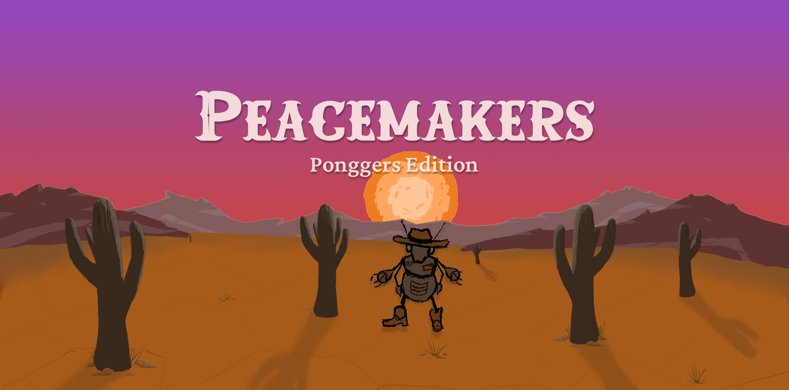

  
  
  
  
  
   
  
  
  &nbsp
  

 

Real-time multiplayer PONG Game built as a Single Page Application, developed by five students during 42 school curriculum.
This project combines authentication, live gameplay, chat, and 3D rendering using modern web technologies.   
   
## Demo video 🛠️👷🏻‍♂️

## Usage 🛠️👷🏻‍♂️

## Features

### Key Features

- **Real-time Multiplayer**: WebSocket-based game synchronization
- **Multi-factor Authentication**: Email-based verification system
- **OAuth 2.0 Integration**: Third-party authentication support
- **3D Gaming**: Hardware-accelerated 3D graphics with Three.js
- **Tournament System**: Bracket-based competitive play
- **Live Chat**: Real-time messaging with notifications

### Other Features

#### User management

- Secure registration with validation and connection using JWT
- User profile page including customizable avatar and Game stat (win/loss rate, duel history, Elo change chart, best/worst opponents)
- User blocking system
- Forgotten password reset functionality

#### Game

- Local game with AI opponent option
- Game customization
- Game worker: Background processing of game logic
- Matchmaking and Game invitation for Multiplayer Game

#### UI & Graphics

- Responsive design
- Two color themes: Light and Dark
- Google Chrome Compatibility
- Hand-made 3D models, animation and art!

#### DevOps and CD/CI

- Containerized environment using Docker
- Workflows and templated for issue/task creation

## Technologies

### Front-end

### Game

### UI design

### Back-end

### Data base

### DevOps & CI/CD

### Testing

## Architecture

### Component Responsibilities

#### Frontend Layer

- **SPA (Single Page Application)**: Vanilla JavaScript with component-based architecture
- **WebSocket Client**: Real-time communication for chat, notifications, and game state
- **3D Game Engine**: Three.js for rendering

#### Infrastructure Layer

- **Nginx**: Load balancing, static file serving, WebSocket proxy
- **Docker**: Containerized architecture

#### Application Layer

- **Django API**: RESTful API with Django Ninja, JWT authentication
- **WebSocket Server**: Django Channels for real-time features
- **Background Tasks**: Crontab for scheduled operations

#### Data Layer

- **PostgreSQL**: Primary database for user data, game records, chat history
- **Redis**: WebSocket session management, pub/sub messaging

#### External Integrations

- **OAuth Providers**: GitHub and 42 School for third-party authentication
- **Email Service**: Gmail SMTP for MFA verification codes

## Documentation 🛠️👷🏻‍♂️

### Front-end

- [Front-end overview](/doc/front/FRONTEND.md)
- [Web component](/doc/front/Component.md)
- [Router](doc/front/Router.md)
- [Auth manager](/doc/front/AUTH_MANAGER.md)
- [WebScoket manager](/doc/front/SocketManager.md)
- [Data visualization](/doc/front/DATA_VISUALIZATION.md)
- [Tournament UI](/doc/front/TOURNAMENT_UI.md)

### Server

- [Multi-factor authentication](/doc/server/MFA.md)
- [Remote Authentication (OAuth 2.0)](/doc/server/OAUTH2.md)
- [Live chat](/doc/server/CHAT.md)
- [Tournament system](/doc/server/TOURNAMENT.md)

### Protocol

- [Live chat modules (Chat, notifications, Game invitation)](/doc/protocol/LIVECHAT_MODULE_WS_PROTOCOL.md)
- [Tournament state](/doc/protocol/TOURNAMENT_WS_PROTOCOL.md)

### UI design

- [Wireframe and Mock-up design](https://www.figma.com/design/bIKKWAFQjcnPiEDc63jWa1/ft_transcendence?node-id=37-340&t=AJvSNhCCjxhZqsCV-1)

## 👥 Contributors

<table>
  <tr>
    <td align="center">
      <a href="https://github.com/emuminov">
         
        <b>emuminov</b>
      </a>
    </td>
    <td align="center">
      <a href="https://github.com/melobern">
         
        <b>melobern</b>
      </a>
    </td>
    <td align="center">
      <a href="https://github.com/faboussard">
         
        <b>faboussard</b>
      </a>
    </td>
    <td align="center">
      <a href="https://github.com/Celiastral">
         
        <b>Celiastral</b>
      </a>
    </td>
    <td align="center">
      <a href="https://github.com/ysengoku">
         
        <b>ysengoku</b>
      </a>
    </td>
  </tr>
</table>

## License
This project is for educational purposes only - not licensed for commercial use.
