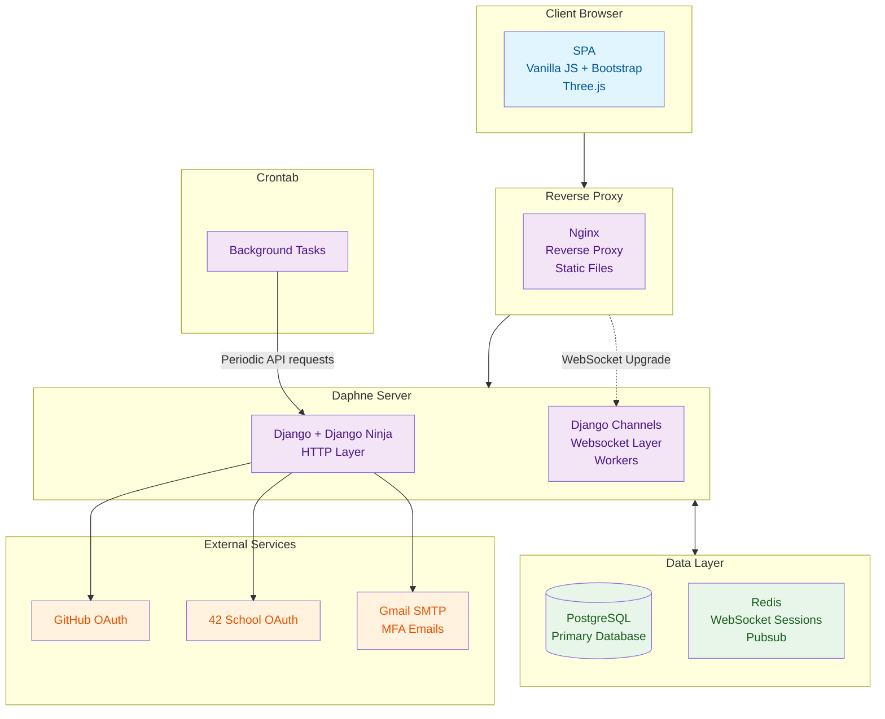

# Architecture

**Peacemakers** is a [Single Page Application (SPA)](https://en.wikipedia.org/wiki/Single-page_application), designed as a real-time multiplayer Pong platform with social networking features. It is designed to comply with the requirements of one of the [42 school](https://en.wikipedia.org/wiki/42_(school)) subject. The subject cannot be disclosed (sorry!), but in short, we chose requirements ourselves, and we have certain limitations regarding the technologies that we are allowed to use. Those requirements and restrictions dictated a lot of design descisions that we made.

The project adheres to the modern architecture: it consists of several containerized (with [Docker](https://en.wikipedia.org/wiki/Docker_(software))) services, including decoupled server and client. Each of the services is modular, have clear responsibility and boundries. They are orchestrated with [Docker Compose](https://docs.docker.com/compose/).

This document will explain what, where and why of **Peacemakers**, from high-level view.

## Technology Stack

We wanted to ensure the minimal dependencies for the project. Unless it's **really** needed, and very hard to write ourselves, like reliable and fast reverse proxy, for example, we won't include it. The project strikes a golden balance between reinventing everything ourselves and having minimal dependencies.

### Frontend Stack

Frontend is the part of the project that uses the least amount of dependencies.

#### Vanilla JavasCript

The inevitable language of the web. Was chosen over TypeScript or frameworks for educational reasons: the school's subject forbid using TypeScript, which added challenge, due to non-existent static error checking and poor error handling in general of JavaScript. It is softened by rigorous use of [JSDoc](https://en.wikipedia.org/wiki/JSDoc) documentation markup everywhere, to ensure the correctness of this dynamically typed language.

#### [Vite](https://vite.dev/)

JavaScript bundler and asset manager of the project. [Bundlers are necessity for any modern web application](https://rolldown.rs/guide/in-depth/why-bundlers). Unlike other bundlers, Vite is very simple. It allows us to write modular, multifile JavaScript and CSS code, it manages fonts, images, 3D models and any other static assets.

#### [Bootstrap](https://getbootstrap.com/)

Frontend toolkit that brings to the table a lot of useful CSS utility classes and JavaScript-based components. It is the most widespread frontend toolkit in the world, and the only one toolkit/framework that was authorized for use due to the restrictions of the subject.

#### [Three.js](https://threejs.org/).

This is what we use for 3D rendering in [our game](./features/PONG.md). It is very barebones and lightweight, but have strong community, and provides essential functions for dealing with 3D graphics.

### Backend Stack

**Peacemakers** server is designed to be a hybrid server (which means it's able to serve two protocols: both [HTTP](https://en.wikipedia.org/wiki/HTTP) and [WebSocket](https://en.wikipedia.org/wiki/WebSocket)) written in [Python](https://www.python.org/), hence it uses technologies that enable that.

#### Python

The choice for the backend language is Python. It's a widely used server programming language with rich standart library and batteries included.

#### [Django](https://www.djangoproject.com/)

Old and revered Python framework. Is is opionated, and by default includes a lot of things required for the web development: most importantly an [powerful ORM](https://www.freecodecamp.org/news/what-is-an-orm-the-meaning-of-object-relational-mapping-database-tools/), testimg framework, router and HTML templating language. The last two are not used in the project.

Django is almost secure by default, and requires to enable a few more settings for full security. It imposes a [specific structure](#backend-structure) to the code. It provides a CLI for code generation, testing, entering REPL and running server.

Django is the key dependency of the backend: every other addition is something that was created to work with Django, and probably something that was created the core Django team itself.

#### [Django Ninja](https://django-ninja.dev/)

Django was not designed to serve JSON in a [RESTful](https://en.wikipedia.org/wiki/REST) way, and a lot of Django utilities become useless if it's used like that. Django Ninja provides two very useful features for development of a RESTful API:

- Schema validation based on type hints and integration with [Pydantic](https://docs.pydantic.dev/latest/). It brings powerful type checking that makes development of the API much more robust. If the data that comes to the server doesn't comply with the schema it expects, it throws an exception. Same thing if the server returns JSON data that doesn't match schema it defined.

- Autogeneration of [swagger documentation](https://swagger.io/) that is based on schemas. It makes communication between a team which writes frontend and a team which writes backend much more effective. After running the server, the documentation can be found at `/api/docs`.

Django & Django Ninja are responsible for the HTTP handling in the project.

#### [Django Channels](https://channels.readthedocs.io/en/latest/)

Django Channels adds two cruicial utilities for the project: 
- The capabilities for the server to handle [WebSocket](https://en.wikipedia.org/wiki/WebSocket) requests. 
- PubSub communications via [Redis](#redis).
The second feature is used for communication between different WebSocket connections, as well as interpocess communications between the main server and [the game](./features/PONG.md#game-worker) or [tournament](./features/TOURNAMENT.md#tournament-worker).

#### [Daphne](https://docs.djangoproject.com/en/5.2/howto/deployment/asgi/daphne/)

Daphne server is web server written purely in Python. It's [ASGI](https://en.wikipedia.org/wiki/Asynchronous_Server_Gateway_Interface) compliant, which means that it can handle requests in an asynchronous way. Daphne server is what runs the Django code and what actually processes requests.

Daphne server is not exposed: it runs begind [Nginx reverse proxy](#nginx).

#### Others

The project also uses various specialized libraries, like [ImageMagick](https://imagemagick.org/) (for uploaded images verification), that are not secure to implement ourselves.

### Data Layer Stack

#### [PostgreSQL](https://en.wikipedia.org/wiki/PostgreSQL)

Powerful industrial-level relational database. It is used for all data needs in the project: for storing data, as well as complex lookups.

It is not used directly. Instead, it's used via [Django ORM](#django).

#### [Redis](https://redis.io/)

In **Peacemakers** Redis is not used for storing any data; instead, it is used as a [message broker](https://en.wikipedia.org/wiki/Message_broker). In the project, [Django Channels](#django-channels) configured to use Redis for distributing messages between different services: different WebSocket connections within the server, and external processes like [the game worker](./features/PONG.md#game-worker) and [the tournament worker](./features/TOURNAMENT.mdtournament-worker).

### Devops & Infrastructure Stack

#### [Docker](https://en.wikipedia.org/wiki/Docker_(software)) and [Docker Compose](https://docs.docker.com/compose/)

For both development and deployment, Docker is used. It is not used directly: we have many containers, and they are orchistrated with Docker Compose, which is responsible for ensuring that their runtime works correctly, their start order and conditional execution of certain containers.

Docker allows us to have consistent reproducible environments for both development and depolyment, and makes dependency management sane, and Docker Compose simplifies management of multiple Docker images/services.

#### [Nginx](https://nginx.org/)

Nginx is a fast and configurable written in C. It has many security features and configurations, is significantly faster at delievering static files of various sizes (especially images) compared to [Daphne](#daphne), encrypts & redirects the traffic to the backend.

### Misc

#### [Blender](https://www.blender.org/)

All 3D models within [the game](./features/PONG.md) are handmade: a lot of work was put into them by Celiastral, using Blender.

#### [Figma](https://www.figma.com/)

All of the pages and UI elements were designed by Yusengok using Figma.
