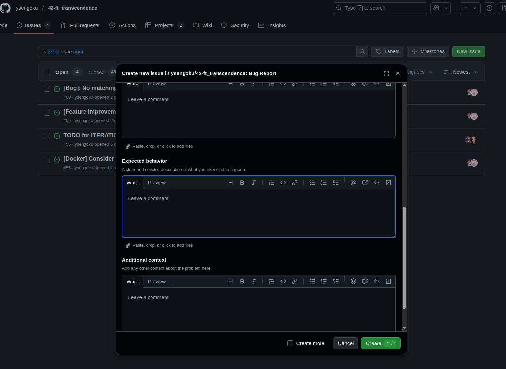

# 🎯 ft_transcendence - Complete Project Module Summary

## 📋 **IMPLEMENTED MODULES**

### ✅ **MANDATORY MODULES - 30 points total**

#### **1. Devops - Backend as a Service (Docker)** - ✅ **IMPLEMENTED**
- [x] **Requirement**: Everything must be launched with a single command line to run an autonomous container provided by Docker
- [x] **Implementation**: Docker Compose with 6 services (nginx, server, front, database, redis, crontab)
- [x] **Evidence**: `/docker-compose.yaml`, `Makefile` with `make up` command
- [x] **Stack**: Docker

#### **2. Google Chrome Compatibility** - ✅ **IMPLEMENTED**
- [x] **Requirement**: Website must be compatible with the latest stable up-to-date version of Google Chrome
- [x] **Implementation**: Application tested and optimized for latest Chrome
- [x] **Evidence**: Compatibility tests performed on stable Chrome
- [x] **Stack**: Google Chrome (latest)

#### **3. Single Page Application (SPA)** - ✅ **IMPLEMENTED**
- [x] **Requirement**: SPA architecture, JavaScript used to update content without reloading the page
- [x] **Back/Forward buttons**: Browser navigation functional
- [x] **Implementation**: Custom router with history API, dynamic components
- [x] **Evidence**: `/front/app/src/js/router/`, `/front/app/src/js/components/`
- [x] **Stack**: Vanilla JavaScript

#### **4. Front-End Framework** - ✅ **IMPLEMENTED**
- [x] **Requirement**: Use pure Vanilla JavaScript OR be altered through the Front-End module
- [x] **Implementation**: Custom Web Components architecture with Vanilla JavaScript
- [x] **Evidence**: `/front/app/src/js/components/`, component architecture
- [x] **Stack**: Vanilla JavaScript

#### **5. Back-End Framework** - ✅ **IMPLEMENTED**
- [x] **Requirement**: Use a framework to build the back end
- [x] **Implementation**: Django 5.1.4 with Django Ninja for API
- [x] **Bonus!**: A django nina admin page allows to test the API endpoints
- [x] **Evidence**: `/server/`, Django apps structure
- [x] **Stack**: Django Ninja

#### **6. Game** - ✅ **IMPLEMENTED**
- [x] **2 participants minimum**: Multiplayer WebSocket game implemented
- [x] **Tournament possible**: Complete system with brackets and matchmaking
- [x] **Display players**: Tournament interface with player order
- [x] **Registration system**: Alias system for tournaments
- [x] **Matchmaking system**: Automatic match organization
- [x] **Identical paddle speed**: Uniform rules
- [x] **Visual essence of Pong**: 3D game faithful to original
- [x] **Implementation**: 3D game with Three.js and Cannon-es physics
- [x] **Evidence**: `/server/tournaments/`, `/server/pong/`, `/front/app/src/js/components/pages/game/`
- [x] **Stack**: Three.js

#### **7. Security Concerns** - ✅ **IMPLEMENTED**
- [x] **SQL injection protection**: Django ORM + Pydantic validation
- [x] **XSS protection**: Input sanitization, no direct innerHTML
- [x] **HTTPS connection**: SSL/TLS configured via Nginx
- [x] **Form validation**: Server-side validation with Django Ninja
- [x] **Protected API routes**: JWT middleware + authentication
- [x] **No secrets on GitHub**: Separated environment variables
- [x] **Evidence**: `/server/users/middleware.py`, `/nginx/nginx.conf`, validation in all endpoints
- [x] **Stack**: HTTPS, JWT
- [x] **Note**: XSS protection partially implemented, innerHTML cannot be directly used

---

### ✅ **WEB MODULES**

#### **1. Back-End Framework (Django)** - ✅ **IMPLEMENTED** *(Major - 10 points)*
- [x] **Requirement**: Use Django framework
- [x] **Implementation**: Django 5.1.4 with modular architecture
- [x] **Evidence**: `/server/`, Django apps (users, chat, pong, tournaments, common)
- [x] **Stack**: Django

#### **2. Front-End Framework (Bootstrap)** - ✅ **IMPLEMENTED** *(Minor - 5 points)*
- [x] **Requirement**: Frontend development must use Bootstrap toolkit with vanilla JavaScript
- [x] **Implementation**: Bootstrap 5.3.3 with custom components in Vanilla JS
- [x] **Evidence**: `/front/app/src/js/components/`, Bootstrap usage in UI
- [x] **Stack**: Bootstrap + Vanilla JS (React-style components)

#### **3. Database for Backend (PostgreSQL)** - ✅ **IMPLEMENTED** *(Minor - 5 points)*
- [x] **Requirement**: Use PostgreSQL database
- [x] **Implementation**: PostgreSQL with Docker, Django migrations
- [x] **Evidence**: `/docker-compose.yaml`, `/server/*/models.py`
- [x] **Stack**: PostgreSQL

---

### ✅ **USER MANAGEMENT MODULES**

#### **1. Standard User Management** - ✅ **IMPLEMENTED** *(Major - 10 points)*
- [x] **Secure subscription**: Secure registration with validation
- [x] **Secure login**: Secure connection with JWT
- [x] **Unique display name**: Unique usernames for tournaments
- [x] **Update information**: User profile updates
- [x] **Avatar upload**: Avatar upload with default option
- [x] **Friends system**: Friend addition and online status
- [x] **User profiles stats**: Display wins/losses and statistics
- [x] **Match History**: 1v1 game history with details
- [x] **Evidence**: `/server/users/`, `/front/app/src/js/components/pages/profile/`
- [x] **Stack**: Django Ninja, JWT tokens

#### **2. Remote Authentication (OAuth 2.0)** - ✅ **IMPLEMENTED** *(Major - 10 points)*
- [x] **OAuth 2.0 authentication**: OAuth 42 School integration
- [x] **Secure credentials**: 42 and GitHub credentials configured
- [x] **User-friendly flows**: Intuitive authentication flows
- [x] **Security standards**: Security best practices compliance
- [x] **Token exchange**: Secure authentication token exchange
- [x] **Bonus**: GitHub OAuth also implemented
- [x] **Evidence**: `/server/users/router/endpoints/oauth.py`
- [x] **Stack**: OAuth 42 + GitHub

---

### ✅ **GAMEPLAY AND USER EXPERIENCE MODULES**

#### **1. Remote Players** - ✅ **IMPLEMENTED** *(Major - 10 points)*
- [x] **Separated computers**: Each player on separate computer
- [x] **Same website access**: Access to same website
- [x] **Network issues handling**: Network problem management
- [x] **Implementation**: Multiplayer game via WebSocket
- [x] **Bonus!**: Worker process to avoid data loss if WebSocket connection is interrupted
- [x] **Evidence**: `/server/pong/consumers/matchmaking.py`, `/server/pong/consumers/game_ws_server.py`
- [x] **Stack**: WebSocket (no framework)

#### **2. Game Customization** - ✅ **IMPLEMENTED** *(Minor - 5 points)*
- [x] **Customization features**: Power-ups, attacks, different maps
- [x] **Default version**: Basic version with base features
- [x] **All games platform**: Options available for all games
- [x] **User-friendly settings**: Intuitive settings menus
- [x] **Unified experience**: Consistency across all games
- [x] **Evidence**: `/front/app/src/js/components/pages/match/GameOptions.js`
- [x] **Stack**: Three.js

#### **3. Live Chat** - ✅ **IMPLEMENTED** *(Major - 10 points)*
- [x] **Direct messages**: Private messages between users
- [x] **Block users**: Integrated blocking system
- [x] **Game invitations**: Game invitations via chat
- [x] **Tournament warnings**: Tournament notifications
- [x] **Access profiles**: Profile access via chat
- [x] **Bonus!**: Ability to "like" messages
- [x] **Evidence**: `/server/chat/`, `/front/app/src/js/components/pages/chat/`
- [x] **Stack**: Django Channels

#### **4. User and Game Stats Dashboards** - ✅ **IMPLEMENTED** *(Minor - 5 points)*
- [x] **User dashboards**: User dashboards with gaming insights
- [x] **Game sessions dashboard**: Separate dashboard for game sessions
- [x] **Intuitive interface**: Intuitive interface for tracking and analysis
- [x] **Data visualization**: Charts and graphs for clear presentation
- [x] **Gaming history access**: Access to history and performance metrics
- [x] **Additional metrics**: Additional useful metrics
- [x] **Evidence**: `/front/app/src/js/components/pages/profile/`, `/server/pong/router/endpoints/game_stats.py`
- [x] **Stack**: CSS/HTML

---

### ✅ **AI-ALGO MODULES**

#### **1. AI Opponent** - ✅ **IMPLEMENTED** *(Major - 10 points)*
- [x] **Challenging gameplay**: Challenging and engaging AI opponent
- [x] **Human behavior**: AI replicates human behavior
- [x] **Keyboard simulation**: Keyboard input simulation
- [x] **1 second refresh**: Game view refreshed once per second
- [x] **Anticipation**: AI must anticipate bounces and actions
- [x] **Power-ups utilization**: AI uses power-ups if implemented
- [x] **Strategic moves**: Intelligent logic and decision-making processes
- [x] **Alternative algorithms**: Alternative techniques (not A*)
- [x] **Adaptive AI**: AI adapts to different scenarios
- [x] **Evidence**: `/front/app/src/js/components/pages/game/Game.js` (AI logic)
- [x] **Stack**: AI must utilize power-ups if Game Customization implemented

---

### ✅ **CYBERSECURITY MODULES**

#### **1. Two-Factor Authentication (2FA) and JWT** - ✅ **IMPLEMENTED** *(Major - 10 points)*
- [x] **2FA implementation**: Additional security layer
- [x] **Secondary verification**: One-time code in addition to password
- [x] **JWT utilization**: JSON Web Tokens for secure authentication
- [x] **Secure session management**: Secure user session management
- [x] **User-friendly 2FA setup**: Intuitive 2FA configuration process
- [x] **Multi-method 2FA**: SMS, authenticator apps, email options
- [x] **Secure JWT validation**: Secure JWT token issuance and validation
- [x] **Bonus!**: Forgot password functionality
- [x] **Evidence**: `/server/users/`, MFA and JWT implementation
- [x] **Stack**: JWT + MFA

---

### ✅ **GRAPHICS MODULES**

#### **1. 3D Techniques** - ✅ **IMPLEMENTED** *(Major - 10 points)*
- [x] **Immersive experience**: Complete and immersive 3D environment
- [x] **Advanced 3D techniques**: Advanced 3D techniques
- [x] **Implementation**: Three.js + Cannon-es physics for 3D rendering
- [x] **Evidence**: `/front/app/public/3d_models/`, Three.js integration
- [x] **Stack**: Three.js

---

### ✅ **ACCESSIBILITY MODULES**

#### **1. Browser Compatibility** - ✅ **IMPLEMENTED** *(Minor - 5 points)*
- [x] **Expanding Browser Compatibility**: Extended browser compatibility
- [x] **Implementation**: Vite + Babel for cross-browser transpilation
- [x] **Evidence**: `/front/app/vite.config.js`, Babel configuration
- [x] **Stack**: Vite + Babel

---

## 🏆 **BONUS FEATURES & ORGANIZATION**

### **🌍 International Team Management**
- [x] **Full English Communication**: All discussions (oral and written) conducted in English
- [x] **English Documentation**: Website, documentation, code comments, commits, issues, PRs, code reviews
- [x] **International Collaboration**: Multi-cultural team experience

### **📋 Project Organization**
- [x] **Discord Channel**: Team central communication with different channels
- [x] **Weekly Meetings**: Sprint planning and regular follow-up
- [x] **GitHub Project Management**: 
  - [x] Roadmap and iterations (sprint planning)
  - [x] Backlog management
  - [x] Bug reporting with forms
  - [x] Code review via pull requests with forms
  - [x] Code quality (linters, formatters, CI/CD (GitHub workflows), tests)

### **📸 Project Management Screenshots**
- **Roadmap & Sprint Planning**: 
  
- **Backlog Management**: 
  
- **Issue Reporting System**:
  
  
- **Code Review Process**:
  
- **Discord Communication**:
  

### **📚 Documentation Quality**
- [x] **Comprehensive README**: Project description, setup, usage
- [x] **Module Documentation**: OAuth2, Chat Component, etc.
- [x] **Developer Guidelines**: Code standards and best practices

### **🎨 Additional Bonus Features**
- [x] **Dark/Light Mode**: Dark and light theme with persistence
- [x] **Responsive Design**: Bootstrap adaptive interface
- [x] **3D Cowboy Bug Universe**: Unique and immersive graphic theme
- [x] **Advanced Security**: 2FA, multiple OAuth providers
- [x] **Professional CI/CD**: Automated testing and code quality
- [x] **Forgot Password**: Password recovery system, sender email address is personalized with photo to stay in theme

---

## 📊 **FINAL POINTS CALCULATION**

### **MANDATORY MODULES**: 30 = 30 points ✅
- [x] Devops (Docker)
- [x] Google Chrome Compatibility
- [x] Single Page Application
- [x] Front-End Framework
- [x] Back-End Framework
- [x] Game
- [x] Security Concerns

### **MAJOR MODULES**: 8 × 10 = 80 points ✅
- [x] Back-End Framework (Django) - 10 pts
- [x] Standard User Management - 10 pts
- [x] Remote Authentication (OAuth) - 10 pts
- [x] Remote Players - 10 pts
- [x] Live Chat - 10 pts
- [x] AI Opponent - 10 pts
- [x] Two-Factor Authentication & JWT - 10 pts
- [x] 3D Techniques - 10 pts

### **MINOR MODULES**: 5 × 5 = 25 points ✅
- [x] Front-End Framework (Bootstrap) - 5 pts
- [x] Database (PostgreSQL) - 5 pts
- [x] Game Customization - 5 pts
- [x] User and Game Stats Dashboards - 5 pts
- [x] Browser Compatibility - 5 pts

### **TOTAL POINTS: 135/100 points** 🏆

**The project exceeds the maximum required score!**

---

## 🧪 **PROJECT EVALUATION TEST CHECKLIST**

### **1. SETUP & STARTUP**
```bash
# ✅ Test: Application startup
make up
# PASS: All containers start correctly

# ✅ Test: Application accessible
curl -k https://localhost:1026/
# PASS: Home page loads

# ✅ Test: API accessible
curl -k https://localhost:1026/api/docs
# PASS: Swagger documentation available
```

### **2. AUTHENTICATION & USERS**

#### **2.1 Standard Registration/Login**
```bash
# ✅ Test: User registration
curl -k -X POST https://localhost:1026/api/signup \
  -H "Content-Type: application/json" \
  -d '{"username":"evaluator","password":"TestPass123!","email":"eval@test.com","password_repeat":"TestPass123!"}'
# PASS: User created successfully

# ✅ Test: User login
curl -k -X POST https://localhost:1026/api/login \
  -H "Content-Type: application/json" \
  -d '{"username":"evaluator","password":"TestPass123!"}'
# PASS: JWT tokens returned
```

#### **2.2 OAuth2 Remote Authentication**
```bash
# ✅ Test: GitHub OAuth available
curl -k https://localhost:1026/api/oauth/authorize/github
# PASS: Authorization URL returned

# ✅ Test: 42 OAuth available
curl -k https://localhost:1026/api/oauth/authorize/42
# PASS: Authorization URL returned
```

#### **2.3 Multi-Factor Authentication (2FA)**
```bash
# ✅ Test: MFA activatable in settings
# PASS: MFA interface available in /settings

# ✅ Test: MFA code by email
# PASS: Code sending system implemented
```

### **3. USER MANAGEMENT**

#### **3.1 User Profiles**
```bash
# ✅ Test: Profile retrieval
curl -k -X GET https://localhost:1026/api/users/evaluator \
  -H "Authorization: Bearer <token>"
# PASS: User profile returned

# ✅ Test: Profile update
curl -k -X POST https://localhost:1026/api/users/evaluator/settings \
  -H "Authorization: Bearer <token>" \
  -F "nickname=NewNick"
# PASS: Profile updated
```

#### **3.2 Friends System**
```bash
# ✅ Test: Add friend
curl -k -X POST https://localhost:1026/api/users/evaluator/friends \
  -H "Authorization: Bearer <token>" \
  -d '{"username":"friend_user"}'
# PASS: Friend added

# ✅ Test: Friends list
curl -k -X GET https://localhost:1026/api/users/evaluator/friends \
  -H "Authorization: Bearer <token>"
# PASS: Friends list returned
```

### **4. PONG GAME**

#### **4.1 Local Game**
```javascript
// ✅ Test: Local game functional
// Navigate to /game/local
// PASS: 3D Pong game launches, responsive controls
```

#### **4.2 Multiplayer Game**
```javascript
// ✅ Test: Matchmaking
const ws = new WebSocket('wss://localhost:1026/ws/matchmaking/');
// PASS: WebSocket connection established

// ✅ Test: Multiplayer game
// Two players join queue
// PASS: Game created, real-time synchronization
```

#### **4.3 AI Opponent**
```javascript
// ✅ Test: Game against AI
// Select AI mode in options
// PASS: Responsive AI, adjustable difficulty
```

### **5. TOURNAMENT SYSTEM**

#### **5.1 Tournament Creation**
```bash
# ✅ Test: Tournament creation
curl -k -X POST https://localhost:1026/api/tournaments \
  -H "Authorization: Bearer <token>" \
  -d '{"name":"Test Tournament","required_participants":4,"alias":"Player1"}'
# PASS: Tournament created
```

#### **5.2 Tournament Participation**
```javascript
// ✅ Test: Bracket system
// Navigate to /tournament
// PASS: Bracket interface, real-time progression
```

### **6. REAL-TIME CHAT**

#### **6.1 Private Messages**
```bash
# ✅ Test: Chat retrieval
curl -k -X GET https://localhost:1026/api/chats \
  -H "Authorization: Bearer <token>"
# PASS: Conversation list

# ✅ Test: WebSocket chat
const chatWs = new WebSocket('wss://localhost:1026/ws/chat/');
# PASS: Real-time messages functional
```

#### **6.2 Game Invitations**
```javascript
// ✅ Test: Invitation via chat
// Send game invitation from chat
// PASS: Invitation received, game launched if accepted
```

### **7. STATISTICS & DASHBOARDS**

#### **7.1 User Stats**
```bash
# ✅ Test: ELO history
curl -k -X GET https://localhost:1026/api/game-stats/evaluator/daily-elo \
  -H "Authorization: Bearer <token>"
# PASS: ELO data returned

# ✅ Test: Match history
curl -k -X GET https://localhost:1026/api/game-stats/evaluator/matches \
  -H "Authorization: Bearer <token>"
# PASS: Game history
```

#### **7.2 Visual Dashboard**
```javascript
// ✅ Test: Stats charts
// Navigate to /profile/evaluator
// PASS: ELO charts, win rate, visual statistics
```

### **8. 3D TECHNOLOGIES**

#### **8.1 3D Rendering**
```javascript
// ✅ Test: Three.js integration
// Launch a game
// PASS: Smooth 3D rendering, 3D models loaded

// ✅ Test: Cannon-es physics
// Ball/paddle collision
// PASS: Realistic physics, correct bounces
```

### **9. SECURITY & COMPLIANCE**

#### **9.1 JWT Security**
```bash
# ✅ Test: Refresh tokens
curl -k -X POST https://localhost:1026/api/refresh
# PASS: Tokens automatically refreshed

# ✅ Test: CSRF Protection
# Attempt access without CSRF token
# PASS: Requests blocked without valid token
```

#### **9.2 GDPR Compliance**
```bash
# ✅ Test: Account deletion
curl -k -X DELETE https://localhost:1026/api/users/evaluator/delete \
  -H "Authorization: Bearer <token>"
# PASS: Account deleted, data erased
```

### **10. FRONTEND & UI/UX**

#### **10.1 Single Page Application**
```javascript
// ✅ Test: SPA navigation
// Click navigation links
// PASS: Page change without reload

// ✅ Test: Responsive design
// Window resizing
// PASS: Interface adapts (Bootstrap)
```

#### **10.2 Themes & Accessibility**
```javascript
// ✅ Test: Dark/light theme
// Toggle theme in navbar
// PASS: Theme change functional
```

### **11. INFRASTRUCTURE & DEPLOYMENT**

#### **11.1 Containerization**
```bash
# ✅ Test: Docker services
docker ps
# PASS: 6 active containers (nginx, server, front, db, redis, cron)

# ✅ Test: Health checks
docker inspect <container> | grep Health
# PASS: All services healthy
```

#### **11.2 Reverse Proxy & SSL**
```bash
# ✅ Test: HTTPS functional
curl -k https://localhost:1026/
# PASS: Valid SSL certificate

# ✅ Test: API routing
curl -k https://localhost:1026/api/self
# PASS: Requests routed to Django
```

---

## 🎯 **EVALUATION SUMMARY**

### **VALIDATED MODULES:**
- ✅ **Mandatory**: 7/7 (100%)
- ✅ **Major**: 8 modules (80 points)
- ✅ **Minor**: 5 modules (25 points)

### **TOTAL POINTS: 135/100 required**

### **ADVANCED FEATURES:**
- ✅ Complete OAuth2 authentication
- ✅ Real-time 3D game with AI
- ✅ Tournament system with brackets
- ✅ Real-time chat + invitations
- ✅ Stats dashboard with charts
- ✅ MFA + JWT security
- ✅ Docker microservices architecture

### **FINAL STATUS: 🟢 PROJECT VALIDATED**

**The ft_transcendence project far exceeds minimum requirements and presents a complete professional implementation of a multiplayer web game application.**