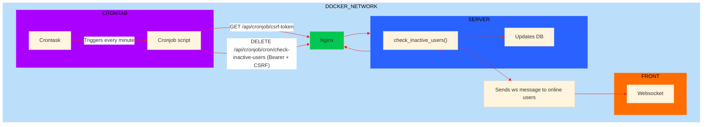

# CRONTAB

Objective : detect inactive uses and set them offline.
The **Crontab** manages:

- Periodic execution of inactive user checks.
- Secure calls to the Django API : trigger the task via a cronjob running in a separate container.
- Handling of CSRF token retrieval and Bearer token authentication for endpoint security.

---

## 1. Architecture \& Execution Flow

- The cronjob script runs in a **separate Docker container** from the Django backend.
- On every scheduled interval (every minute), the cronjob script performs:
  - A GET request to fetch a CSRF token from the `/api/cronjob/csrf-token` endpoint.
  - A DELETE request to the `/api/cronjob/cron/check-inactive-users` endpoint, sending the required headers (`Authorization Bearer` token and `X-CSRFToken`).
- The Django backend, secured with HTTPS through Nginx, verifies the Bearer token and bypasses CSRF validation on this endpoint using the `@csrf_exempt` decorator.
- The business logic function `check_inactive_users()` is invoked :
  - Marks users without recent activity as inactive
  - Updates the database
  - Sends a ws message to active users, to change the online dot from green to gray.

---

## 2. Docker Container and Configuration

- The `crontab` service is defined in `docker-compose.yaml` with:
  - Volumes providing the Python script and dependencies (`/app/scripts`).
  - Environment variables critical for operation: `CRON_SECRET`, `CRON_ENDPOINT`, `CRON_CSRF_TOKEN`.
  - A shared Docker network allowing the cronjob container to reach the Django backend by its Docker service name.
- The cron script uses Python's `requests` library with `verify=False` to accept self-signed certificate.

---

## 3. Cronjob Script (`check_inactive_users_cron.py`)

### Initialization

- Checks that the script wasn't launched in the last 59 seconds.
- Reads environment variables from the container environment to set API URLs and authentication secret.

### CSRF Token Retrieval

- Sends a GET request to `/api/cronjob/csrf-token`.
- Extracts the `csrftoken` cookie from the response, storing it in the session for subsequent use.

### API DELETE Request

- Constructs headers including:
  - `Authorization: Bearer <CRON_SECRET>`
  - `X-CSRFToken: <token>`
  - `Referer` set based on the base URL.
- Sends a DELETE request to `/api/cronjob/cron/check-inactive-users`.
- Outputs the HTTP status code (200 expected upon success).

---

## 4. Django Endpoint (`trigger_inactive_users_check`)

- Declared in Django Ninja with the `@csrf_exempt` decorator to avoid CSRF errors.
- Protected by custom authentication `CronAuth` validating the Bearer token.
- Calls the function `check_inactive_users()` which:
  - Computes inactivity cutoff times (30 minutes).
  - Updates user online status and active connection counters in the database.
  - Sends notifications of disconnections via Channels.

---

## 5. Security and Best Practices

- **CSRF:** Although the cronjob retrieves a CSRF token, the endpoint disables CSRF protection because security is enforced through the Bearer token.
- **HTTPS:** The cronjob must call the API over HTTPS to ensure the CSRF cookie is transmitted.
- **Authentication:** The Bearer token (`CRON_SECRET`) authorizes the cronjob’s access to this endpoint.
- **Container Isolation:** Docker networking ensures secure communication between separated containers.
- **Logs:** The cronjob script logs HTTP status and messages to `/var/log/cron.log` for monitoring.

---

## 6. Summary of API Endpoints Used

| Endpoint                                 | Method | Authentication | CSRF Validation           | Description                                 |
| :--------------------------------------- | :----- | :------------- | :------------------------ | :------------------------------------------ |
| `/api/cronjob/csrf-token`                | GET    | None           | Sets CSRF cookie          | Provides the CSRF token cookie to cron      |
| `/api/cronjob/cron/check-inactive-users` | DELETE | Bearer Token   | Disabled (`@csrf_exempt`) | Triggers check and update of inactive users |

---

## 7. Simplified Execution Example

1. The cron triggers the `check_inactive_users_cron.py` script.
2. The script fetches a CSRF token from `/api/cronjob/csrf-token`.
3. The script sends a DELETE request with Bearer token and CSRF token headers to `/api/cronjob/cron/check-inactive-users`.
4. The backend authenticates the request, skips CSRF validation, and updates the users accordingly.
5. The script logs the HTTP status code for confirmation.

---

