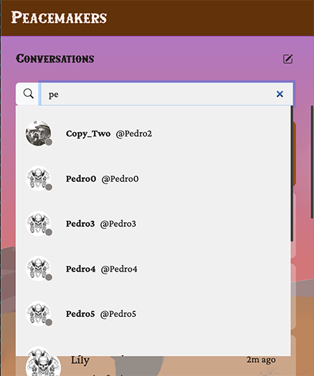
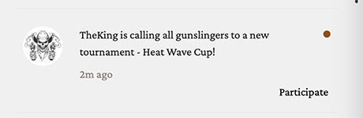

# Chat and Live Events

The Chat App manages core communication features within the application, including messaging, notifications, game invitations, and real-time user presence.

## Table of contents

- [Key features](#key-features)
- [API Endpoints](#api-endpoints)
- [WebSocket protocol](#websocket-protocol)
- [Backend](#backend)
- [Frontend Behavior](#frontend-interaction-logic)
- [Contributors](#contributors)

<br />

## Key Features

### Real-time Messaging

- Start or restart conversations using the embedded user search within the chat interface
- Send and receive messages instantly
- Toggle likes on messages
- Mark messages as read

### Notifications

- Notify users when someone adds them as a friend
- Notify users when new tournaments are created

### Game Invitations

- Send Duel invitations to other users
- Accept or decline incoming Duel invitations

### Real-time Presence

- Periodic background job (cron) to monitor user presence status
- Upon detecting status change, broadcast real-time notifications to all connected users

<br />

## API Endpoints

### Chat

| Endpoint                          | Method | Description                                     | Params            | Returns (Code)             |
| :-------------------------------- | :----- | :---------------------------------------------- | :---------------- | :------------------------- |
| `/chats/`                         | GET    | Paginated list of user's chats                  | `limit`, `offset` | 200, 401                   |
| `/chats/{username}`               | PUT    | Open or create a chat, returns last 30 messages | -                 | 200/201, 401, 404          |
| `/chats/{username}/messages`      | GET    | Retrieve chat messages (paginated)              | `limit`, `offset` | 200, 401, 404              |

### Notifications

| Endpoint                          | Method | Description                                     | Params                       | Returns (Code)             |
| :-------------------------------- | :----- | :---------------------------------------------- | :--------------------------- | :------------------------- |
| `/notifications/`                 | GET    | Paginated notification list                     | `is_read`, `limit`, `offset` | 200, 401                   |
| `/notifications/mark_all_as_read` | POST   | Mark all notifications as read                  | -                            | 200, 401                   | 

<br />

## WebSocket Protocol

The Live Chat WebSocket (`/ws/events`) manages real-time events within the application, including chat messages, message reactions, friend additions, game invitations, notifications, and user presence updates.
Connection is opened when a user logs in and remains active until the user logs out, closes the tab, or loses connection.

### Message Format

```json
{
  "action":"<action name>",
  "data":{
    "<data content>"
  }
}
```

### Chat

#### CLIENT --> SERVER

<a id="client-serverprotocol-new-message"></a>
- **`new_message`**

  Send a new message to a chat room

  <details><summary>View fields and Server-side processing</summary>

  | Field       | Type     | Description                           |
  |:------------|:---------|:------------------------------------- |
  | `chat_id`   | `string` | id of the chat room                   |
  | `content`   | `string` | message content                       |
  | `timestamp` | `string` | Timestamp indicating when it was sent |

  *Server-side processing:*   
  *Calls `ChatEvent.handle_message` to validate and store the message, then broadcasts to chat participants.*
  </details>

<a id="protocol-like-message"></a>
- **`like_message`**:

  Like a message

  <details>
  <summary>View fields and Server-side processing</summary>

  | Field     | Type      | Description             |
  |:----------|:----------|:------------------------|
  | `chat_id` | `string`  | id of the chat room     |
  | `id`      | `string`  | id of the liked message |

  *Server-side processing:*   
  *Calls `ChatEvent.handle_toggle_like_message` to update like status and notify chat participants.*
  </details>

<a id="protocol-unlike-message"></a>
- **`unlike_message`**

  Remove a like from a message

  <details>
  <summary>View fields and Server-side processing</summary>

  | Field     | Type      | Description                |
  |:----------|:----------|:---------------------------|
  | `chat_id` | `string`  | id of the chat room        |
  | `id`      | `string`  | id of the un-liked message |

  *Server-side processing:*   
  *Calls `ChatEvent.handle_toggle_like_message` to update like status and notify chat participants.*
  </details>

<a id="client-server-read-message"></a>
- **`read_message`**

  Mark a message as read

  <details>
  <summary>View fields and Server-side processing</summary>

  | Field     | Type      | Description            |
  |:----------|:----------|:-----------------------|
  | `chat_id` | `string`  | id of the chat room    |
  | `id`      | `string`  | id of the read message |

  *Server-side processing:*   
  *Calls `ChatEvent.handle_read_message` to mark the message as read in the database.*
  </details>

<br />

#### SERVER --> CLIENT

- **`new_message`**

  Send a new message to the receiver and the sender

  <details>
  <summary>View fields</summary>

  | Field      | Type       | Description                           |
  |:-----------|:-----------|:------------------------------------- |
  | `chat_id`  | `string`   | id of the chat room                   |
  | `id`       | `string`   | id of the message                     |
  | `content`  | `string`   | message content                       |
  | `date`     | `datetime` | date and time the message was sent    |
  | `sender`   | `string`   | username of the sender                |
  | `timestamp` | `string`  | Timestamp indicating when it was sent |
  </details>

  [▶︎ See UI behavior](#new_message)   

- **`like_message`**

  Sent when the receiver toggles a like on message

  <details>
  <summary>View fields</summary>

  | Field       | Type       | Description                              |
  |:------------|:-----------|:---------------------------------------- |
  | `chat_id`   | `string`   | id of the chat room                      |
  | `id`        | `string`   | id of the message                        |
  | `is_liked`  | `boolean`  | true if the message is liked, else false |
  </details>

  [▶︎ See UI behavior](#like_message) 

---

### Notifications

#### SERVER --> CLIENT

- **`new_friend`**

  Sent when someone adds the user to his friend list

  <details>
  <summary>View fields</summary>

  | Field       | Type       | Description                                            |
  |:------------|:-----------|:------------------------------------------------------ |
  | `username`  | `string`   | username of the user who added the receiver as friend  |
  | `nickname`  | `string`   | nickname of the user who added the receiver as friend  |
  </details>

  [▶︎ See UI behavior](#new_friend)

- **`new_tournament`**

  Sent when a new tournament is created

  <details>
  <summary>View fields</summary>

  | Field             | Type       | Description                            |
  |:------------------|:-----------|:---------------------------------------|
  | `tournament_id`   | `string`   | id of the new tournament               |
  | `tournament_name` | `string`   | name of the new tournament             |
  | `creator`         | `string`   | alias of the creator of the tournament |
  </details>

  [▶︎ See UI behavior](#new_tournament)

<br />

#### CLIENT --> SERVER

<a id="client-server-read-notification"></a>
- **`read_notification`**

  Sent to the server when th user made an action on the notification (click on button)

  <details>
  <summary>View fields and Server-side processing</summary>

  | Field  | Type     | Description            |
  |:-------|:---------|:-----------------------|
  | `id`   | `string` | id of the notification |

  *Server-side processing:*   
  *Calls `UserEventsConsumer.read_notification` to mark the notification as read in the database.*
  </details>

---

### Game invitation

#### CLIENT --> SERVER

<a id="protocol-game-invite"></a>
- **`game_invite`**

  Invite a user to duel

  <details>
  <summary>View fields and Server-side processing</summary>

  | Field       | Type     | Description                                                                       |
  |:------------|:---------|:--------------------------------------------------------------------------------- |
  | `username`  | `string` | username of the invitee                                                           |
  | `options`   | `json`   | game options selected by the inviter                                              |
  | `client_id` | `string` | id of the websocket instance of the browser tab from which the invitation is sent |

  *Server-side processing:*   
  *Calls `DuelEvent.send_game_invite` to send an invitation to the specified user.*
  </details>

<a id="protocol-reply-game-invite"></a>
- **`reply_game_invite`**

  Reply to a game invitation (accept or decline)

  <details>
  <summary>View fields and Server-side processing</summary>

  | Field       | Type      | Description.                        |
  |:------------|:----------|:------------------------------------|
  | `username`  | `string`  | username of the inviter             |
  | `accept`    | `boolean` | true if accepted, false if declined |

  *Server-side processing:*   
  *Calls `DuelEvent.reply_game_invite` to process the acceptance or decline.*
  </details>

<a id="protocol-cancel-game-invite"></a>
- **`cancel_game_invite`**

  Cancel the game invitation sent by the user

  <details>
  <summary>View fields and Server-side processing</summary>

  | Field       | Type     | Description             |
  |:------------|:---------|:------------------------|
  | `username`  | `string` | username of the invitee |

  *Server-side processing:*   
  *Calls `DuelEvent.cancel_game_invite` to cancel the sent invitation.*
  </details>

<br />

#### SERVER --> CLIENT

- **`game_invite`**

  Sent when someone invites the user to duel

  <details>
  <summary>View fields</summary>

  | Field      | Type       | Description               |
  |:-----------|:-----------|:--------------------------|
  | `username` | `string`   | username of the inviter   |
  | `nickname` | `string`   | nickname of the inviter   |
  | `avatar`   | `string`   | avatar url of the inviter |
  </details>

  [▶︎ See UI behavior](#game_invite)

- **`game_accepted`**

  Sent to the inviter and the invitee when the invitee accepted the invitation

  <details>
  <summary>View fields</summary>

  | Field      | Type       | Description.                      |
  |:-----------|:-----------|:----------------------------------|
  | `game_id`  | `string`   | id of the game room for this duel |
  | `username` | `string`   | username of the invitee           |
  | `nickname` | `string`   | nickname of the invitee           |
  | `avatar`   | `string`   | avatar url of the invitee         |
  </details>

  [▶︎ See UI behavior](#game_accepted)

- **`game_declined`**

  Sent to the inviter when the invitee declined the invitation

  <details>
  <summary>View fields</summary>

  | Field      | Type       | Description.                      |
  |:-----------|:-----------|:----------------------------------|
  | `username` | `string`   | username of the invitee           |
  | `nickname` | `string`   | nickname of the invitee           |
  </details>

  [▶︎ See UI behavior](#game_declined)

<br />

- **`game_invite_canceled`**

  Sent to the inviter when the server cancels the invitation, or to both the inviter and invitee when the inviter cancels the invitation.

  <details>
  <summary>View fields</summary>

  | Field       | Type               | Description               |
  |:------------|:-------------------|:--------------------------|
  | `username`  | `string` \| `null` | username of the inviter   |
  | `nickname`  | `string` \| `null` | nickname of the inviter   |
  | `message`   | `string` \| `null` | reason why the server cancels the invitation |
  | `client_id` | `string`           | id of the websocket instance of the browser tab from which the invitation is sent |
  </details>

  [▶︎ See UI behavior](#game_invite_canceled)

<br />

##### Game options

```json
{
  "score_to_win":	int,
  "game_speed": string,
  "ranked": boolean,
  "time_limit": int,
  "cool_mode": boolean,
}
```

---

### Online status 

#### SERVER --> CLIENT

- **`user_online`**

  Sent to all connected users when online status of someone changed from offline to online

  <details>
  <summary>View fields</summary>

  | Field      | Type     | Description                                      |
  |:-----------|:---------|:-------------------------------------------------|
  | `username` | `string` | username of the user whose status becomes online |
  </details>

  [▶︎ See UI behavior]()

- **`user_offline`**

  Sent to all connected users when online status of someone changed from online to offline

  <details>
  <summary>View fields</summary>

  | Field      | Type     | Description                                       |
  |:-----------|:---------|:--------------------------------------------------|
  | `username` | `string` | username of the user whose status becomes offline |
  </details>

  [▶︎ See UI behavior]()

<br />

## Backend
Server of the project is able to handle WebSockets thanks to the Django Channels integration (TODO: link to the .md file that describes in high level the dependencies of the project). User events are governed by the `UserEventsConsumer`, which is responsible for handling and distributing different events for different groups. It uses JWT authentication, like [the rest of the consumers in the project](./USER_MANAGEMENT.md#jwt-authentication).

### WebSocket connection
- Open WebSocket (one connection per browser tab) on login
- Authenticate token and accept/close connection
- Join channel groups: `user_{id}`, `chat_{uuid}` (for each chat), `online_users`

### On incoming WebSocket action:

- Validate incoming action
- Process application logic and persist changes (DB + optional cache)
- Push resulting events to relevant channel groups
  - (Detailed validation and error handling are described in [**Validation & Security**](#validation--security))

### Notification delivery

- User-scoped events → `user_{id}` group (private push)
- Chat events → `chat_{uuid}` group (room push)
- Presence broadcasts → `online_users` group (connected online users only)

### Game invitations

- Deliver real-time game invitations between users and persist them as notifications for all recipients, including those who are offline.
- Validate sender is not the recipient, validate settings, and ensure neither party is already in a `pending or ongoing GameRoom`.
- Transactionally create a `GameInvitation` record with status `PENDING` and a `Notification` with action `game_invite`.
- Send the `game_invite` WebSocket event to the recipient’s `user_{id} group` (private push), and also persist a sender copy so the invite can be canceled or queried later.
   
- On `reply_game_invite`:
  - If **accept**
    - Re-validate;
    - Create a `GameRoom`;
    - Mark the invitation `ACCEPTED`;
    - Update notifications, and broadcast `game_accepted` to both users.
  - If **decline**
    - Mark the invitation `DECLINED`;
    - Update notifications, and broadcast `game_declined`.
   
- Support explicit `cancel_game_invite` by the sender to mark the invitation `CANCELLED` and notify the invitee.
- Optionally expire stale `PENDING` invitations via a background job and notify sender and recipient when that happens.

### Presence handling

- Increment / decrement per-connection counter (`nb_active_connexions`) on connect / disconnect
- Consider user offline when counter == 0; persist offline state to DB/Redis
- Periodic cron (e.g., every 30 min) to detect inactive sessions and force-offline stale connections
- Refresh `last_activity` on each meaningful API/WebSocket request

### Core Models

The chat system revolves around three main models: `Chat`, `ChatMessage`, and `Notification`. These models manage conversations between users, message histories, and notification events.

#### 🔸 `Chat`:

- Represents a chat session between multiple users

  <details>
    <summary>See Fields details</summary>

    -  `id` (UUID): Unique chat identifier  
    -  `participants` (ManyToMany to Profile): Users participating in the chat 
  </details>

#### 🔸 `ChatMessage`:

- Represents a message sent in a chat

  <details>
    <summary>See Fields details</summary>

    - `id` (UUID): Unique message ID
    - `content` (text): Message content (max length 256)
    - `date` (DateTime): Timestamp when message was sent
    - `sender` (ForeignKey to Profile): User who sent the message
    - `chat` (ForeignKey to Chat): Chat to which the message belongs
    - `is_read` (boolean): Whether the message has been read
    - `is_liked` (boolean): Whether the message is liked
  </details>

#### 🔸 `Notification`:

- Represents notifications sent to users regarding various events

  <details>
    <summary>See Fields details</summary>

    - `id` (UUID): Unique notification ID  
    - `receiver` (ForeignKey to Profile): User receiving the notification  
    - `data` (JSON): Arbitrary notification-specific data  
    - `action` (enum): Type of notification (`game_invite`, `reply_game_invite`, `new_tournament`, `new_friend`, `message`)  
    - `is_read` (boolean): Whether notification has been read  
  </details>

#### 🔸 `GameInvitation`:

- Represents a real-time game invitation sent from one user to another

  <details>
    <summary>See Fields details</summary>

    - `id` (UUID): Unique invitation ID  
    - `sender` (ForeignKey to Profile): User who sent the invitation  
    - `invitee` (ForeignKey to Profile): Optional field for special invite handling  
    - `recipient` (ForeignKey to Profile): User receiving the invitation  
    - `status` (enum): Invitation status (`pending`, `accepted`, `declined`, `cancelled`)  
    - `settings` (JSON): Game-specific options or configurations for the invitation  
  </details>

<br />

### WebSockets (Django Channels)

Each user establishes a WebSocket connection (one per browser tab), enabling:
  - Joining groups: `user_{id}`, `chat_{uuid}`, `online_users`
  - Receiving real-time events including chat messages, likes/unlikes on messages, friend additions, game invitations, notifications for newly created tournaments.


#### Channel Groups:
  - `user_{id}`: Private actions (notifications, friend-related updates)
  - `chat_{uuid}`: One-to-one chat messages between the two participants
  - `online_users`: Presence updates broadcasts

<br />

### Validation & Security

- **Strict schema validation** for all incoming WebSocket data (fields, types, valid UUIDs).
  - Invalid data immediately triggers WebSocket closure with code `3100 (BAD_DATA)`.
  - Reasons for rejection: missing fields, wrong types, invalid UUID, unknown action.
- **Business logic constraints:**
  - Cannot self-invite/self-chat or like own messages.
  - No multiple invites for users already engaged in a game.
- **Backend protections:**
  - JWT auth is mandatory.
  - Resource access checked at every API/WebSocket action.
  - Use `transaction.atomic()` and `select_for_update()` for invitation acceptance to ensure atomic state changes.
  - Only the original sender can cancel an invitation.
  - Rate limiting applied to invitation sending to prevent spam.
  - All game settings and `client_id` values strictly sanitized and validated.

<br />

## Frontend Interaction Logic

### Chat

#### Basic UI Components

- Main component
  - `Chat`:   
    Manages the overall chat functionality and coordinates communication between child components.

- Child components
  - `ChatUsersearch`:   
    Handles the user search input and displays search results.
  - `ChatList`:   
    Displays the list of chat conversations and manages selection and unread badges.
  - `ChatMessageArea`:   
    Manages the chat messages UI, including displaying messages, user info, and interaction buttons.
  - `ChatMessageInput`:   
    Provides the message input form and handles sending messages.
  - `InviteGameModal`:   
    Displays the Pong game invitation modal, manages game options selection and sending invitations.

#### User-triggered Events

■ **User Search form input**

- When the user types in the search input, a debounced API request is sent to `/users/?search=<query>&limit=10&offset=<offset>` to fetch matching users.
- Search results are displayed in a dropdown list.
- Infinite scroll is implemented using `IntersectionObserver`; when the user reaches the end of the list, additional results are fetched and appended.
- Clicking outside the search results or hiding the search clears the list and resets the state.

<p align="center">
  
</p>

<br />

■ **Click on a User Search result item**

- Clicking a user in the search results triggers an API request to `/chats/{username}` to create or retrieve a chat room with that user.
- If the target user has blocked the current user, an error message is shown.
- If the chat already exists (`200 OK` response), it is added or moved to the top of the left-side chat list.
- If a new chat is created (`201 Created` response), it is added to the top of the chat list.
- The relevant conversation is rendered in the main chat message area.

<p align="center">
  
</p>

<br />

■ **Click on a Chat List item**

- Clicking a chat list item selects the conversation and visually highlights the item.
- Unread message badges on the selected chat are hidden.
- Other chat list items are set to unselected.
- A custom `chatItemSelected` event is dispatched to notify the parent `Chat` component.
- The Chat component sends an API request to `chats/{username}` to fetch the chat data, then passes it to the child `ChatMessageArea` component, which renders the messages in the main chat area.

<p align="center">
  
</p>

<br />

■ **Send messages**

- User writes a message in the `<textarea>`, then sends it by clicking the send button or pressing the Enter key.
- The input enforces a maximum length with a live character counter that turns red near the limit.
- When the input is valid, a `sendMessage` custom event is dispatched with the message text.
- The `Chat` component listens for `sendMessage` events:
  - It builds a message data object, then sends it as [`new_message`](#protocol-new-message) to the server via `socketManager`;
  - The message is rendered immediately in `ChatMessagesArea` as a pending message for instant user feedback.
- After sending, the input is cleared.

<p align="center">
  
</p>

<br />

■ **Scroll in the main chat message area**

- The main chat message area (`#chat-messages`) is a scrollable container that displays chat messages in chronological order.
- When new messages are rendered, the view automatically scrolls to the bottom to show the latest messages, ensuring users always see the newest content.
- The component listens for the `scrollend` event on the messages container to detect when the user scrolls to the top.
  - Upon reaching the top, if older messages are available, fetch and prepend older messages from the server via an API call to `/chats/{username}/messages?limit=10&offset=>offset`.
  - After loading older messages, the scroll position is adjusted.

<br />

■ **Toggle a like on received messages**

- The `click` event handler for toggling likes is attached to the entire message container element.
- When clicked, the handler identifies which message was clicked by retrieving the `id attribute` from the clicked element.
- The corresponding message’s `is_liked` state is toggled between `true` and `false`.
- The callback function `sendToggleLikeEvent` in the parent `Chat` component is called to send a [`like_message`](#protocol-like-message) or [`unlike_message`](#protocol-unlike-message) action to the server via `socketManager`.

<br />

■ **Block/unblock a user**

- By default, the component displays a `Block user` button. If the current chat user is already blocked, the button changes to `Unblock user`.
- Clicking the button sends an API request to block or unblock the user:
  - For **Block user**, a `POST` request is sent to `users/{username}/blocked_users`.
  - For **Unblock user**, a `DELETE` request is sent to `users/{username}/blocked_users/{blockedUser}`.
- After a successful block/unblock request, the UI updates accordingly:
  - The block button text toggles between **Block user** and **Unblock user**.
  - The message input area is shown or hidden based on the block status.
  - The chat list updates to reflect the user’s blocked state, including styling changes and the last message text.

<p align="center">
  
</p>

<br />

■ **Invite a user to play Pong**

- Please refer [Game invitation section](#client-server-invite-game)

#### Server-triggered Events

<a id="new_message"></a>
■ **`new_message`**

- Display new message badge over Chat button in Navbar.  
- If the user is on Chat page, `socketManager` dispatches `newChatMessage` custom event.   
  - If `Chat` component’s private state `#state.currentChat`'s `chat_id` matches the event data’s `chat_id`, render the new message immediately.  
  - Otherwise, show an unread badge and update the message preview on the corresponding chat in the left-side chat list.

<br />

<p align="center">
  
</p>

<a id="like_message"></a>
■ **`like_message`**

- `socketManager` dispatches `toggleLikeChatMessage` custom event.
- If `Chat` component’s private state `#state.currentChat`'s `chat_id` matches the event data’s `chat_id`, toggle the message’s component CSS class between `liked` and `unliked` to show/hide a heart icon.   

<p align="center">
  
</p>

<br />

### Notifications

#### Basic UI Components

- Main component
  - `NotificationButton`:  
    Displays the notifications bell icon with an unread badge and toggles the notifications dropdown.

  - `NotificationsList`:  
    Fetches and renders notifications, supports infinite scroll, and updates according to user actions.

- Child components (`NotificationListItem`)
  - New friend:  
    Renders "new friend" notifications and provides navigation to the friend's profile.

  - Game invitations:  
    Renders "game invitation" notifications with action buttons to accept or decline.

  - New tournament:  
    Renders "new tournament" notifications with a "Participate" button that navigate to the tournament registration.

- Notification Toast:  
  Displays toast pop-ups for new notifications.

#### User-triggered Events

■ **Click on the Notification Button in Navbar**

- Clicking the `Notification Button` opens the `Notifications Dropdown` containing `NotificationsList` component.
- The `NotificationsList` component fetches notifications data from the API endpoint `/notifications?is_read=all&limit=10&offset={offset}`.
- Notifications are rendered dynamically according their actions (`new_friend`, `game_invite`, `new_tournament`).
- An `IntersectionObserver` detects when the user scrolls near the end of the list, triggering an API call to fetch and render more data.

<p align="center">
  
</p>

<br />

■ **Toggle between** *All notifications* **and** *Unread notifications*

- Clicking `All` or `Unread` button switches the notifications tabs.
- Updates the current tab state (`all` or `unread`) and notifications with corresponding query parameters:
  - **All**: `/notifications?is_read=all&limit=10&offset={offset}`
  - **Unread** `/notifications?is_read=unread&limit=10&offset={offset}`
- Clears the current list and renders notifications based on the selected tab.

<br />

■ **Mark all notifications as read**

- Clicking the Mark all as read button sends a POST request to the API endpoint `/notifications/mark_all_as_read` to mark all notifications as read.
- Upon success, the notification list is refreshed to reflect the updated read status.

<br />

■ **`new friend` notification element**

- Clicking the `See profile` button navigates the user to the friend's profile page (`/profile/{username}`).
- [`read_notification`](#client-server-read-notification) action is sent via `socketManager` to mark this notification as read.

  

<br />

■ **`game invitation` notification element**

- [`read_notification`](#client-server-read-notification) action is sent via `socketManager` to mark this notification as read.
- Please refer to the [Game Invitations section](#game-invitations) for details.

  

<br />

■ **`new tournament` notification element**

- Clicking the `Participate` button navigates the user to the Tournament menu page (`/tournament-menu`).
- When the Tournament menu page loads, the registration form modal is shown.
- [`read_notification`](#client-server-read-notification) action is sent via `socketManager` to mark this notification as read.

  


#### Server-triggered Events

<a id="new_friend"></a>
■ **`new_friend`**

- Show a notification toast, add an unread badge on the Notification button in Navbar.

<br />

<a id="game_invite"></a>
■ **`game_invite`**

- Show a notification toast, add an unread badge on the Notification button in Navbar.

<br />

<a id="new_tournament"></a>
■ **`new_tournament`**

- Show a notification toast, add an unread badge on the Notification button in Navbar.
- If the current page is `/tournament-menu`, re-renders the tournament-menu component.

<br />

### Game invitations

#### Basic UI Components

- In `Chat`
  - `Invite to Play` button:  
    Opens a modal to send a game invitation to another user
  - `InviteGameModal`:  
    Allows selecting game options and sends the invitation

- `DuelMenu`:  
  Sends a game invitation using user search

- `Duel`:  
  Displays the current duel status (`INVITING`, `STARTING`, `CANCELED`, `DECLINED`, etc.), opponent information, and a countdown timer when status is `STARTING`

#### User-triggered Events

■ **Invite a user to play**

- Clicking the `Invite to play` button opens a modal to send a game invitation.
- The `InviteGameModal` component manages this modal, including displaying game options and handling user interaction.
  - The modal allows the inviter to select game options; if some or all options are opted out, the default game settings are applied automatically.
  - Clicking `Send invitation` sends a [`game_invite`](#protocol-game-invite) action via `socketManager`.
- After sending the invitation, the modal closes, and navigation to the **Duel page** (`/duel`) occurs with the invitation details in query parameters.

<p align="center">
  
</p>

<p align="center">
  
</p>

- Users can invite others also from the Duel Menu page (`/duel-menu`) by using user search form.

<p align="center">
  
</p>

<br />

■ **Accept invitation**

- Clicking the `Accept` button in a game invitation notification first checks if the user is already in a duel (`/duel` page, `DUEL_STATUS.STARTING`).  
  - If in another starting duel, shows an error toast and aborts.  
  - If in an inviting state, cancels the existing invitation.
- Waits for the server’s confirmation `game_accepted` event using a `Promise` after sending a [`reply_game_invite`](#protocol-reply-game-invite) action via `socketManager` with `accept = true`.
- On confirmation, redirects to **Duel page** (`/duel`) with the new game’s details.

<br />

■ **Decline invitation**

- Clicking `Decline` button in Game invitation notification sends a [`reply_game_invite`](#protocol-reply-game-invite) action via `socketManager` with `accept = false`.
- Updates the **Duel page** status to `INVITATION_DECLINED` and renders the relevant content.

<br />

■ **Cancel Game invitation**

- The inviter can cancel the invitaion. Clicking `Cancel invitaion` button in Duel page (`/duel`) sends [`cancel_game_invite`](#protocol-cancel-game-invite) action via `socketManager`.
- Updates the **Duel page** status to `INVITATION_CANCELED` and the renders the relevant content.

#### Server-triggered Events

<a id="game_accepted"></a>
■ **`game_accepted`**

- The `duelInvitationAccepted` custom event is dispatched by `socketManager` with the game information in its detail.

- For the inviter, if the current page is **Duel page**(`/duel`),
  - Cancels matchmaking if in progress.
  - Sets game information from the custom event detail.
  - Updates page state to `STARTING`.
  - Starts countdown and redirects to the Multiplayer Game page (`/multiplayer-game/{id}`) when timer ends.

- For the invitee,
  - `duelInvitationAccepted` event listener retrieves the game information from the event detail.
  - Navigate to **Duel page** with the information as query parameters.
  - Starts countdown and redirects to the Multiplayer Game page (`/multiplayer-game/{id}`) when timer ends.

<br />

<a id="game_declined"></a>
■ **`game_declined`**

- If the current page is **Duel page** (`/duel`) and the **Duel page** status is `INVITING`, updates the **Duel page** status to `INVITATION_DECLINED` and renders the relevant content.
- Shows a notification toast to inform the user.

<br />

<a id="game_invite_canceled"></a>
■ **`game_invite_canceled`**

- If the current page is **Duel page** (`/duel`) and the **Duel page** status is `INVITING`, updates the **Duel page** status to `INVITATION_CANCELED` and renders the relevant content.
- Shows a notification toast to inform the user.

<br />

### Online status

#### Basic UI Components

- Online status indicator in:
  - `Profile` (realtime-update)
  - `UserSearch` in Navbar
  - `ChatListItem` (realtime-update)
  - `ChatMessageArea` (realtime-update)
  - `ChatUserSearch`
  - User search result in `DuelMenu` (realtime-update)

#### Client-triggered Events

- On each API request, if server responses include online status information (`is_online`), the client updates the corresponding UI elements to reflect the current status.

#### Server-triggered Events

<a id="user_online"></a>
■ **`user_online`**

- Upon receiving `user_online` event, `socketManager` dispatches an `onlineStatus` custom event  
  with `detail.online` set to `true`.
- Components that support real-time updates have listeners for this event and update UI accordingly.

<br/>

<a id="user_offline"></a>
■ **`user_offline`**

- Upon receiving `user_offline` event, `socketManager` dispatches an `onlineStatus` custom event  
  with `detail.online` set to `false`.
- Components that support real-time status updates have listeners for this event and update their UI accordingly.

---

## Contributors

<table>
  <tr>
    <td align="center" style="padding: 8px; vertical-align: middle;">
      <a href="https://github.com/emuminov" style="text-decoration: none;">
        <br />
        <p>emuminov</p>
      </a>
    </td>
    <td style="padding-left: 16px; vertical-align: middle;">
      Chat HTTP API, documentation
    </td>
  </tr>

  <tr>
    <td align="center" style="padding: 8px; vertical-align: middle;">
      <a href="https://github.com/melobern" style="text-decoration: none;">
        <br />
        <p>melobern</p>
      </a>
    </td>
    <td style="padding-left: 16px; vertical-align: middle;">
      Chat HTTP API, WebSocket chat layer, and documentation
    </td>
  </tr>

  <tr>
    <td align="center" style="padding: 8px; vertical-align: middle;">
      <a href="https://github.com/ysengoku" style="text-decoration: none;">
        <br />
        <p>ysengoku</p>
      </a>
    </td>
    <td style="padding-left: 16px; vertical-align: middle;">
      Chat UI design, frontend development and documentation
    </td>
  </tr>
</table>
