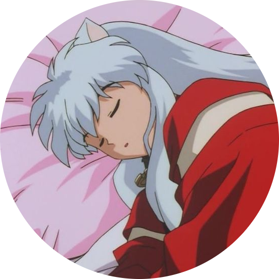

# Chat and Live Events Documentation

The Chat and Live Events system manages core communication features within the application, including messaging, notifications, game invitations, and real-time user presence. All of those systems are interconnected and handled in a live, real-time manner through [WebSocket](https://en.wikipedia.org/wiki/WebSocket) connection to the `/ws/events` endpoint, with the help of a handful HTTP endpoints.

Thanks to the WebSocket protocol, which is, unlike HTTP, a bidirectional protocol, the server can send the data to the target user by itself, without that user requesting it. It's the heart of the chat and live events system: It's what makes them "live".

## Table of contents

- [Features](#features)
  - [Chat](#chat)
    - [Real-time Messaging](#real-time-messaging)
    - [Social Networking Elements](#social-networking-elements)
    - [Adding or Removing Likes on a Message](#adding-or-removing-likes-on-a-message)
  - [Notifications](#notifications)
  - [Game Invitations](#game-invitation)
  - [User Presence System](#user-presence-system)
- [Implementation Details](#implementation-details)
  - [Backend](#backend)
    - [Core Models](#core-models)
    - [Event Groups](#event-groups)
    - [User Presence Internals](#user-presence-internals)
  - [Frontend](#frontend)
    - [Chat Components](#chat-components)
    - [Notifications Component](#notifications-components)
    - [Game Invitations Component](#game-invitations-components)
    - [User Presence System Components](#user-presence-system-components)
- [WebSocket Protocol Reference](#websocket-protocol-reference)
    - [Chat Events](#chat-events)
    - [Notification Events](#notification-events)
    - [Game Invitation Events](#game-invitation-events)
    - [User Presence System Events](#user-presence-system-events)
- [Testing](#testing)
- [Contributors](#contributors)

---

## Features

This section describes the features of the events system in high-level.

All the features in the chat and live events system works through `/ws/events/`. The way the system works is by exchanges of special messages via custom protocol (detailed specifications the protocol [are here](#websocket-protocol-reference)). Those special messages are called `action`s, and contain the type of event that happened and the context of this event.

### Chat

Users can send messages to to each other using convenient UI that is similar to the ones of Messenger, WhatsApp or Telegram. The core feature of the chat is real-time messaging, but besides that, chat has additional features for better user experience: it takes advantage of the [social features](./USER_MANAGEMENT.md#social-networking-elements) of the app, has a message-liking system, user search UI and visual indication for when the server was acknowledged by the server.

Chat feature uses a short list of HTTP endpoints. HTTP endpoints complement the WebSocket endpoint, which does most of the work, and are used for cases when there is no necessity for biderectional communication that WebSockets enable. For example, something like the initial load of chats and chat messages when one goes to the chat page is done through HTTP, but The rest of the logic is handled through [`/ws/events/` WebSocket endpoint](#chat-events). The list of HTTP endpoints:
- `GET /api/chats`: Fetches a paginated list of the user's chats. Used when the user visits the chat page.
- `PUT /api/chats/{username}`: Opens an existing chat or creates a new one with `username`.
- `GET /api/chats/{username}/messages`: Fetches a paginated list of user's messages with `username`.
- `GET /api/self`: See [User Management docs](./USER_MANAGEMENT.md#user-search-and-user-profiles).

<p align="center">
  <em>Start a new chat</em><br />
  
</p>

<p align="center">
  <em>Select an existing chat</em><br />
  
</p>

#### Real-time Messaging

The main feature of the chat is real-time messaging; when a user sends a message to a target user, user can start conversation through [profile page of the user](./USER_MANAGEMENT.md#user-search-and-user-profiles) they desire to message, through search bar on the chat page, or by finding an existing conversation in the chat UI.

Whenever user sends a message, the client sends it to the server via the [`new_message`](#protocol-new-message-client-server) action. For the sender, the message is considered to be "pending", and is grayed out until the the server confirms receipt.

<p align="center">
  
</p>

On success, the client updates the chat list by moving the conversation to the top and renders the messages in the chat messages area.

<p align="center">
  
</p>

Receiver gets [`new_message`](#protocol-new-message-server-client) action without receiver asking for it from their side, and the new message appears in the relevant chat. Unless the reciever is in the chat with the sender, they also receive a notification that informs them about a new unread message by putting a badge on the navbar chat icon.

<p align="center">
  
</p>

The message is considered read when it's displayed in the UI, and the client sends [`read_message`](#protocol-read-message) action to the server.

---
#### Social Networking Elements

[User blocking system](./USER_MANAGEMENT.md#social-networking-elements) is integrated into chat feature.   
When a user is blocked, all messaging between the two users is disabled, and the blocked user can no longer find the blocking user through [user search feature](./USER_MANAGEMENT.md#user-search-and-user-profiles).


<p align="center">
  <em>The current user is blocking the user "sad_hampter"</em><br />
  
</p>
<p align="center">
  <em>The current user is blocked by the user "pedro3"</em><br />
  
</p>

---
#### Adding or Removing Likes on a Message

A user can toggle a like on any received message by clicking on it.   
When a message is clicked, the client identifies the target message by its id attribute, then sends [`like_message`](#protocol-like-message-client-server) or [`unlike_message`](#protocol-unlike-message-client-server) action to the server.

The server then confirms the like to both participants with [`like_message`](#protocol-like-message-server-client) action, and UI is updated by displaying animated heart icon over the liked message.

<p align="center">
  
</p>

---
### Notifications

Notifications are things of interest that server sends to the user without user explicitely requesting for it. Users receive notifications when:
- Another user added them to their friend list: [`new_friend`](#protocol-new-friend) action. See [User Management docs](./USER_MANAGEMENT.md#social-networking-elements) for friend list.
- The user is invited to Pong Duel by another user: [`game_invite`](#protocol-game-invite-server-client) action. See [Game invitation section](#game-invitation).
- A new tournament has been created by another user: [`new_tournament`](#protocol-new-tournament) action. Notication system notifies users of new tournaments, but to see in details how the tournament system works, go to [Tournaments docs](./PONG.md#Tournaments).

When a notification arrives, the client displays a toast and adds an unread badge to the **Notifications** button in the Navbar.
Clicking the button fetches the data and displays a dropdown menu containing a list of notifications.

<p align="center">
  
</p>

Just like [chat](#chat), notifications feature uses only a handful of HTTP endpoints, the rest is handled by `/ws/events/` WebSocket endpoint. Those endpoints are:
- `GET /api/notifications/`: Fetches a paginated of notifications.
- `POST /api/notifications/mark_all_as_read`: Marks of user's notifications as read.
- `GET /api/self`: See [User Management docs](./USER_MANAGEMENT.md#user-search-and-user-profiles).

When user selects a notification item in the list, it has different effects depending on notification. Regardless of type, it will be considered read, and the client sends [`read_notification`](#protocol-read-notification) action to the server.

- If the notification type is [`new_friend`](#protocol-new-friend): Navigate to the new friend's profile page.   
  

- If the notification type is [`new_tournament`](#protocol-new-tournament): Navigate to the tournament page and open the registration form.   
  

User can also mark all unread notification as read by clicking **Mark all as read** button, which will tigger `POST /notifications/mark_all_as_read`.

---
### Game Invitations

🛠️👷🏻‍♂️ TODO: do proper links with the game part of the documentation when it's going to be ready.   
Since Peacemakers is a platform for playing pong, an invitation to play pong is an important feature. User can invite others to Pong Duel from either **[Chat page](#chat)** or **[Duel Menu page](./PONG.md#matchmaking)**.

<p align="center" id="game-invitation-settings">
  <em>Send invitation from Chat page</em><br />
  
</p>
<p align="center">
  <em>Send invitation from Duel Menu page</em><br />
  
</p>

When a user sends an invitation, clients sends a [`game_invitation`](#protocol-game-invite-client-server) to the server. If the user is not engaged in any game activity (like being in [matchmaking](./PONG.md#matchmaking), [tournament](#./PONG.md#tournaments), [playing a game](./PONG.md#pong-game) or has another pending invitation), an invitee receives a game invite with [`game_invite`](#protocol-game-invite-server-client) action from the server, and the invitee's client displays a notification toast.
Otherwise, the game invitation is cancelled, and the inviter receives [`game_invite_canceled`](#protocol-game-invite-canceled) action from the server.

The inviter is redirected to **Duel page** after sending the invitation. From there the inviter can cancel the invitation, and [`cancel_game_invite`](#protocol-cancel-game-invite) action will be sent to the server.

<p align="center">
  
</p>

The invitee can accept or decline the invitation from **Notification list** in Navbar selecting **Accept** or **Decline**, which will send [`reply_game_invite`](#protocol-reply-game-invite) action to the server.

<p align="center">
  
</p>

If invitation is accepted, both players will receive [`game_accepted`](#protocol-game-accepted) action, and will be redirected to [a newly created pong game](./PONG.md#pong-game).
Otherwise, the inviter is notified of the declination by [`game_declined`](#protocol-game-declined) action.

---
### User Presence System

Users can be online or offline. Each meaningful API request and WebSocket events in the last 30 minutes makes them online, which is going to be visible for anyone who sees them in [chat](#chat) or sees their [profile page](./USER_MANAGEMENT.md#user-search-and-user-profiles). Presence is denoted as a green or gray badge, depending on if they are online or offline respectively. When a user becomes online, all users receive [`user_online`](#protocol-user-online) action.

Users are checked periodically for their activity. Inactive users, users who disconnected from all devices or the ones who logged out explicitely, are considered to be offline, and all users receive [`user_offline`](#protocol-user-offline) action.

🛠️👷🏻‍♂️TODO: move cronjob documentation here.

<p align="center">
  
</p>

---
## Implementation Details
Every time an authenticated user connects to the application, WebSocket connection to `/ws/events/` is established, and stays opened for the remainder of the session. This connections is responsible for delivering real-time events, including chat messages, reactions, friend additions, game invitations, notifications, and presence updates.

The server and the client exchange messages (`action`s) with each other using [well-defined protocol](#websocket-protocol-reference).

### Backend

Backend side of the chat & events system is implemented with `chat` Django app (🛠️👷🏻‍♂️TODO: link to the high level explanation of the tech stack/overall backend overview). The app follows typical of the Django app structure, with some files differing due to being broken down from the core files in order not to bloat their size too much. Those files are:
- `chat_events.py`: contains `ChatEvents`, a class dedicated to handling [chat events](#chat-events).
- `duel_events.py`: contains `DuelEvents`, a class dedicated to handling [game invitation events](#game-invitation-events).
- `validator.py`: contains `Validator`, a class dedicated to validation of the user events: their sctructure, types, ranges. All live events go through this class.

Server of the project is able to handle WebSockets thanks to the Django Channels integration (🛠️👷🏻‍♂️TODO: link to the .md file that describes in high level the dependencies of the project). User events are governed by the `UserEventsConsumer`, which is responsible for handling and distributing different events for different groups. It uses [JWT authentication](./USER_MANAGEMENT.md#jwt-authentication) to identify and autorize users, like the rest of the consumers in the project.

---
#### Core Models

Information about chats, messages, notifications and invites is stored in the database. There are four main models in chat & events system: `Chat`, `ChatMessage`, `Notification` and `GameInvite`.

- `Chat`: Represents a chat session. This model itself supports multiple participants, but in the current app implementation, only one-to-one chats are used. All messages exchanged in the chat are associated with it via the `ChatMessage` model. Key fields include `id`, and `participants`.

- `ChatMessage`: Represents a single message sent within a chat. It tracks the sender, the content, and the read and like status. Key fields include `id`, `content`, `date`, `sender`, `chat`, `is_read`, and `is_liked`.

- `Notification`: Manages an event notification sent to a user. Notifications have different types: new messages, game invitations, new tournaments announcement, or friend additions. Key fields include `id`, `receiver`, `action`, `data` (`action` and `data` roughly correspond to the [WebSocket events](#websocket-protocol-reference)) and `is_read`.
  Each notification stores arbitrary JSON data related to the event:
  - `GAME_INVITE`: Information about the game invitation, such as `game_id`, `status`, and `invitee` information.
  - `NEW_TOURNAMENT` Details of the tournament, including `tournament_id`, `tournament_name`, and  current `status`.
  - `NEW_FRIEND`: Includes sender's profile information to identify the new friend.

- `GameInvitation`: Represents a game invitation from one user to another. It tracks sender, recipient, optional invitee for special cases, status, and game settings. Key fields include `id`, `sender`, `invitee`, `recipient`, `status` (can be `pending`, `accepted`, `declined`, `cancelled`), and `settings` (settings for the game the inviter wish to play).

---
#### Event Groups

With Django Channels (🛠️👷🏻‍♂️TODO: send link to how Django Channels are used in our project and with Redis) one may want to associate certain actions with certain group of users. For example, when one use messages to another, it's undesirable to broadcast this event to every single user. Only those two users should receive relevant messages.
Once user is authenticated, they are subscribed to several channel groups that define the scope of events it will receive:

- `user_{id}`: user-scoped events such as notifications, game invitations or friend updates. This is a personal group that contains only one specific user.
- `chat_{uuid}`: one-to-one chat messages between participants. This group contains two people: the chat participants.
- `online_users`: global presence broadcasts. This group is global and contains every user who is currently online.

Once user establishes connection to `/ws/events/`, they are subscribed to all relevant groups, which includes one `user_{id}`, one `online_users` and many `chat_{uuid}` (one group per chat).

---
#### User Presence Internals

User presence feature is implemented through a container with [`cron`](https://en.wikipedia.org/wiki/Cron), which is configured to call to `DELETE /api/cronjob/cron/check-inactive-users` endpoint every minute, using `check_inactive_users.py` script. This endpoint is implemented in [`users` app](./USER_MANAGEMENT.md#presence-system).

This endpoint uses its own alternative authentication method, separated from the rest of the authentication within the application. Callers to the endpoint should have the correct header: `Bearer: <CRON_SECRET>`, where `CRON_SECRET` is an environment variable provided to the container during the build stage, otherwise they will be rejected with `401` status code. This is done for security reasons; only the `cronjob` container should be able to call the endpoint.

(🛠️👷🏻‍♂️TODO: add a link to infrastructure file that describes our containers and environment)

---
### Frontend

The frontend is composed of modular components that work to provide real-time chat, notifications, game invitations, and presence updates across the application.

#### Chat Components

The chat feature is structured around a central `Chat` component that coordinates several supporting components. Together, they provide user search, conversation management, real-time messaging, and game invitations.

##### `Chat`:   

The `Chat` component is the entry point of the chat interface containing the list of conversations (`ChatList`), the message area (`ChatMessageArea`) and the game invitation form modal (`InviteGameModal`).   
It initializes the chat  by fetching the data from the server, determines which conversation to display in the message area, and updates dynamically when new messages arrive or when the user blocks/unblocks others.   
The layout adapts seamlessly to different screen sizes to ensure a consistent experience across devices.

##### `ChatList`:   

Displays the user’s conversations, including the last message information, unread message counts and online status indicators. When a conversation is selected, its messages are loaded into the message area.
It also provides a search function, allowing the user to find existing conversations or start new ones.

##### `ChatMessageArea`:  

Manages the content of a conversation by displaying messages, user information, and interaction options such as navigating to the profile page, inviting to a Pong Duel, blocking/unblocking the user.   
This component is a scrollable container that shows messages in chronological order. When a new message arrives, it is loaded dynamically and the view scrolls to the bottom. The messages are considered read once the user scrolls through them.

##### `InviteGameModal`:  
See [Game invitations components section](#game-invitations-components)

---

#### Notifications Components

The notifications feature revolves around a notification button (`NotificationButton`) in the Navbar that toggles the visibility of the notification list (`NotificationsList`). They provide real-time updates, and actions for different types of notifications.

##### `NotificationButton`:

Serves as the entry point to the notification system, showing an unread badge when the user has unread notifications. Clicking the button reveals the notification list.


##### `NotificationsList`:  

Displays notifications in a scrollable container and loads additional items are when the user scrolls, providing a seamless infinite-scroll experience.   
This list supports switching between **All** and **Unread** tabs, updating the content based on the selected tab. Users can also mark all notifications as read with a single action, which updates both the UI and the server state.

##### `NotificationListItem`

Represents a single notification and adapts its content and actions depending on its type (new friend, game invitation, or new tournament).   
**New friend** notifications link to the friend's profile, **game invitations** allow the user to accept or decline, and **new tournament** notifications include a link to navigate to registration. 

##### `Notification Toast`:  

Provides brief pop-ups for newly received notifications, giving immediate feedback even if the notification list dropdown is closed.

---

#### Game Invitations Components

Two components are available for selecting game options and sending invitations:
- On the `Chat` page, by opening the `InviteGameModal`
- On the `DuelMenu` page where the invitation form is embedded directly in the interface

After sending an invitation, the inviter is redirected to the `Duel` page, which shows the opponent's information and updates dynamically once the invitee responds. For the invitee, accepting the invitation from the notification list triggers a redirection to the `Duel` page.   
If the invitation is accepted and the server confirms the creation of a game room, a countdown starts on both clients, then both are redirected to the game. Otherwise, the UI of the inviter shows the invitation declination.

---

#### User Presence System Components

The real-time presence system keeps users informed about the online status of other users across the UI. Status indicators update dynamically whenever a user comes online or goes offline.

**Online status indicators** appear in the following components to reflect users’ current presence:
- `Profile` (updates in real time)
- `UserSearch` in Navbar
- `ChatListItem` (updates in real time)
- `ChatMessageArea` (updates in real time)
- `ChatUserSearch`
- User search results in `DuelMenu`

Each indicator updates in real time, ensuring consistent status information wherever users interact.

<br />

## WebSocket Protocol Reference

All data exchanges betwen the server and the client use JSON messages that conform to this format:

```json
{
  "action":"<action name>",
  "data":{
    "<data content>"
  }
}
```

- `action`: what kind of event it is (new message, notification, presence update etc). `action` is always a simple string.
- `data`: context to the this event (who sent the message, what kind of notification is this, which exactly user went online etc). `data` may contain an arbitrary amount of fields of any types. Exact schema of `data` depends on the `action`.

### Chat Events

CLIENT --> SERVER

<a id="protocol-new-message-client-server"></a>
- `new_message`
  | Data field  | Type     | Description                           |
  |:------------|:---------|:------------------------------------- |
  | `chat_id`   | `string` | id of the chat room                   |
  | `content`   | `string` | message content                       |
  | `timestamp` | `string` | Timestamp indicating when it was sent |

<br />

<a id="protocol-like-message-client-server"></a>
- `like_message`
  | Data field | Type      | Description             |
  |:-----------|:----------|:------------------------|
  | `chat_id`  | `string`  | id of the chat room     |
  | `id`       | `string`  | id of the liked message |

<br />

<a id="protocol-unlike-message-client-server"></a>
- `unlike_message`

  | Data field | Type      | Description                |
  |:-----------|:----------|:---------------------------|
  | `chat_id`  | `string`  | id of the chat room        |
  | `id`       | `string`  | id of the un-liked message |

<br />

<a id="protocol-read-message"></a>
- `read_message`

  | Data field | Type      | Description            |
  |:-----------|:----------|:-----------------------|
  | `chat_id`  | `string`  | id of the chat room    |
  | `id`       | `string`  | id of the read message |

<br />

SERVER --> CLIENT

<a id="protocol-new-message-server-client"></a>
- `new_message`

  | Data field | Type       | Description                           |
  |:-----------|:-----------|:------------------------------------- |
  | `chat_id`  | `string`   | id of the chat room                   |
  | `id`       | `string`   | id of the message                     |
  | `content`  | `string`   | message content                       |
  | `date`     | `datetime` | date and time the message was sent    |
  | `sender`   | `string`   | username of the sender                |
  | `timestamp`| `string`   | Timestamp indicating when it was sent | 

<br />

<a id="protocol-like-message-server-client"></a>
- `like_message`

  | Data field  | Type       | Description                              |
  |:------------|:-----------|:---------------------------------------- |
  | `chat_id`   | `string`   | id of the chat room                      |
  | `id`        | `string`   | id of the message                        |
  | `is_liked`  | `boolean`  | true if the message is liked, else false |

---

### Notification Events

CLIENT --> SERVER

<a id="protocol-read-notification"></a>
- `read_notification`

  | Data field | Type     | Description            |
  |:-----------|:---------|:-----------------------|
  | `id`       | `string` | id of the notification |

<br />

SERVER --> CLIENT

<a id="protocol-new-friend"></a>
- `new_friend`

  | Data field  | Type       | Description                                            |
  |:------------|:-----------|:------------------------------------------------------ |
  | `username`  | `string`   | username of the user who added the receiver as friend  |
  | `nickname`  | `string`   | nickname of the user who added the receiver as friend  |

<br />

<a id="protocol-new-tournament"></a>
- `new_tournament`

  | Data field        | Type       | Description                            |
  |:------------------|:-----------|:---------------------------------------|
  | `tournament_id`   | `string`   | id of the new tournament               |
  | `tournament_name` | `string`   | name of the new tournament             |
  | `creator`         | `string`   | alias of the creator of the tournament |

<br />

---

### Game Invitation Events

CLIENT --> SERVER

<a id="protocol-game-invite-client-server"></a>
- `game_invite`
  | Data field  | Type     | Description                                                                       |
  |:------------|:---------|:--------------------------------------------------------------------------------- |
  | `username`  | `string` | username of the invitee                                                           |
  | `options`   | `json`   | game options selected by the inviter                                              |
  | `client_id` | `string` | id of the websocket instance of the browser tab from which the invitation is sent |

  **Example of `options` JSON:**
  ```json
  {
    "score_to_win": 10,
    "game_speed": "slow",
    "ranked": true,
    "time_limit": 3,
    "cool_mode": false
  }
  ```
<br />

<a id="protocol-reply-game-invite"></a>
- `reply_game_invite`

  | Data field  | Type      | Description.                        |
  |:------------|:----------|:------------------------------------|
  | `username`  | `string`  | username of the inviter             |
  | `accept`    | `boolean` | true if accepted, false if declined |

<br />

<a id="protocol-cancel-game-invite"></a>
- `cancel_game_invite`

  | Data field  | Type     | Description             |
  |:------------|:---------|:------------------------|
  | `username`  | `string` | username of the invitee |

<br />

SERVER --> CLIENT

<a id="protocol-game-invite-server-client"></a>
- `game_invite`

  | Data field | Type       | Description               |
  |:-----------|:-----------|:--------------------------|
  | `username` | `string`   | username of the inviter   |
  | `nickname` | `string`   | nickname of the inviter   |
  | `avatar`   | `string`   | avatar url of the inviter |

<br />

<a id="protocol-game-accepted"></a>
- `game_accepted`

  | Data field | Type       | Description.                      |
  |:-----------|:-----------|:----------------------------------|
  | `game_id`  | `string`   | id of the game room for this duel |
  | `username` | `string`   | username of the invitee           |
  | `nickname` | `string`   | nickname of the invitee           |
  | `avatar`   | `string`   | avatar url of the invitee         |

<br />

<a id="protocol-game-declined"></a>
- `game_declined`

  | Data field | Type       | Description.                      |
  |:-----------|:-----------|:----------------------------------|
  | `username` | `string`   | username of the invitee           |
  | `nickname` | `string`   | nickname of the invitee           |

<br />

<a id="protocol-game-invite-canceled"></a>
- `game_invite_canceled`

  | Data field  | Type               | Description                                  |
  |:------------|:-------------------|:---------------------------------------------|
  | `username`  | `string` \| `null` | username of the inviter                      |
  | `nickname`  | `string` \| `null` | nickname of the inviter                      |
  | `message`   | `string` \| `null` | reason why the server cancels the invitation |
  | `client_id` | `string`           | id of the websocket instance of the browser tab from which the invitation is sent |

<br />

### User Presence System Events

SERVER --> CLIENT

<a id="protocol-user-online"></a>
- `user_online`
  | Data field  | Type     | Description                                      |
  |:------------|:---------|:-------------------------------------------------|
  | `username`  | `string` | username of the user whose status becomes online |

<br />

<a id="protocol-user-offline"></a>
- `user_offline`
  | Data field  | Type     | Description                                       |
  |:------------|:---------|:--------------------------------------------------|
  | `username`  | `string` | username of the user whose status becomes offline |

<br />

## Testing

`make tests-chat` will initialize the tests related to the chat and live events system.

## Contributors

<table>
  <tr>
    <td align="center" style="padding: 8px; vertical-align: middle;">
      <a href="https://github.com/emuminov" style="text-decoration: none;">
        <br />
        <p>emuminov</p>
      </a>
    </td>
    <td style="padding-left: 16px; vertical-align: middle;">
      Chat HTTP API
    </td>
  </tr>

  <tr>
    <td align="center" style="padding: 8px; vertical-align: middle;">
      <a href="https://github.com/melobern" style="text-decoration: none;">
        <br />
        <p>melobern</p>
      </a>
    </td>
    <td style="padding-left: 16px; vertical-align: middle;">
      Chat HTTP API, WebSocket chat layer
    </td>
  </tr>

  <tr>
    <td align="center" style="padding: 8px; vertical-align: middle;">
      <a href="https://github.com/ysengoku" style="text-decoration: none;">
        <br />
        <p>ysengoku</p>
      </a>
    </td>
    <td style="padding-left: 16px; vertical-align: middle;">
      Chat UI design, frontend development
    </td>
  </tr>
</table>

---
<br />

Authored by: [emuminov](https://github.com/emuminov) and [ysengoku](https://github.com/ysengoku)
