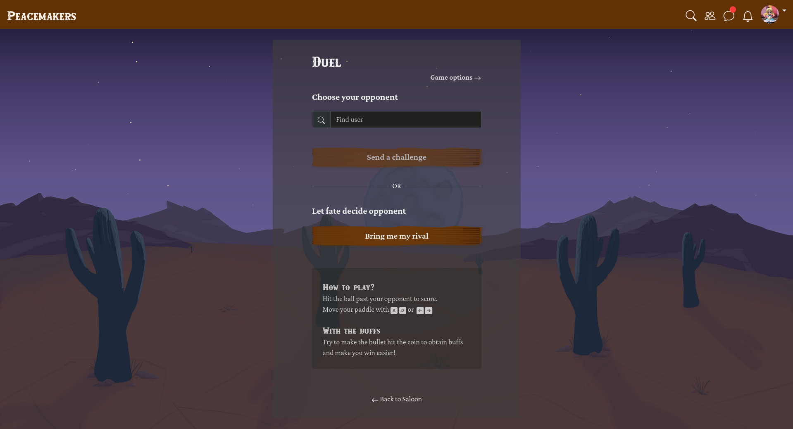
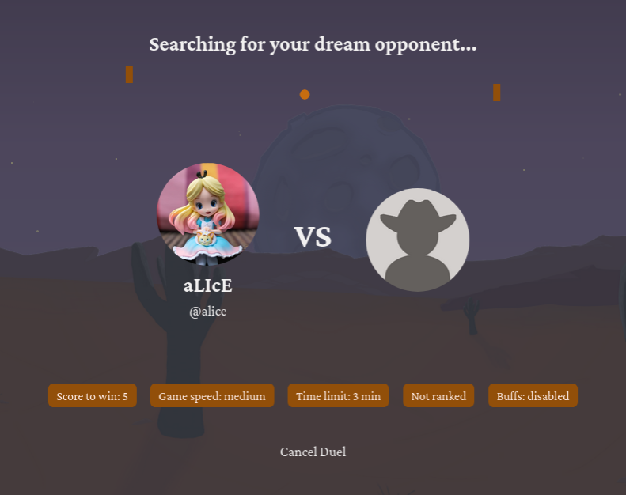
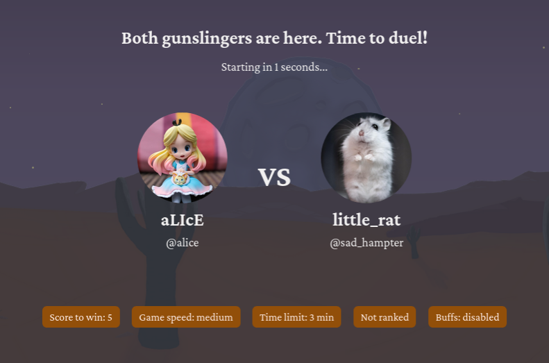
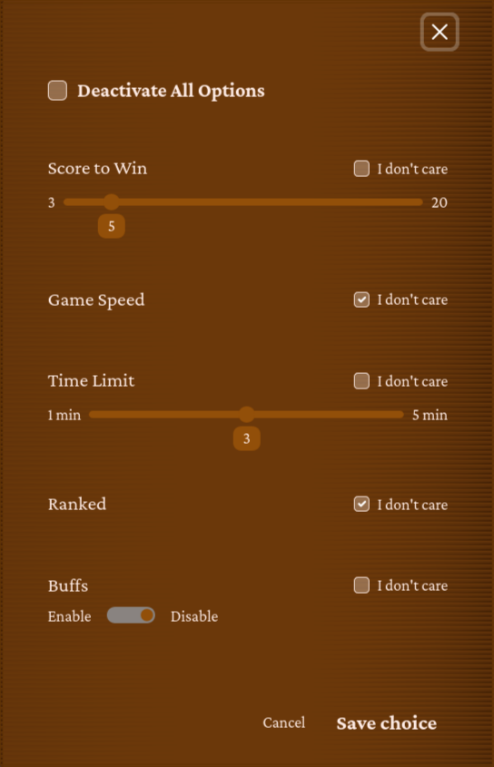
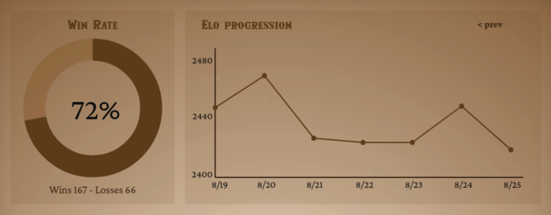
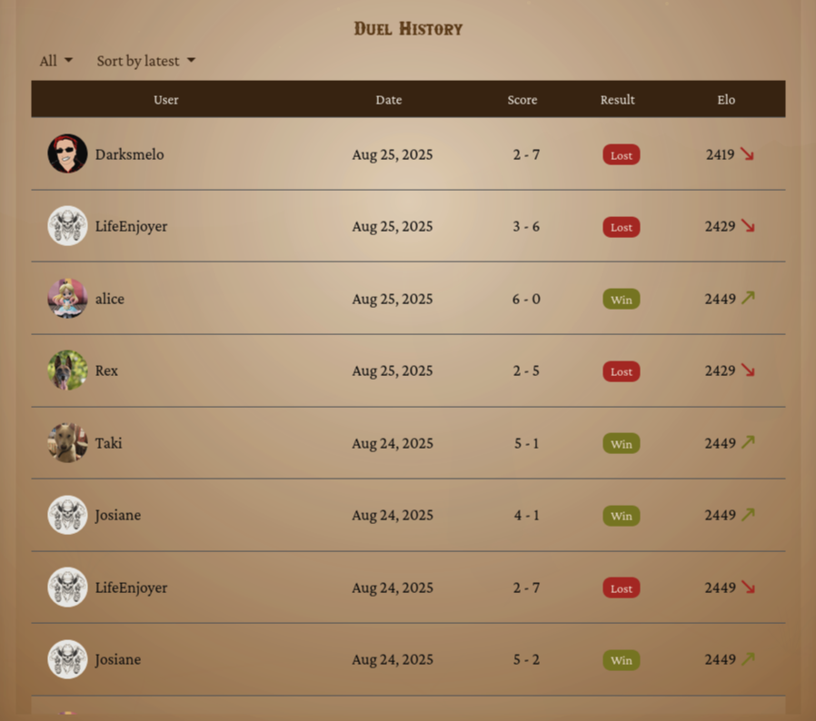

# Pong Game Documentation

The main attraction of the whole project is [the pong game](https://en.wikipedia.org/wiki/Pong). **Peacemakers** is a project built around it: it's a platform for playing pong after all. The project supports the ability to play the game locally, against another player or a computer opponent, but mostly the project was built around playing pong remotely via multiplayer.   

Besides duels, which are single, self-contained matches, the project also offers a **tournament system**, extending this feature into a series of competitive rounds. The tournament management system is explained in [this document](./TOURNAMENT.md).

## Table of contents
- [Features](#features)
  - [Pong Game](#pong-game)
  - [Game Settings](#game-settings)
  - [Matchmaking](#matchmaking)
  - [Match History & Elo System](#match-history-elo-system)
  - [Additional Gameplay Features](#additional-gameplay-features)
- [Implementation Details](#implementation-details)
  - [Backend](#backend)
    - [Core Models](#core-models)
    - [Details of Matchmaking](#details-of-matchmaking)
    - [Details of Tournaments](#details-of-tournaments)
  - [Frontend](#frontend)
- [WebSocket Protocol Reference](#websocket-protocol-reference)
  - [Mathcmaking Actions](#matchmaking-events)
  - [Pong Actions](#pong-events)
- [Testing](#testing)
- [Contributors](#contributors)

---

## Features

### Pong Game

The heart of the **Peacemakers** platform is [the legendary Pong game](https://en.wikipedia.org/wiki/Pong) itself. Our version differs in couple of major ways: it is [customizable](#game-settings), features [additional gameplay features](#additional-gameplay-features) and while it is available from the browser, it is rendered in 3D, using rich hand-crafted 3D models [sculpted with Blender](https://en.wikipedia.org/wiki/Blender_(software)) by our lead game designer/game developer. (TODO: link to Celia's profile). 

(TODO: screennshots of the game)

(TODO: screenshots of models made in blender)

We use advanced techniques to make 3D rendering of the Pong more efficient:
- Frustum culling to conditionally render only models that are visible to the camera.
- We compress our models assets for efficiency, and use KTX2 loader to load these compressed models.
- We avoid rerendering static objects by implementing new functions to the basic Three.js loader.

---
### Computer Opponent
**Peacemakers: Ponggers Edition** supports playing against another opponent locally, but also, against an AI opponent. The AI was designed to have dynamic difficulty based on the player's skill. It's an algorithmic AI (as opposed to deep learning AI) made with player's fun in mind: it's dynamically reacting to [buffs and debuffs](#additional-gameplay-features), and adjusts its own behaviour based on the gap between the player and itself. So, for example, if the player struggles against the *computer opponent*, it shifts its difficulty to be more forgiving. The opposite is true as well: skilled players might find themselves challenged by AI.

AI uses multiple parameters to determine its own behaviour against the player, in order to push the player to their limit without being impossible to beat. Like every other gameplay mode in the **Peacemakeers: Ponggers Edition**, the matches against the machine can use [game settings](#game-settings) for precise adjustment of the player experience, and the AI opponent uses game settings fully to its advantage.

---
### Game Settings

Different users have different tastes, and the **Peacemakers** platform allows them to tune their game settings to make the game as accessible or as challenging as player desires.
Users can specify game settings through [Duel Menu page](matchmaking-game-settings), [game invitations modal](./CHAT_AND_LIVE_EVENTS.md#game-invitation-settings) or tournament creation page (TODO: add a link to the tournaments page).

- Game speed: affects the speed of the ball and paddles. Can be fast, medium or slow.
- Score to win: the match is won by the player who will reach this score first. Ranges from 3 to 20.
- Time limit: matches can last maximum this long. Ranges from 1 to 5 minutes.
- Ranked: whether to enable the [elo system](#match-history-elo-system). Can be enabled or disabled.
- Buffs, also known as the **Cool mode**: whether to enable the [additional gameplay features](#additional-gameplay-features). Can be enabled or disabled.

Game settings influence not just the flow of the pong match itself, but also which players are going to be matched in the [matchmaking system](#matchmaking).

---
### Matchmaking

Players can [invite people they know to play pong](./CHAT_AND_LIVE_EVENTS.md#game-invitations), but **Peacemakers** also provides the ability to play with willing strangers.
Matchmaking is the main mechanism through which players find pong games. It's accessed through the duel menu page. On this page, the player can choose the [game settings](#game-settings) they wish to have in their pong match.

  <em>Duel Page</em> 
  

Matchmaking is accessed through `/ws/matchmaking/` endpoint. The endpoint establishes the connection between the client and the server, and the connection stays open until server finds a suitable opponent. It shows the settings that were chosen by the user.

  <em>Ongoing Matchmaking</em> 
  

At this point user can cancel the search, and the client will send [`cancel`](protocol-matchmaking-cancel-client-server) action to the server, and the user would be able to exit this page.
If the opponent was found, however, the server will send [`game_found`](protocol-matchmaking-game-found-server-client) action to the client, and both players are going to be redirected to the pong game.

  <em>Matchmaking Found An Opponent</em> 
  

When the server tries to match players, it doesn't look at the [elo](#match-history-elo-system), but it takes into account the [game settings](#game-settings) both players have chosen when they entered into the matchmaking search. Players are not matched if their settings conflict with each other: for example, if one player desires to have a `slow` game, they won't be matched against a player who wants to have a `fast` game. However, both players will be able to match against someone who doesn't care about the game speed.

Players can specify that they don't care about certain settings in the settings menu. If a player doesn't care about the game speed, they will be able to match against a player with any game speed setting.

  <em>Game Settings in Matchmaking</em> 
  

In matchmaking, game settings are specified via URL parameters to the `/ws/matchmaking/`.

### Match History & Elo System
The result of each match gets recorded to the database for user's statistics. Each match may result either in win or loss for a player, and also, depending on the [game settings](#game-settings), *elo* gain or loss.

[Elo rating system](https://en.wikipedia.org/wiki/Elo_rating_system) is a method to calculate relative skill of players. It's a number that starts with `1000` and has the minimum of `100` and maximum of `3000`.

Elo can be gain or lost only in [`ranked` games](#game-settings). In those games, winner gains elo and loser loses elo. The amount of elo gained/lost is the same and depends on the rank of playing participants, using the elo formula.

Match history and elo are used to [display statistics on the user's page](./USER_MANAGEMENT.md#user-search-and-user-profiles) as elo progression graph and sortable duel history dashboard.

  <em>Game Settings in Matchmaking</em> 
  

  <em>Game Settings in Matchmaking</em> 
  

This feature uses following HTTP endpoints:
- `GET /api/game-stats/{username}/daily-elo`: Retrieves paginated list of statistics of a given user over time.
- `GET /api/game-stats/{username}/matches`: Retrieves paginated list of played matches of a given user.
- `GET /api/game-stats/matches/{game_id}`: Gets stats of one specific match.

### Additional Gameplay Features

## Implementation Details

### Backend

#### Core Models

#### Details of Matchmaking

#### Details of Tournaments

Tournament handling is a complex system that can function independently of the main pong game, as it can serve any kind of games. It's a very modular system in that sense. Hence it's implemented as a separate `tournaments` app.

### Frontend

## WebSocket Protocol Reference

### Settings

### Mathcmaking Actions

CLIENT --> SERVER

- `cancel`
*This action has no additional data.*

SERVER --> CLIENT

- `game_found`

  | Data field      | Type     | Description                           |
  |:----------------|:---------|:--------------------------------------|
  | `game_room_id`  | `string` | id of the game room                   |
  | `username`      | `string` | username of the opponent              |
  | `nickname`      | `string` | nickname of the opponent              |
  | `avatar`        | `string` | avatar URL of the opponent            |
  | `elo`           | `number` | elo rating of the opponent            |

### Pong Actions
TODO: write them after they are going to be consolidated with Celia
