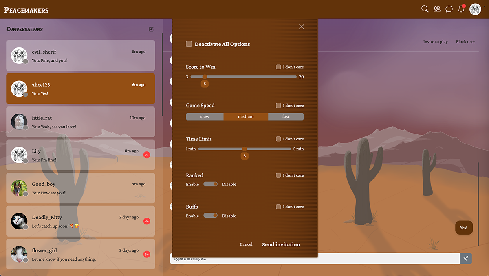

# Pong Game Documentation

The main attraction of the whole project is [the pong game](https://en.wikipedia.org/wiki/Pong). **Peacemakers** is a project built around it: it's a platform for playing pong after all. The project supports the ability to play the game locally, against another player or a computer opponent, but mostly the project was built around playing pong remotely via multiplayer.

## Table of contents
- [Features](#features)
  - [Pong Game](#pong-game)
  - [Matchmaking](#matchmaking)
  - [Tournaments](#tournaments)
  - [3D Graphics](#3d-graphics)
  - [Game Settings](#game-settings)
  - [Additional Gameplay Features](#additional-gameplay-features)
- [Implementation Details](#implementation-details)
  - [Backend](#backend)
    - [Core Models](#core-models)
    - [Details of Matchmaking](#details-of-matchmaking)
    - [Details of Tournaments](#details-of-tournaments)
  - [Frontend](#frontend)
- [WebSocket Protocol Reference](#websocket-protocol-reference)
  - [Mathcmaking Actions](#matchmaking-events)
  - [Tournament Actions](#tournament-events)
  - [Pong Actions](#pong-events)
- [Testing](#testing)
- [Contributors](#contributors)

---

## Features

### Pong Game

### Matchmaking

  <em>Send invitation from Chat page</em> 
  

### Tournaments

### 3D Graphics

The first thing that catches a visitor's attention after starting a pong match is the fact that the game is made with 3D technologies, using Three.js (TODO: link to the main docs describing our stack). The game itself is rendered on the canvas, while the game UI is done with plain HTML/CSS and JavaScript.

The game features rich hand-crafted 3D models [sculpted with Blender](https://en.wikipedia.org/wiki/Blender_(software)) by our lead game designer/game developer (TODO: link to Celia's profile). 

(TODO: screenshots of models made in blender/screenshots of game)

### Game Settings

### Additional Gameplay Features

## Implementation Details

### Backend

#### Core Models

#### Details of Matchmaking

#### Details of Tournaments

Tournament handling is a complex system that can function independently of the main pong game, as it can serve any kind of games. It's a very modular system in that sense. Hence it's implemented as a separate `tournaments` app.

### Frontend

## WebSocket Protocol Reference

### Mathcmaking Actions

### Tournament Actions

### Pong Actions
TODO: write them after they are going to be consolidated with Celia
