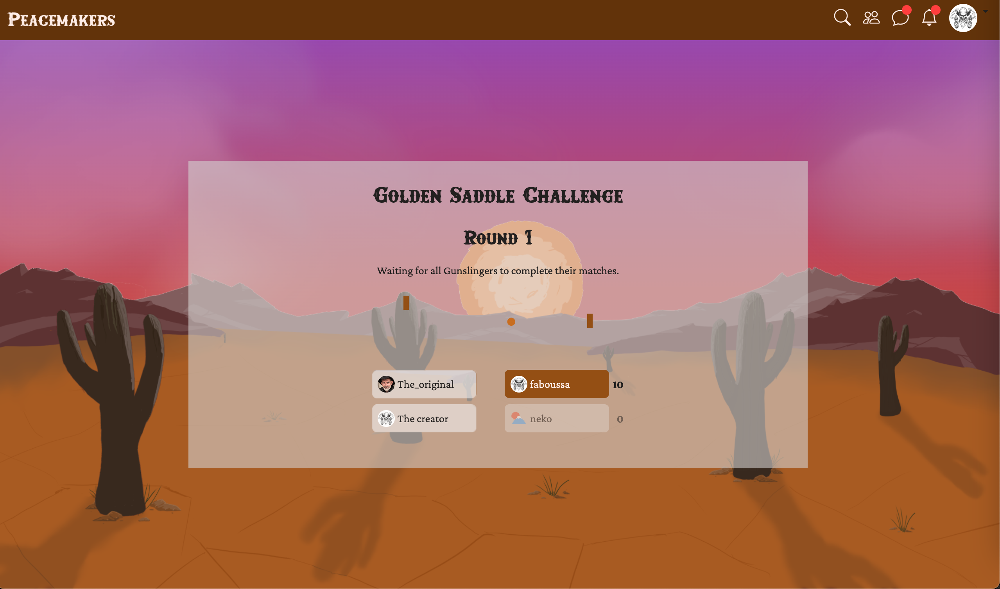
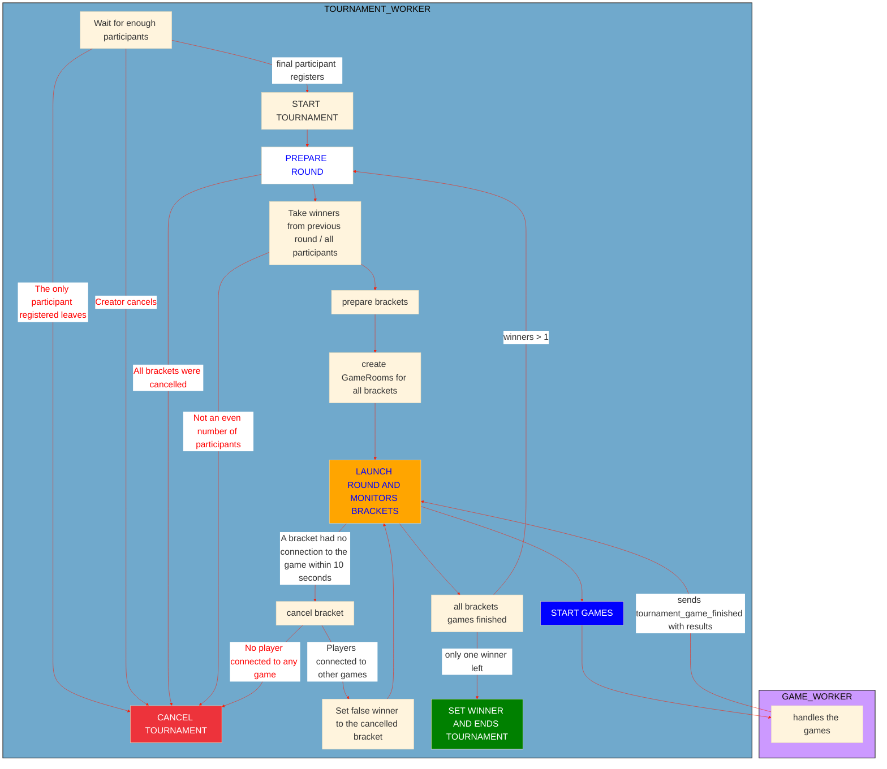
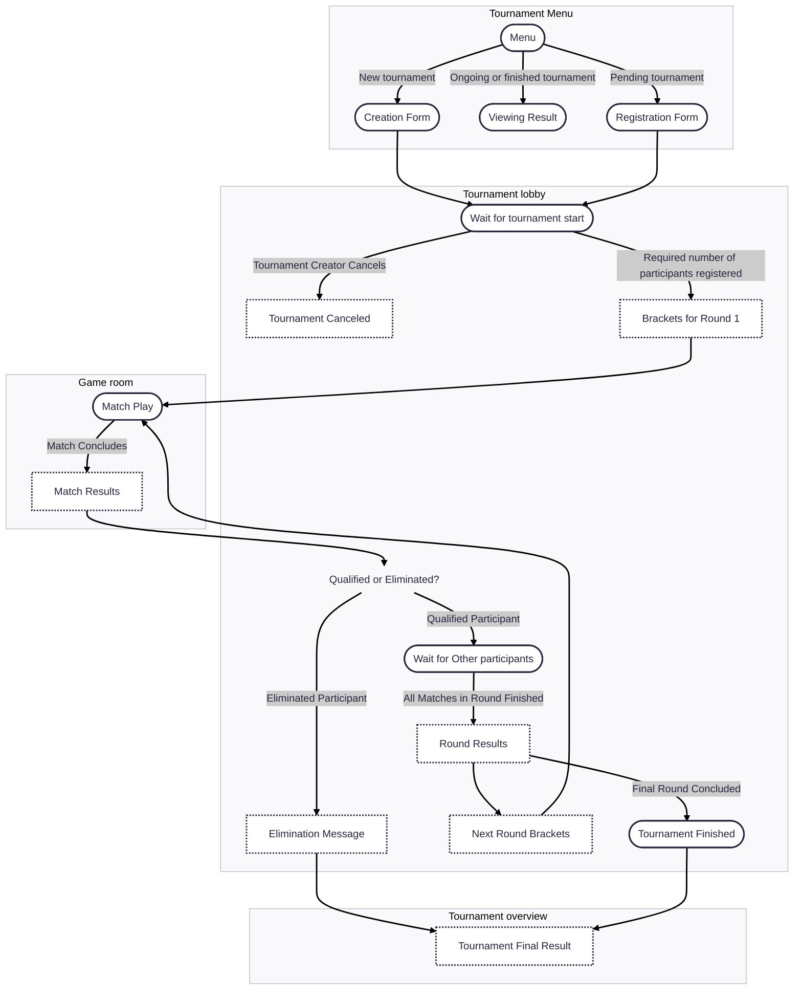

# Tournament System Documentation

The Tournament app handles the full lifecycle of tournaments, from creation and registration to real-time match updates and result reporting. It integrates with Django Channels for live interactions and provides both REST and WebSocket APIs.

## Table of contents

- [Features](#features)
  - [Tournament Creation and Registration](#tournament-creation-and-registration)
  - [Tournament Progress Management](#tournament-progress-management)
  - [Tournament Result Viewing]()
- [Implementation Details](#implementation-details)
  - [Backend](#backend)
    - [Core Models](#core-models) ✅
    - [Trounament Worker](#tournament-worker)
    - [Channel Groups](#channel-groups)
  - [Frontend](#frontend)
    - [Tournament Menu Page Components](#tournament-menu-page-components)
    - [Tournament Page Components](#tournament-page-components)
    - [Tournament Over View Components](#tournament-overview-page-components)
    - [UI Flow during Tournament](#ui-flow-during-tournament)
- [WebSocket Protocol Reference](#websocket-protocol-reference) ✅
- [Contributors](#contributors) ✅

<br/>

## Features
🛠️👷🏻‍♂️ ON WORKING
### Tournament Creation and Registration

Users can view available tournaments on the tournament menu page (`/tournament-menu`). It serves as the entry point for browsing, joining or creating tournaments. Each action is handled via the API endpoints and reflected in the UI.   

The tournament list displays all tournaments in reverse chronological order.  
By default, it shows tournaments **open for entries (pending)**, with an optional filter to include **ongoing** and **finished** ones.

- `GET /api/tournaments/`: List all tournaments (optional `status` filter: `pending`, `ongoing`, `finished`).  

<p align="center">
  
</p>

Users can create a new tournament by specifying its **name**, **required participants**, and **game settings**.  
The creator is automatically registered as a participant.  

Pending tournaments can be canceled by their creator.

- `POST /api/tournaments/`: Create a new tournament.  
- `DELETE /api/tournaments/{id}`: Cancel a pending tournament (creator only).  

<p align="center">
  
</p>

Users can join a tournament by registering with a unique alias.  
Registration can be canceled before the tournament starts.

- `POST /api/tournaments/{id}/register`: Register with alias.  
- `DELETE /api/tournaments/{id}/unregister`: Unregister (pending only).  

For ongoing or finished tournaments, users can view results from the menu.  
A summary is displayed in a modal, with a link to the [Tournament Overview](#tournament-overview-page) for details.

<p align="center">
  
</p>

### Tournament Progress Management

<p align="center">

</p>

### Tournament Result Viewing

- `GET /api/tournaments/{id}`:  Retrieve specific tournament 

<p align="center">
  
</p>

<p align="center">
  
</p>

<br/>

🛠️👷🏻‍♂️🛠️👷🏻‍♂️   
The Tournament WebSocket (`/ws/tournament/{id}`) handles real-time updates related to tournament lifecycle, user registrations, and round progress.
This socket is opened when a user subscribes to a tournament and remains active until the elimination or the tournament ends.

Validation, Security & Integrity   
**REST/WS input validation**: required fields, types, valid status, alias uniqueness, users per tournament (4 or 8).   
**Registration constraints**: can't register if already participating or in a game.   
**Database protection**: atomic transactions during (un)registration, avoids duplicates/race conditions.   
🛠️👷🏻‍♂️🛠️👷🏻‍♂️


## Implementation Details

###  Backend

🛠️👷🏻‍♂️ TODO: Add text

#### Core Models

The tournament system is built around four core models: `Tournament`, `Round`, `Bracket`, and `Participant`. Each model captures a different aspect of organizing and running a tournament.

- `Tournament`: Encapsulates the overall tournament, including its configuration, required participants, and current progress. It manages which users have joined, tracks the winner, and coordinates the sequence of rounds.   
 Key fields include `id`, `name`, `date`, `status` (current state: pending, ongoing, finished, cancelled), `required_participants`, `creator` (Foreign key to [`Profile`](./USER_MANAGEMENT.md#core-models)), winner (ForeignKey to `Participant` or `null`), and `settings`.

- `Round`: Represents a single stage of the tournament, grouping multiple matches. It tracks the progress of each match and determines when the round is complete, serving as a bridge between the tournament and its individual matches.   
  Key fields include `number`, `status`, `tournament` (ForeignKey to `Tournament`), and `brackets` (list of `Bracket` instances).

- `Bracket`: Represents a single match between two participants. It tracks the outcome of the game, records scores, and links to the actual game session when it has started.   
  Key fields include `participant1` and `participant2` (ForeignKey to `Participant`), `winner` (ForeignKey to `Participant` or `null`), `winners_score`, `losers_score`, `status`, and `game_room` (OneToOneField to `GameRoom` or `null`).

- `Participant`: It stores the participant's identity, alias, status within the tournament, progress through rounds, and whether they are still eligible to compete. This model connects users to tournaments and matches.   
  Key fields include `profile` (ForeignKey to [`Profile`](./USER_MANAGEMENT.md#core-models)), `alias`, `tournament` (ForeignKey to `Tournament`), `status` (pending, playing, qualified, eliminated, winner), `current_round`, and `excluded`.

<br/>

#### Tournament Worker

The diagram below illustrates the internal workflow of the Tournament and Game backend workers, showing how tournaments progress from registration to completion, including all possible cancellation paths.


<br/>

#### Channel Groups
🛠️👷🏻‍♂️ TODO
  - Clients connect per tournament, identified via `tournament_{uuid}` group.
  - Private tournament events (defeat, kick...) use `tournament_user_{id}` group.
  - New tournaments announced site-wide by `tournament_global`.

  - `tournament_{uuid}`: all tournament participants.
  - `tournament_user_{id}`: individual user events (connection, defeat, exclusion).
  - `tournament_global`: broadcast site-wide tournament creation.

<br/>

### Frontend
🛠️👷🏻‍♂️ TODO
This document outlines the user interface flow for tournament-related features, from creation and registration to participation and result viewing.

- [Tournament Menu (`/tournament-menu`)](#tournament-menu-page): The central hub for tournament creation, registration, and browsing.
- [Tournament Lobby (`/tournament-room/:id`)](#tournament-lobby-page): Real-time progress and status view for tournament participants.
- [Tournament Overview (`/tournament-overview/:id`)](#tournament-lobby-page): Detailed results view for ongoing or finished tournaments.


#### Tournament Menu Page Components

The Tournament Menu serves as the central hub for all tournament activities.

##### Creating a new tournament

Users can initiate the creation of a new tournament by clicking on a "Create Tournament" button. This action opens the Tournament Creation Form.

##### Tournament list

The Tournament List shows tournaments (by default, `Open for entries`(pending)) in a scrollable view. A filter allows switching to `All` to include Ongoing and Finished tournaments.   
   
Each list item shows the tournament’s information.   
On clicking:
- `Pending`: opens the Registration Form
- `Ongoing` / `Finished`: opens a summary modal with a link to detailed results

##### Viewing tournaments

The main screen of the Tournament Menu displays a list of available tournaments.

- ###### Pending tournament

  Clicking on a pending tournament in the list will open its Registration Form, allowing users to sign up for the tournament.

- ###### Ongoing and Finished tournament

  For ongoing or finished tournaments, clicking on the tournament entry will display an Modal. This modal provides a quick summary and includes a direct link to a more Detailed Results Page (`/tournament-overview/:id`).

---

#### Tournament Page Components

The Tournament Lobby is exclusively accessible to participants of a specific tournament and provides real-time updates on its progress.

##### Tournament Status updates

The lobby dynamically displays the current status of the tournament, which can include:
- **Pending**: The tournament is awaiting the required number of participants.
- **Tournament starting**: The tournament is about to begin, showing the brackets of the first round.
- **Round ongoing**: Matches in the current round are in progress. Displays the current status of the matches. 
- **Round finished**: All matches in the current round have concluded. Display the results
- **Round starting**: The next round is about to begin. Displays the brackets of the next round.

---

#### Tournament Overview Page Components

The Tournament Overview page presents the results of ongoing or finished tournaments.

##### Displaying results

- Media wider than Break Point MD (768 by default): Results are displayed in a clear tree structure, making it easy to visualize the progression.
- Mobile (smaller than Break Point MD): For optimal viewing on smaller screens, results are presented in a table format.

---

#### UI Flow during tournament


---

<br />

## WebSocket Protocol Reference

All data exchanges betwen the server and the client use JSON messages that conform to this format:

```json
{
  "action":"<action name>",
  "data":{
    "<data content>"
  }
}
```

- `action`: what kind of event it is. `action` is always a simple string.
- `data`: context to the this event. `data` may contain an arbitrary amount of fields of any types. Exact schema of `data` depends on the `action`.

### Registration Events

- `new_registration`: Sent when a user registers for the tournament.

  | Data Field | Type       | Description        |
  |------------|------------|--------------------|
  | `alias`    | `string`   | Alias of the user  |
  | `avatar`   | `string`   | Avatar URL         |

<br />

- `registration_canceled`: Sent when a user unregisters from the tournament.

  | Data Field | Type     | Description       |
  |------------|----------|-------------------|
  | `alias`    | `string` | Alias of the user |

<br />

- `tournament_canceled`: Sent to participants when the tournament is canceled by its creator.

  | Data Field        | Type     | Description            |
  |-------------------|----------|------------------------|
  | `tournament_id`   | `string` | ID of the tournament   |
  | `tournament_name` | `string` | Name of the tournament |

---

### Tournament Progress

- `tournament_start`: Sent when the tournament begins.

  | Data Field        | Type     | Description            |
  |-------------------|----------|------------------------|
  | `tournament_id`   | `string` | Tournament ID          |
  | `tournament_name` | `string` | Tournament name        |
  | `round`           | `ROUND`  | First round bracket data|

<br />

- `round_start`: Sent when a new round starts (excluding round 1).

  | Data Field        | Type     | Description           |
  |-------------------|----------|-----------------------|
  | `tournament_id`   | `string` | Tournament ID         |
  | `tournament_name` | `string` | Tournament name       |
  | `round`           | `ROUND`  | Bracket data of round |

<br />

- `match_result`: Sent when a match finishes and its result becomes available.

  | Data Field      | Type      | Description           |
  |-----------------|-----------|-----------------------|
  | `tournament_id` | `string`  | Tournament ID         |
  | `round_number`  | `int`     | Round number          |
  | `bracket`       | `BRACKET` | Updated match bracket |

<br />

- `round_end`: Sent when all matches in a round are completed.

  | Data Field      | Type     | Description           |
  |-----------------|----------|-----------------------|
  | `tournament_id` | `string` | Tournament ID         |

---

### Match Completion

- `user_won` / `player_resigned`: Sent from pong WebSocket.

  | Data Field      | Type               | Description                    |
  |-----------------|--------------------|-------------------------------|
  | `winner`        | `PLAYER`           | Winner of the match            |
  | `loser`         | `PLAYER`           | Loser of the match             |
  | `tournament_id` | `string` \| `null` | Tournament ID for the match    |


<br/>

## Contributors

<table>
  <tr>
    <td align="center" style="padding: 8px; vertical-align: middle;">
      <a href="https://github.com/emuminov" style="text-decoration: none;">
        <br />
        <p>emuminov</p>
      </a>
    </td>
    <td style="padding-left: 16px; vertical-align: middle;">
      Tournaments HTTP API
    </td>
  </tr>

  <tr>
    <td align="center" style="padding: 8px; vertical-align: middle;">
      <a href="https://github.com/melobern" style="text-decoration: none;">
        <br />
        <p>melobern</p>
      </a>
    </td>
    <td style="padding-left: 16px; vertical-align: middle;">
      Tournaments HTTP API, WebSocket tournament layer, tournament worker and documentation
    </td>
  </tr>

  <tr>
    <td align="center" style="padding: 8px; vertical-align: middle;">
      <a href="https://github.com/ysengoku" style="text-decoration: none;">
        <br />
        <p>ysengoku</p>
      </a>
    </td>
    <td style="padding-left: 16px; vertical-align: middle;">
      Tournament UI design, frontend development and documentation
    </td>
  </tr>
</table>
