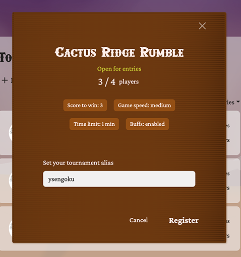

# Tournament System Documentation

Building on [the core Pong gameplay](./PONG.md), the Tournament System handles the full lifecycle of tournaments, from creation and registration to real-time match updates and result reporting. It integrates with Django Channels for live interactions and provides both REST and WebSocket APIs.

## Table of contents

- [Features](#features)
  - [Tournament Creation and Registration](#tournament-creation-and-registration)
  - [Tournament Progress Management](#tournament-progress-management)
    - [Pending Tournament](#pending-tournament)
    - [Ongoing Tournament](#ongoing-tournament)
  - [Tournament Result Viewing](#tournament-result-viewing)
- [Implementation Details](#implementation-details)
  - [Backend](#backend)
    - [Core Models](#core-models)
    - [Tournament Worker](#tournament-worker)
    - [Channel Groups](#channel-groups)
  - [Frontend](#frontend)
    - [Tournament Menu Page Components](#tournament-menu-page-components)
    - [Tournament Page Components](#tournament-page-components)
    - [Tournament Over View Components](#tournament-overview-page-components)
    - [UI Flow during Tournament](#ui-flow-during-tournament)
- [WebSocket Protocol Reference](#websocket-protocol-reference)
- [Contributors](#contributors)

<br/>

## Features

The tournament system offers a range of functionalities to manage and play tournaments efficiently.  
The system operates through a combination of dedicated **API endpoints** and real-time communication via `/ws/tournament/{id}` using a custom protocol (detailed specifications of the protocol are [here](#websocket-protocol-reference)).  
These special messages are called *actions* and contain the type of event that occurred along with its context.

### Tournament Creation and Registration

Users can view available tournaments on the tournament menu page (`/tournament-menu`). It serves as the entry point for browsing, joining or creating tournaments. Each action is handled via the API requests to dedicated endpoints.     

- `GET /api/tournaments/`: Retrieves paginated list of available tournaments in reverse chronological order. The list is filtered based on tournament status given in query parameters. By default, the page shows **pending tournaments** (open for entries), with an optional filter to show all tournaments, including **ongoing** and **finished** ones.

<p align="center">
  
</p>

- `POST /api/tournaments/`: Creates a new tournament by specifying its **name**, **required participants**, and **game settings**. The creator is automatically registered as a participant.  
- `DELETE /api/tournaments/{id}`: Cancels a pending tournament if the request is sent from the creator and the status is pending. Otherwise, an error is returned.  

<p align="center">
  
</p>

- `POST /api/tournaments/{id}/register`: Registers a participant by specifying a unique alias, which is used only for this tournament. If the user is already participating in another pending or ongoing tournament, the registration fails and an error is returned.  
- `DELETE /api/tournaments/{id}/unregister`: Unregisters a participant if the tournament status is pending.     

<p align="center">
  
</p>

For ongoing or finished tournaments, users can view results from the menu. A summary is displayed in a modal, with a link to the [Tournament Overview](#tournament-overview-page) for details.

<p align="center">
  
</p>

---

### Tournament Progress Management

A tournament's progress is managed through a combination of `GET /api/tournaments/{id}` API calls and real-time **WebSocket** communication.   

#### Pending tournament

After registration, a user is redirected to the **tournament page** (`/tournament/{id}`). This is where participants wait until the tournament begins.   
The server uses real-time actions to keep everyone updated:   
[`new_registration`](#protocol-new-registration) is sent when a new participant joins, and [`registration_canceled`](#protocol-registration-canceled) is sent when someone unregisters. If the creator cancels the tournament, the server notifies all participants with a [`tournament_canceled`](#protocol-tournament-canceled) action.

<p align="center">
  
</p>

#### Ongoing tournament

Once the tournament is ready to begin, participants receive a [`tournament_start`](#protocol-tournament-start) action and are navigated to the game room. After a match, they are brought back to the **tournament page** by a [`user_won` or `player_resigned`](./PONG.md) (🛠️👷🏻‍♂️ TODO: Add link to protocol section) action from the Game Worker.  

If the current round is still **ongoing**, qualified participants can either wait on the **tournament page**, where the results of other matches are displayed, or they can leave and return later. Eliminated participants are redirected to the **tournament overview page** (`/tournament-overview/{id}`).

<p align="center">
  
</p>

When all matches in a round are complete, the server broadcasts a [`round_end`](#protocol-round-end) action, followed by a [`round_start`](#protocol-round-start) action for the next round. This prompts participants to return to the **tournament page** if they have left, allowing the tournament to continue.

After [`round_end`](#protocol-round-end) action of the final round, two finalists are redirected to the **tournament overview** page.

---

### Tournament Result Viewing

- `GET /api/tournaments/{id}`: Retrieves the tournament data specified by the `id`. The results of ongoing or finished tournaments are displayed on the tournament overview page (`/tournament-overview/{id}`). This page is accessible to all users, including those who did not participate in the tournament. 

<p align="center">
  
</p>

<br/>

## Implementation Details

###  Backend

The backend is responsible for all the core logic and state management of the tournament application.   
It uses a worker system to handle the complex, multi-stage flow of tournaments, from initial registration to determining a final winner. The Tournament worker specifically orchestrates this flow, communicating with the Game worker to manage individual match sessions. Real-time updates for participants are managed efficiently using a Django Channel layer, which sends messages to specific groups of users.

#### Core Models

The tournament system is built around four core models: `Tournament`, `Round`, `Bracket`, and `Participant`. Each model captures a different aspect of organizing and running a tournament.

- `Tournament`: Encapsulates the overall tournament, including its configuration, required participants, and current progress. It manages which users have joined, tracks the winner, and coordinates the sequence of rounds.   
 Key fields include `id`, `name`, `date`, `status` (current state: pending, ongoing, finished, cancelled), `required_participants`, `creator` (Foreign key to [`Profile`](./USER_MANAGEMENT.md#core-models)), winner (ForeignKey to `Participant` or `null`), and `settings`.

- `Round`: Represents a single stage of the tournament, grouping multiple matches. It tracks the progress of each match and determines when the round is complete, serving as a bridge between the tournament and its individual matches.   
  Key fields include `number`, `status`, `tournament` (ForeignKey to `Tournament`), and `brackets` (list of `Bracket` instances).

- `Bracket`: Represents a single match between two participants. It tracks the outcome of the game, records scores, and links to the actual game session when it has started.   
  Key fields include `participant1` and `participant2` (ForeignKey to `Participant`), `winner` (ForeignKey to `Participant` or `null`), `winners_score`, `losers_score`, `status`, and `game_room` (OneToOneField to `GameRoom` or `null`).

- `Participant`: It stores the participant's identity, alias, status within the tournament, progress through rounds, and whether they are still eligible to compete. This model connects users to tournaments and matches.   
  Key fields include `profile` (ForeignKey to [`Profile`](./USER_MANAGEMENT.md#core-models)), `alias`, `tournament` (ForeignKey to `Tournament`), `status` (pending, playing, qualified, eliminated, winner), `current_round`, and `excluded`.

<br/>

#### Tournament Worker

The backend workflow of the tournament system involves the **Tournament Worker**, a separate process that runs independently from other backend processes and is responsible for managing the tournament lifecycle.

**Pending participants**:   
The Tournament Worker first waits for enough participants to register. If the creator cancels the tournament or the last participant leaves before registration completes, the tournament is cancelled.

**Starting a tournament**:   
Once registration is complete, the tournament begins and the worker prepares the first round. For the first round, all participants are organized into brackets. In subsequent rounds, winners from previous rounds are carried forward and the new brackets are prepared accordingly, ensuring that each match is ready to proceed.

**Game rooms and monitoring**:   
For each bracket, [`GameRoom`](./PONG.md) <-- 🛠️👷🏻‍♂️TODO: add link -- is created and the round is launched. The Tournament Worker monitors the progress of each game, while the actual game handling is performed by the [Game Worker](./PONG.md) 🛠️👷🏻‍♂️TODO: add link

**Handling cancellations**:   
If a bracket fails to connect within 10 seconds, it is cancelled. When no players remain connected to any game, the tournament itself is cancelled. In cases where some players are connected to other games, a false winner is assigned and the monitoring process continues.

**Round and tournament completion**:   
Once all bracket matches finish, the worker checks the remaining winners. If only one winner remains, the tournament ends. Otherwise, the remaining winners are carried forward into the next round, and the process repeats until a final winner is determined.   


<br/>

#### Channel Groups

The backend uses a system of channel groups of Django Channels (🛠️👷🏻‍♂️TODO: link to how Django Channels are used in our project and with Redis) to manage and scope real-time events. This ensures that users only receive messages relevant to their context.   
When users register for a tournament and establishe connection to  `ws/tournament/{id}`, they are subscribed to specific groups that define the events they will receive.

- `tournament_global`: This is a global group used to broadcast site-wide events, such as the creation of a new tournament.
- `tournament_{id}`: This group is used for events specific to a single tournament, ensuring that all participants receive relevant updates on match progression, round status, or new registrations.
-`tournament_user_{id}`: This is a private group for an individual user, handling personal events like notifications, defeats, or exclusion from a tournament.

<br/>

  ### Frontend

  The user interface for managing tournaments consists of three main pages:
  - **Tournament Menu** (`/tournament-menu`) for creation, registration, and browsing
  - **Tournament Page** (`/tournament-room/{id}`) serving as a dynamic lobby for participants
  - **Tournament Overview Page** (`/tournament-overview/{id}`) showing ongoing or final results.

  #### Tournament Menu Page Components

  The **Tournament Menu** page acts as the entry point to the tournament system. It is managed by the `TournamentMenu` component, which coordinates the display of the tournament list and various modal forms described below.

  ##### Tournament List Component (`TournamentList`):

  Responsible for retrieving and displaying the list of available tournaments. By default, it shows pending tournaments, and also supports toggling the filter to retrieve all tournaments, including ongoing and finished ones. The list items are clickable, allowing users to view tournament details. To handle list rendering efficiently, even when it becomes long, the component supports infinite scrolling and pagination, ensuring a smooth browsing experience.   

  ##### Tournament Creation Form Modal (`TournamentCreation`): 

 Provides the form for creating a new tournament. The modal opens when a user clicks the dedicated button on the Tournament Menu page. User inputs are validated, then passed to the parent component (`TournamentMenu`) which sends the creation request to the server.

  ##### Registration Form Modal:
  
  Opens when a user clicks a **pending tournament** in the list. It allows users to register for the selected tournament. User's alias input is validated, then the request is sent to the server.

  ##### Tournament Result Viewing Modal:
  
  Opens by a click on an **ongoing or finished tournament** in the list. It displays a read-only summary of the selected tournament and includes a link to the **Tournament Overview** page which shows more detailed results.

---

#### Tournament Page Components

The Tournament page is exclusively accessible to participants of a specific tournament and serves as a tournament lobby providing real-time updates on its progress.

The lobby dynamically displays the current status of the tournament, which can include:
- **Pending**: The tournament is awaiting the required number of participants. It displays registered users and real-time updates for new registrations or unregistrations.
- **Tournament starting**: The tournament is about to begin, showing the brackets of the first round.
- **Round ongoing**: Some matches in the current round are still in progress, and real-time status of all matches are displayed.
- **Round finished**: All matches in the current round have concluded, and the results are displayed.
- **Round starting**: The next round is about to begin. and its brackets are displayed.

---

#### Tournament Overview Page Components

The Tournament Overview page presents the results of ongoing or finished tournaments. The layout is responsive to the screen size. On larger screens, results are displayed in a clear tree structure for easy visualization of the progression. On smaller screens, the results are presented in a table format for optimal viewing.

---

#### UI Flow during tournament


<br />

## WebSocket Protocol Reference

All data exchanges betwen the server and the client use JSON messages that conform to this format:

```json
{
  "action":"<action name>",
  "data":{
    "<data content>"
  }
}
```

- `action`: what kind of event it is. `action` is always a simple string.
- `data`: context to the this event. `data` may contain an arbitrary amount of fields of any types. Exact schema of `data` depends on the `action`.

### Registration Events

<a id="protocol-new-registration"></a>
- `new_registration`: Sent when a user registers for the tournament.

  | Data Field | Type       | Description        |
  |------------|------------|--------------------|
  | `alias`    | `string`   | Alias of the user  |
  | `avatar`   | `string`   | Avatar URL         |

<br />

<a id="protocol-registration-canceled"></a>
- `registration_canceled`: Sent when a user unregisters from the tournament.

  | Data Field | Type     | Description       |
  |------------|----------|-------------------|
  | `alias`    | `string` | Alias of the user |

<br />

<a id="protocol-tournament-canceled"></a>
- `tournament_canceled`: Sent to participants when the tournament is canceled by its creator.

  | Data Field        | Type     | Description            |
  |-------------------|----------|------------------------|
  | `tournament_id`   | `string` | ID of the tournament   |
  | `tournament_name` | `string` | Name of the tournament |

---

### Tournament Progress

<a id="protocol-tournament-start"></a>
- `tournament_start`: Sent when the tournament begins.

  | Data Field        | Type     | Description            |
  |-------------------|----------|------------------------|
  | `tournament_id`   | `string` | Tournament ID          |
  | `tournament_name` | `string` | Tournament name        |
  | `round`           | `ROUND`  | First round bracket data|

<br />

<a id="protocol-round-start"></a>
- `round_start`: Sent when a new round starts (excluding round 1).

  | Data Field        | Type     | Description           |
  |-------------------|----------|-----------------------|
  | `tournament_id`   | `string` | Tournament ID         |
  | `tournament_name` | `string` | Tournament name       |
  | `round`           | `ROUND`  | Bracket data of round |

<br />

<a id="protocol-match-result"></a>
- `match_result`: Sent when a match finishes and its result becomes available.

  | Data Field      | Type      | Description           |
  |-----------------|-----------|-----------------------|
  | `tournament_id` | `string`  | Tournament ID         |
  | `round_number`  | `int`     | Round number          |
  | `bracket`       | `BRACKET` | Updated match bracket |

<br />

<a id="protocol-round-end"></a>
- `round_end`: Sent when all matches in a round are completed.

  | Data Field      | Type     | Description           |
  |-----------------|----------|-----------------------|
  | `tournament_id` | `string` | Tournament ID         |

---

### Match Completion

<a id="protocol-user-won"></a>
- `user_won` / `player_resigned`: Sent from pong WebSocket.

  | Data Field      | Type               | Description                    |
  |-----------------|--------------------|-------------------------------|
  | `winner`        | `PLAYER`           | Winner of the match            |
  | `loser`         | `PLAYER`           | Loser of the match             |
  | `tournament_id` | `string` \| `null` | Tournament ID for the match    |


<br/>

## Contributors

<table>
  <tr>
    <td align="center" style="padding: 8px; vertical-align: middle;">
      <a href="https://github.com/emuminov" style="text-decoration: none;">
        <br />
        <p>emuminov</p>
      </a>
    </td>
    <td style="padding-left: 16px; vertical-align: middle;">
      Tournaments HTTP API
    </td>
  </tr>

  <tr>
    <td align="center" style="padding: 8px; vertical-align: middle;">
      <a href="https://github.com/melobern" style="text-decoration: none;">
        <br />
        <p>melobern</p>
      </a>
    </td>
    <td style="padding-left: 16px; vertical-align: middle;">
      Tournaments HTTP API, WebSocket tournament layer, tournament worker
    </td>
  </tr>

  <tr>
    <td align="center" style="padding: 8px; vertical-align: middle;">
      <a href="https://github.com/ysengoku" style="text-decoration: none;">
        <br />
        <p>ysengoku</p>
      </a>
    </td>
    <td style="padding-left: 16px; vertical-align: middle;">
      Tournament UI design, frontend development
    </td>
  </tr>
</table>

Authored by: [melobern](https://github.com/melobern) and [ysengoku](https://github.com/ysengoku)
