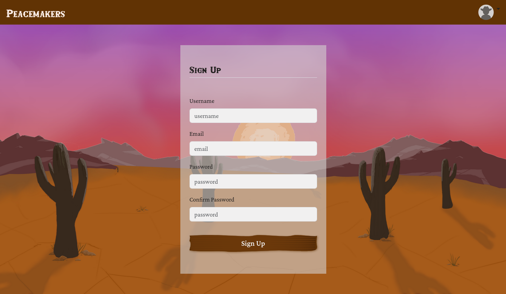

# User Management System Documentation

The user management system is the cornerstone of the project, managing user authentication, authorization, and profiles. It provides a comprehensive suite of features, including standard email/password registration, Multi-Factor Authentication (MFA), and third-party login via OAuth 2.0.

Every other part of the project is affected by this system; after all, the ability to correctly identify users and deal with their data is a requirement for any modern app.

## Table of contents

- [Features](#features)
    - [JWT Authentication](#jwt-authentication)
    - [Authentication Endpoints And CSRF Protection](#authentication-endpoints-and-csrf-protection)
    - [Password Restoration](#password-restoration)
    - [Multi-Factor Authentication (MFA)](#multi-factor-authentication-mfa)
    - [OAuth 2.0 Integration](#oauth-20-integration)
    - [Social Networking Elements](#social-networking-elements)
    - [User Search And User Profiles](#user-search-and-user-profiles)
    - [User Settings](#user-settings)
    - [User Presence System](#user-presence-system)
- [Implementation Details](#Implementation-details)
    - [Backend](#backend)
        - [Core Models](#core-models)
        - [JWT Authentication Middleware](#jwt-authentication-middleware)
    - [Frontend](#frontend)
        - [Authentication redirection](#authentication-redirection)
        - [Authentication and User Settings Components](#authentication-and-user-settings-components)
        - [User Dashboard and Social Networking Components](#user-dashboard-and-social-networking-components)
- [Testing](#testing)
- [Contributors](#contributors)

---
## Features

### JWT Authentication

The primary authentication mechanism is based on [JSON Web Tokens (JWT)](https://en.wikipedia.org/wiki/JSON_Web_Token). On [creating account or logging in](authentication-endpoints-and-csrf-protection), `access_token` and `refresh_token` are issued.

`access_token` is JWT, and contains signature and identity of the user. It's short-lived for security reasons. It has companion cookie (also JWT): `refresh_token`, which is long-lived, may be revoked by the server, and is responsible for refreshing the short-lived `access_token`. Refreshing is not done automatically: the client must call  special endpoint (`POST /api/refresh`), after which new `access_token` is granted, while the current `refresh_token` is rotated (the current one is revoked & the new one is issued).

Both tokens are [HTTP-only](https://owasp.org/www-community/HttpOnly) and [secure](https://en.wikipedia.org/wiki/Secure_cookie) cookies.

The benefits of the JWT authentication system (with refresh tokens) compared to the traditional session-based system is that it's easier on the database. It's not stateless, as pure JWT authentication, but pure stateless JWT authentication is not suitable for applications such as pong platform. Having refresh tokens is important to security ([video with simple explanation](https://www.youtube.com/watch?v=T0k-3Ze4NLo)).

---
### Authentication Endpoints And CSRF Protection

Server provides multiple endpoints for the necessary for secure creation, logging in and logging outof users. `signup` and `login` endpoints also issue [CSRF token (cookies-to-header approach)](https://en.wikipedia.org/wiki/Cross-site_request_forgery#Cookie-to-header_token), another security measure of the project.

The way CSRF protection works is that malicious side that attempts CSRF attack cannot read the cookies from another domain (Ponggers, in this case). However, the server expects it to be sent in the header on each request. If they don't match, request fails, invalidating the attack. [Additional information.](https://stackoverflow.com/a/49301318)

- `POST /api/signup`: Creates a new user account with a username, email, and password, if all the fields are valid. For security reasons, there are restrictions placed on passwords, which are specified in `settings.py`. Upon success, it returns JWTs in secure, HTTP-only cookies to start a session. Doesn't require CSRF token and issues a CSRF token.

  

- `POST /api/login`: Authenticates a user with their credentials. If MFA is enabled, it initiates the two-factor flow by sending a code. Otherwise, it returns user data and sets secure HTTP-only JWT cookies. Doesn't require CSRF token and issues a CSRF token.

  

- `DELETE /api/logout`: Securely logs out the user by revoking the refresh token and clearing the JWT cookies from the browser.
- `POST /api/refresh`: Rotates the refresh token. It takes a valid `refresh_token` cookie and issues a new pair of access and refresh tokens to maintain the session without requiring the user to log in again. Refresh tokens aren't refreshed automatically, so the client has to call to this endpoint periodically.

---
### Password Restoration

- `POST /api/forgot-password`: Allows users to request a password reset. It takes an email address and sends a password reset link with a unique token.

- `POST /api/reset-password/{token}`: Allows a user to set a new password using a valid token received via email. The token expires after 10 minutes.

  
  

---
### Multi-Factor Authentication (MFA)

For enhanced security, users can enable email-based MFA.
See MFA docs [here](../server/MFA.md).

  

---
### OAuth 2.0 Integration

Users can register and log in using their GitHub or 42 School accounts.
See OAuth docs [here](../server/OAUTH2.md).

---
### Social Networking Elements

There are social networking features, like the ability to add friends, block annoying users or [chat with other users](./CHAT_AND_LIVE_EVENTS.md).

Friends are special users who are "bookmarked" by the user. There are no special effects, but befriended users are displayed in a list on the navbar for quick access to their profile and/or chat.
Friendship feature has following endpoints:
- `GET /api/users/{username}/friends`: Fetches a user's list of friends.
- `POST /api/users/{username}/friends`: Adds a new friend. This action also creates a `new_friend` [notification](./CHAT_AND_LIVE_EVENTS.md) for the added user.

  

- `DELETE /api/users/{username}/friends/{friend_to_remove}`: Removes a friend.

Blocking user have more effects than befriending them; blocked users are unable to chat or invite people who blocked them. Blocking user immediately hides the chat between two of them, as well hides them from the [search](#user-search-and-user-profiles).
Blocking feature has following:
- `GET /api/users/{username}/blocked_users`: Retrieves the list of users blocked by the authenticated user.
- `POST /api/users/{username}/blocked_users`: Blocks a user, which also removes them from the friend list if they were friends.
- `DELETE /api/users/{username}/blocked_users/{blocked_user_to_remove}`: Unblocks a user.

---
### User Search And User Profiles

Each of the users have a lot of different data that is associated with them: their username, nickname, elo, winrate, list of games, friendship/block status relative to the user currently viewing the profile... It is displayed neatly on their profile page, which can be visited by other ([non-blocked](#social-networking-elements)) users.

  

- `GET /api/users`: Retreives paginated list of users filtered based on query parameters. Users can be searched by their nickname or username.
- `GET /api/users/{username}`: Retrieves the full public profile for a specified user, including game statistics like win/loss records, elo history, and best/worst enemies.

- `GET /api/self`: A protected endpoint that returns the profile data for the currently authenticated user, including private information like the number of unread messages and notifications, as well as whether they currently play any game/hold a matchmaking queue or not.

User can search for other users by typing their name or nickname into the search bar.

  

---
### User Settings

Users are able to change their settings:
1. Password, and they are required to input their old password.
2. Nickname, which is a non-unique displayed name of the user.
3. Profile picture.
4. [MFA status](#multi-factor-authentication-mfa), if they wish to opt-in or opt-out of the feature.

All of the new settings must conform to the constraints for each of the fields, otherwise they are rejected.
- `GET /api/users/{username}/settings`: Allows an authenticated user to see their current settings, such as their nickname, email, avatar.
- `POST /api/users/{username}/settings`: Allows an authenticated user to update their own profile information, such as their nickname, email, password, and avatar. Avatar uploads are validated for size (under 10MB) and file type (.png, .jpg, .webp).

  

---

### User Presence System

This features lives on the intersection between user management & live events systems. [See chat and live events documentation](CHAT_AND_LIVE_EVENTS.md#user-presence-system).

 

## Implementation Details

### Backend

Backend side of the user management system in this project is implemented with `users` Django app (TODO: link to the high level explanation of the tech stack/overall backend overview). This app interacts with all other Django apps in the project, and was the first one that was developed.

This app follows typical Django app structure for the project, and includes additional notable files:
- `signals.py`: contains Django signals handler that allow the creation of `Profile` for each of the `User` models.
- `middleware.py`: contains middleware for [JWT authentication](#jwt-authentication-middleware).
- `service.py`: contains `OnlineStatusService`, a class that provides logic used in [user presence system](CHAT_AND_LIVE_EVENTS.md#user-presence-system).

---
#### Core Models

The app's functionality is centered around two primary models: `User` and `Profile`, which share a one-to-one relationship.

- `User`: Extending Django's default `AbstractUser`, this model is dedicated to authentication and authorization. It stores essential credentials like `username`, `email`, and `password`, as well as security-related fields for MFA and password resets. It also links to an `OauthConnection` model for users who sign up via third-party services (42 or Github).
- `Profile`: This model stores application-specific data related to a user's activity (gaming, friends, chatting etc) within the platform. This model is the most used model in whole application, connected to all the actual logic within it. Key fields include `elo` rating, `friends` and `blocked_users` lists, `profile_picture`, and presence status (`is_online`, `last_activity`). A `Profile` is automatically created for every `User` via a signal.
- `RefreshToken`: Manages the lifecycle of JWTs. It handles the creation of short-lived access tokens and long-lived refresh tokens, as well as their verification, rotation and revocation upon logout.
 There are two middlewares on the server that are responsible for handling requests: the one is for HTTP requests, and another is for WebSocket requests:

---
#### JWT Authentication Middleware

Middleware is triggered on every request/connection. Authentication middleware identifies the user who made request and restricts access of anonymous users to the system.

- `JWTEndpointsAuthMiddleware`: Secures all HTTP API endpoints (except the ones you need to use to login in the first place) by validating the `access_token` provided in cookies. Populates each `request` with the user data.
- `JWTWebsocketAuthMiddleware`: Secures all WebSocket endpoints using the `access_token` from cookies, populating the `scope` for real-time services like chat and the actual game.

 

### Frontend

#### Authentication redirection

The application checks the authentication status of the current user on each navigation using [`/api/self`](#api-self) or other endpoints.   
Unauthenticated users attempting to access pages restricted to authenticated users are redirected to **/login**. Conversely, authenticated users navigating to **/login**, **/register**, or any other authentication-related pages are sent to **/home**.

---

#### Authentication and User Settings components

##### `Register`:

The `Register` page handles new account creation. Users provide a unique username, email address, and password, with client-side validation complementing server-side checks. Usernames are permanent and cannot be changed after registration, serving as the primary identifier within the application.   
On successful registration, the application redirects to `/home`. If the registration is rejected due to server-side checks, an error message is displayed directly in the form.

##### `Login`:

The `Login` page includes a **standard login form (`LoginForm`)** and **`OAuth` login** via 42 profile or GitHub account.  
When a user logs in through `LoginForm`, the client checks whether both the username/email and the password fields are filled, then sends the request to the server. 
On success, the user is redirected to **/home** (or to `MfaVerification` if [MFA](../server/MFA.md) is enabled). On failure, an error feedback is displayed.

This component also provides [password reset](#password-restoration) form (`ForgotPassword`). The user can request a reset by submitting the registered email address. The server then sends an email containing a link to **/reset-password/{token}** (`ResetPassword`).

##### `Settings`:

The `Settings` page allows users to update profile information, including avatar, nickname, and if the account is not managed through OAuth, email and password. It also provides controls for enabling or disabling MFA for non-OAuth users. Validation rules for nickname, email, and password are consistent with those applied during registration.   

Avatar uploads are handled through a dedicated modal component.   
Client-side validation checks MIME type, extension, and file size. To prevent spoofing (e.g., non-image files with an image extension), the client also verifies that they can be parsed as actual images. If validated, files are displayed as safe previews using [Blob](https://developer.mozilla.org/en-US/docs/Web/API/Blob) URLs, which avoid direct HTML injection.   
Final validation is performed server-side to ensure that only valid files are accepted and stored safely.
 
##### Logout:

The logout functionality does not rely on a dedicated component. Instead, the handler function `handleLogout()` is triggered when the user clicks the logout button in the **navbar dropdown menu** or on the **home page**. After execution, the user is redirected to the root (`/`).

---

#### User Dashboard and Social Networking components

##### `Profile`:

The `Profile` page is accessible at `/profile/{username}` and provides a comprehensive view of a user’s information, available actions, and game statistics. The content is dynamically loaded based on the username in the URL by fetching data from [`/api/users/{username}`](#api-users).

Game statistics, such as Elo, win rate, duel history, and best/worst opponents, are rendered through reusable components. Elo progression and win rate are visualized using custom elements (see [Data Visualization documentation](../front/DATA_VISUALIZATION.md) for details) that generate the charts with native HTML and SVG, offering users an intuitive view of their game performance.　　　

If the requested user does not exist or is blocking the current user, the page redirects to `/user-not-found`.

##### `FriendsList` and `UserSearch`

Both the `FriendsList` and `UserSearch` components open via the navbar and display the corresponding items in a dedicated dropdown menu. Items in both lists are rendered using reusable item components that include a link to each user’s [profile](#user-search-and-user-profiles) page. Both components support lazy loading of additional items as the user scrolls. If no items are available or the request fails, a placeholder message is shown.   

`FriendsList` fetches the friend list from the API as soon as the dropdown is opened.
In contrast, `UserSearch` fetches data dynamically based on the user’s input, using debouncing to minimize API calls.

 

## Testing
`make tests-users` will initialize the tests related to the users management system.

 

## Contributors

<table>
  <tr>
    <td align="center" style="padding: 8px; vertical-align: middle;">
      <a href="https://github.com/emuminov" style="text-decoration: none;">
         
        
emuminov

      </a>
    </td>
    <td style="padding-left: 16px; vertical-align: middle;">
      JWT authentication, auth HTTP API, social networking elements
    </td>
  </tr>

  <tr>
    <td align="center" style="padding: 8px; vertical-align: middle;">
      <a href="https://github.com/faboussard" style="text-decoration: none;">
         
        <b>faboussard</b>
      </a>
    </td>
    <td style="padding-left: 16px; vertical-align: middle;">
      MFA, OAuth2, JWT authentication, auth HTTP API
    </td>
  </tr>

  <tr>
    <td align="center" style="padding: 8px; vertical-align: middle;">
      <a href="https://github.com/melobern" style="text-decoration: none;">
         
        
melobern

      </a>
    </td>
    <td style="padding-left: 16px; vertical-align: middle;">
      Presence system
    </td>
  </tr>

  <tr>
    <td align="center" style="padding: 8px; vertical-align: middle;">
      <a href="https://github.com/ysengoku" style="text-decoration: none;">
         
        
ysengoku

      </a>
    </td>
    <td style="padding-left: 16px; vertical-align: middle;">
      UI design with Figma, everything on the frontend side for all of the features
    </td>
  </tr>
</table>

---
 

Authored by: [emuminov](https://github.com/emuminov) and [ysengoku](https://github.com/ysengoku)
