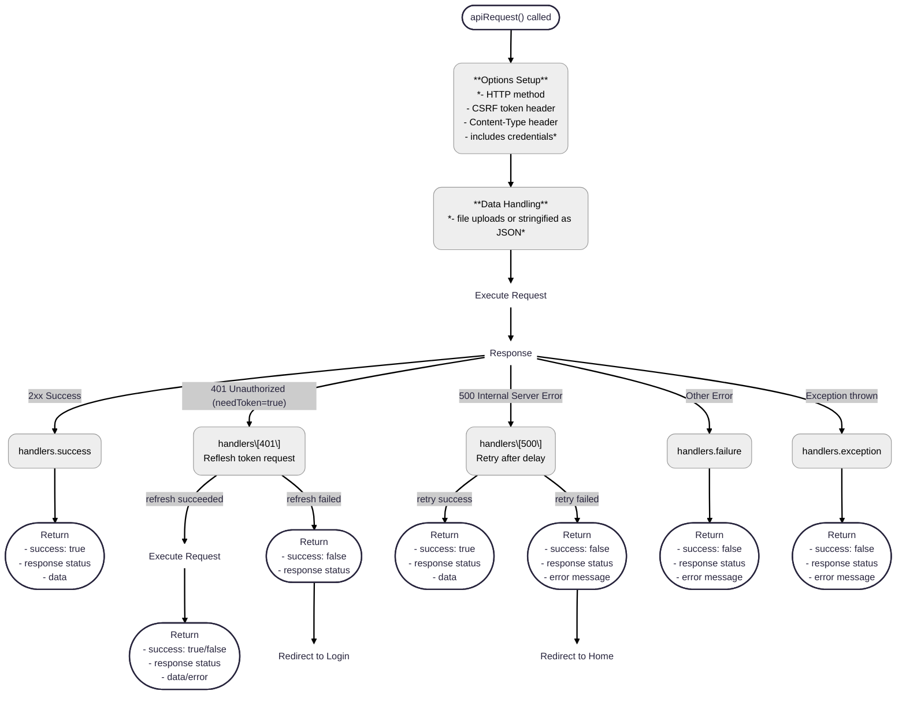

# API Request

`apiRequest` module is responsible for sending API requests using the browser's fetch API. It provides a unified way to handle various response statuses, including token refresh on 401 errors and retries on 500 errors.

## Overview

The primary function exported by this module is `apiRequest()`, an asynchronous function that sends an HTTP request to a specified endpoint.
It accepts various parameters to customize the request (such as HTTP method, request data, file upload support, and token requirements) and automatically handles common response scenarios via dedicated handler functions.

## `apiRequest` function
```js
apiRequest(method, endpoint, data = null, isFileUpload = false, needToken = true)
```

| Parameter      | Type               | Default | Description                                   |
| -------------- | ------------------ | ------- | --------------------------------------------- |
| `method`       | `string`           | –       | HTTP method to be used (e.g., `GET`, `POST`, `PUT`, `DELETE`).                                     |
| `endpoint`     | `string`           | –       | API endpoint to which the request is sent.                                                  |
| `data`         | `object` \| `null` | `null`  | The payload sent with the request. For `POST` or `PUT`, this is stringified unless it's a file. |
| `isFileUpload` | `boolean`          | `false` | Whether the request uploads a file. If `true`, `Content-Type` header is omitted. |
| `needToken`    | `boolean`          | `true`  | Whether an access token is needed. Affects how `401` errors are handled. |


### Functionality

1. Fetch Options Setup:
The function constructs a fetch options object:

  - Sets the HTTP method.
  - Adds a CSRF token header (if available).
  - Configures the Content-Type header based on whether the request involves a file upload.
  - Includes credentials with the request.

2. Data Handling:
If data is provided, it is either attached directly (for file uploads) or stringified as JSON.

3. Executing the Request:
The request is sent using fetch(url, options). Depending on the response:
  - Successful Responses: Handled by the handlers.success function.
  - 401 Unauthorized: If a token is needed, the handlers[401] function attempts to refresh the access token and retry the request.
  - 500 Internal Server Error: Managed by the handlers[500] function, which retries the request after a delay.
  - Other Errors: Handled by the handlers.failure function.
  - Exceptions: Any network or unexpected errors are processed by handlers.exception.

### Handlers
The module defines a handlers object with specific functions to manage different response scenarios:

#### ✅ handlers.success(response)

Processes successful API responses.

Behavior:
- Parses the response as JSON (except when the status is 204, No Content).
- Returns an object containing:
  - success: true
  - The response status
  - The parsed response data

#### ❌ handlers[401](method, endpoint, data, isFileUpload, needToken, csrfToken)
Handles 401 Unauthorized responses.

Behavior:
- Attempts to refresh the access token using refreshAccessToken.
- If the refresh is successful, it retries the original API request.
- If the refresh fails with a 401 status, it navigates to the login page, shows a session expiration alert, and returns an error object.
- For other refresh failures, it clears stored user data, navigates to the home page, and displays a generic error alert.

#### ❌ handlers[500](url, options)
Manages 500 Internal Server Error responses.

Behavior:
- Displays an error alert indicating a server issue.
- Retries the request after a 3-second delay.
- If the retry still fails, it clears stored user data, navigates to the home page, and returns an error object with a status of 500.

#### ❌ handlers.failure(response)
Handles non-successful API responses not covered by specific status handlers.

Behavior:
- Parses the error response JSON.
- Extracts an error message from the response data.
- Returns an object containing:
  - success: false
  - The response status.
  - The error message.

#### ❌ handlers.exception(error)
Handles exceptions occurring during the API request.

Behavior:
- Logs the error to the console.
- Returns an error object with:
  - success: false
  - A status code of 0
  - The error message.

### Flowchart



## API_ENDPOINTS

`API_ENDPOINTS` object centralizes all API endpoint URLs used throughout the application.  
It provides string constants or functions that generate full URLs for various API operations, ensuring consistency and ease of maintenance.

### Structure

- **Static endpoints:** Keys mapping directly to fixed API URLs (e.g., `LOGIN`, `SIGNUP`).
- **Dynamic endpoints:** Keys mapping to functions that accept parameters to build URLs dynamically (e.g., `USER_PROFILE(username)`).

### Usage Example

```js
import { API_ENDPOINTS } from './apiEndpoints';

// Static URL usage
const loginUrl = API_ENDPOINTS.LOGIN;

// Dynamic URL usage
const userProfileUrl = API_ENDPOINTS.USER_PROFILE('johnDoe');
const chatMessagesUrl = API_ENDPOINTS.CHAT_MESSAGES('alice', 30, 0);
```
