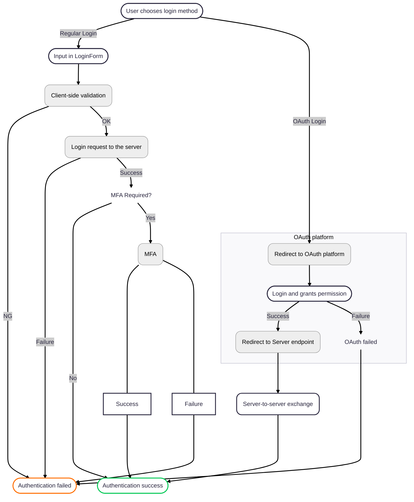

# Auth Manager

The `authManager` module and its encapsulated `auth` singleton represent the foundational components for authentication.

## Overview

The `authManager` module serves as a central point for managing user authentication state within the application. It encapsulates the core auth singleton, which handles various aspects of user session management, status fetching, and game engagement checks.   
The primary responsibility of this module is to export the `auth` singleton, making its functionalities available throughout the application for managing user authentication and related states.

## `auth` Singleton

The `auth` object is an immediately invoked function expression that returns a new instance of the AuthManager class. This design pattern ensures that only one instance of `AuthManager` exists throughout the application's lifecycle, making `auth` a singleton.   
This approach centralizes the management of user authentication state, ensuring consistency across the application.

The `auth` singleton provides the following core functionalities:

### fetchAuthStatus

`async fetchAuthStatus(fireEvent = true)`   

Communicates with the server to determine the user's current login status.

| Parameter   | Type      | Default | Description                                               |
| ----------- | --------- | ------- | --------------------------------------------------------- |
| `fireEvent` | `boolean` | `true`  | Indicates whether to dispatch a `userStatusChange` event. |

#### Behavior:

- Makes a `GET` request to `self` endpoint with the CSRF token retrived from cookies;
- If the initial response is `ok (status: 204)`;
  - parses the JSON data, stores the user item to `sessionStorage`
  - returns success: true with the user data
- If the status is `401`, it attempts to refresh the access token:
  - If `refreshAccessToken()` returns `204`, it recursively calls `fetchAuthStatus()` to retry the original request
  - If `refreshAccessToken()` returns `401`, it indicates a session expiration and returns `success: false` with the HTTP status code
  - Handles` 500` and `other unknown statuses` and returns `success: false` with the HTTP status code.

---

### storeUser

`storeUser(data, fireEvent)`   

Stores essential user information (username, nickname, avatar, unread message/notification counts) in `sessionStorage`.

| Parameter   | Type      | Default | Description                                               |
| ----------- | --------- | ------- | --------------------------------------------------------- |
| `data`      | `object`  | –       | Contains user data fetched from `self` endpoint.          |
| `fireEvent` | `boolean` | –       | Indicates whether to dispatch a `userStatusChange` event. |

#### Behavior:

- Compares the incoming `user` data with the stored one. If there are any changes or there is no stored user in `sessionStorage`, it updates data;
- If `fireEvent` is true, it dispatches a custom userStatusChange event to notify `navbar` component to make update if needed;
- Opens WebSocket connections for `livechat` and, if applicable, for a `tournament` based on the user's `tournament_id`.

---

### updateStoredUser

`updateStoredUser(user)`   

Updates specific user profile information (username, nickname, avatar) in `sessionStorage` while preserving unread message/notification counts.   
This method is used when the user has updated information in `Settings` page.

| Parameter   | Type      | Default | Description                            |
| ----------- | --------- | ------- | -------------------------------------- |
| `user`      | `object`  | –       | Contains the updated user data.        |

---

### clearStoredUser

`clearStoredUser()`   

Clears all user-related data from `sessionStorage` and `localStorage`

#### Behavior:

- Removes the `user` item from `sessionStorage`;
- Removes `gameOptions` from `localStorage`;
- Dispatches a `userStatusChange` event with `user: null` to notify logout;
- Closes all active WebSocket connections.

---

### getStoredUser

`getStoredUser()`   

Retrieves the user object from `sessionStorage`.

#### Behavior:

- Get the `user` string from `sessionStorage`;
- Parses the string as JSON and perform validation to ensure the retrived user object has required string properties (username, nickname, avatar);
- Returns the parsed user object or null if not found or invalid.

---

### getUser

`async getUser()`   

Fetches the current user's authentication status from the server and stores it locally.

#### Behavior:

- Calls `fetchAuthStatus(false)` to get the latest user status without dispatching `userStatusChange` event;
- If successful, it stores the user data;
- Returns the user object on success, or null on failure. 

---

### canEngageInGame

`async canEngageInGame(showAlert = true)`   

Checks if the user is authenticated and is not currently engaged in a game or tournament, allowing them to start a new activity.

| Parameter   | Type      | Default | Description                                               |
| ----------- | --------- | ------- | --------------------------------------------------------- |
| `fireEvent` | `boolean` | `true`  | Indicates whether to dispatch a `userStatusChange` event. |

#### Behavior:

- Calls `fetchAuthStatus()` to get the user's authentication status;
- If authenticated and not engaged in a game, tournament, or pending invitation, it returns `true`;
- If authenticated but engaged in an activity, it displays an message indicating the type of ongoing activity (game, tournament, or pending invitation/matchmaking) and returns `false`.
- If not authenticated, redirects to `/login` and returns `false`.

## Refresh Access Token

`refreshAccessToken(csrfToken)` maintains user sessions securely without requiring frequent re-authentication.   
It handles the process to obtain a new `access token` using a `refresh token`, when the current access token has expired. This mechanism enhances security by allowing access tokens to have a short lifespan, reducing the window of opportunity for token misuse if intercepted.

| Parameter   | Type      | Description                                                                           |
| ----------- | --------- | ------------------------------------------------------------------------------------- |
| `csrfToken` | `string`  | The CSRF token required for the refresh request, ensuring the request's authenticity. |

### Behavior:

- Check if `CSRF Token` is provided. If not, it calls `auth.clearStoredUser()` and returns `success: false`;
- Send a `POST` request to `refresh` endopoint including provided `CSRF Token`;
- If the response is `ok (204)`, it returns `success: true`;
- If the response status is `500`, it retries a `POST` request to `refresh` once.
- If the response status is not `ok`, it returns `success: false`

## Get CSRF Token from Cookies

`getCSRFTokenfromCookies()` method is responsible for extracting this CSRF token from the browser's cookies. JavaScript reads the token from a cookie and includes it in a custom HTTP request header (X-CSRF-Token).

### CSRF (Cross-Site Request Forgery) token

A CSRF (Cross-Site Request Forgery) token is a secret, unique, and unpredictable value generated by the server for crucial security measure to protect web applications from unauthorized or malicious requests by verifying the authenticity of requests made by a user.   
When a client makes a request, the server compares the token sent with the request to the one stored in the user's session. If they don't match or the token is missing, the request is rejected.   

## Login

### Regular login

Input validation in Login form and its submission are handled by `handleLogin()` method in the `LoginForm` component.

#### Behavior:

- Calls `checkInputs()` to perform client-side validation;
- Sends a `POST` request to `login` endpoint, passing username(or email) and password;
- If success,
  - If `mfa_required` is true, it stores the username in `sessionStorage` and navigates to the `/mfa-verification` page, passing additional data.
  - Otherwise, it redirects to `/home`.
- If failure, it displays an error message in feedback field.

### Login with OAuth

The application offers a secure login through OAuth authentication, with `42 profile` or `GitHub profile`.   
The user is redirected to the platform's authentication page. If success, redirects to `/home` by the server.

When a user chooses to authenticate via one of these OAuth providers, the user's browser is redirected to the chosen platform's dedicated authentication page. On this external page, the user securely logs in (if not already) and explicitly grants the application permission to access their basic profile information.

On authentication success on the platform, the OAuth provider securely redirects the user's browser back to the application's server endpoint. At this point, the application's backend takes over, performing a critical server-to-server exchange to validate the authorization and obtain secure access tokens. Once the session is successfully established on the server, the user is then redirected to the `/home` page.

## Logout

The logout process involves both server-side session invalidation and client-side data cleanup to ensure a complete and secure termination of the user's session.

### `async handleLogout()` method

Orchestrates the complete user logout process, including server-side session termination request and client-side data clearance.

#### Behavior:

- Sends `DELETE` request to `logout` endpoint.
- Regardless of the server response, it calls `auth.clearStoredUser()` to remove all user data from `sessionStorage` and `localStorage`. This ensures that even if the server-side logout fails, the client-side session is terminated, preventing unauthorized access from the browser.
- Redirects the user to the application's root path (/).
