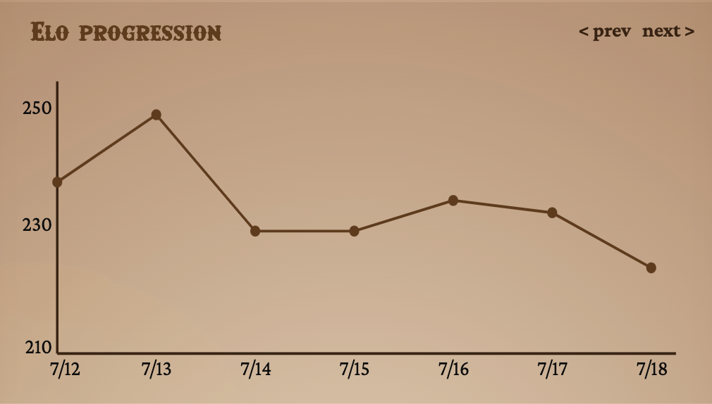

# Data visualization

As part of this project, users’ profile pages include visual representations of game statistics.   
This document focuses on rendering two types of charts using SVG: a **pie chart** for win/loss ratios and a **line chart** for Elo rating progression.   
The implementation is done entirely in vanilla JavaScript, without using any external libraries or frameworks, and covers both data processing and SVG generation.

## Pie Chart Rendering

Given two integers, `wins` and `losses`,` compute percentages and draw a donut-style pie chart with SVG.


```html
<!--
rate = Math.round((wins / (wins + losses)) * 100);
r = 100 / (2 * Math.PI);
offset = (40 - r * 2) / 2;
circlePath = `M20 ${offset}
	a ${r} ${r} 0 0 1 0 ${r * 2}
	a ${r} ${r} 0 0 1 0 -${r * 2}`;
-->

<svg viewBox="0 0 40 40" xmlns="http://www.w3.org/2000/svg">
  <path
    d="${circlePath}"
    fill="none"
    stroke="rgba(var(--pm-primary-500-rgb), 0.4)"
    stroke-width="6"
    stroke-dasharray="100"
  />
  <path
    d="${circlePath}"
    fill="none"
    stroke="var(--pm-primary-600)"
    stroke-width="6"
    stroke-dasharray="${rate} 100"
  />

  <text x="52%" y="40%" text-anchor="middle" dy="7" font-size="0.5rem">
    ${rate}%
  </text>
</svg>
```

### 👉 Data Processing

- If the total game count is 0 (`wins + losses === 0`), skip drawing and show placeholder.

- Calculate win rate percentage:
	```js
	const rate = Math.round((wins / (wins + losses)) * 100)
	```

### 👉 SVG Setup

- #### Use a `<svg>` with `viewBox="0 0 40 40"` so that 40 units map to the full circle.

- #### Compute radius (`r`) and vertical offset (`offset`) to fit the donut within the 40×40 viewBox:
	```js
	// The circle’s radius in SVG coordinate units (viewBox units).
	const r = 100 / (2 * Math.PI);

	// Offset to center the circle:
	const offset = (40 - r * 2) / 2;
	```

	Explanation:
	- **radius** (`r`):   
	Represents the circle’s radius, expressed in the SVG’s own coordinate units. It is calculated so that the circle’s total perimeter (circumference) is exactly 100 units.
	This ensures that using `stroke-dasharray="X 100"` will draw exactly X% of the circle’s outline.

	- **offset**:   
	Ensures the circle is centered vertically within the 40-unit-high SVG by calculating the top margin.

	

- #### Define a reusable path command string for a full circle (two semicircles):
	```js
	const circlePath = `M20 ${offset}
		a ${r} ${r} 0 0 1 0 ${r * 2}
		a ${r} ${r} 0 0 1 0 -${r * 2}`;
	```
  
	Explanation:	
	-	**Move command** (`M20 ${offset}`):   
	Position the pen at the top center of the circle area. From here, both arcs will start and end at precisely defined points, ensuring a seamless ring.

		

	- **First arc** (`a ${r} ${r} 0 0 1 0 ${r * 2}`):   
	Draws the right side semicircle.   
		- `r` (x-radius and y-radius): Sets both horizontal and vertical curvature to the circle’s radius, ensuring a perfectly round arc.
		- `0 0 1` (three flags):
			1. `x-axis-rotation` (0): No rotation of the arc’s ellipse.
			2. `large-arc-flag` (0): Draw the smaller of the two possible arcs (180° here).
			3. `sweep-flag` (1): Draw the arc in a clockwise direction.
		- `0 ${r * 2}` (dx, dy): Move the pen vertically by two radii (the circle’s diameter) from the start point to the opposite side.

		

	- **Second arc** (`a ${r} ${r} 0 0 1 0 -${r * 2}`):   
	Completes the ring by drawing the left side semicircle back up to the start point.   
	The negative vertical offset (`-${r * 2}`) reverses the path, and identical flags maintain the same sweep direction.

		

		This single path creates a continuous donut shape, ready to be clipped by adjusting `stroke-dasharray`.

### 👉 Drawing the rings (Donut)

- Since this is a donut chart, both `<path>` elements should have `fill="none"` and the same `stroke-width` to create a consistent ring thickness.

- **Background ring**: 	 
draw the full circle with low-opacity stroke, using `stroke-dasharray="100"` to map 100% circumference.

- **Win segment**: 	 
draw the same path, but set `stroke-dasharray="${rate} 100"` so that only the first rate percent is visible.

	

### 👉 Rendering Labels

- Center text: show `winRate.toFixed(0) + '%'` at `(cx, cy)`.
- Below chart: display wins and losses counts.

## Line Chart Rendering

Given an array of `{ date: string, elo: number }`, plot a polyline chart over time with axes, grid, and tooltips.



```html
<!--
In this project, the SVG template for the line chart is not pre-defined in the HTML format.
Instead, the entire SVG, including axes, labels, grid lines, data series, and markers, is dynamically generated in JavaScript.

The generated SVG follows this structure:
-->

<svg width="100%" height="232" viewBox="0 0 280 120" preserveAspectRatio="none">
	<!-- Axis lines and labels -->
	<g class="linechart-grid y-linechart-grid">
		<line x1="20" x2="20" y1="10" y2="110"></line>
	</g>
	<g class="linechart-grid x-linechart-grid">
		<line x1="20" x2="270" y1="110" y2="110"></line>
	</g>
	<g class="linechart-labels">
		<!-- Y-axis label (Elo) using 'text' tag -->
		<!-- X-axis label (Date) using 'text' tag -->
	</g>

	<!-- Data line -->
	<polyline points="20,88.625 60,88.625 100,88.625 140,56 180,24.5 220,31.25 260,33.5" fill="none"stroke="var(--pm-primary-600)" stroke-width="1"></polyline>

	<!-- Data maerkers and tooltips -->
	<g class="line-chart-marker">
		<!-- Tooltip background using 'rect' tag -->
		<!-- Tooltip text content using 'text' tag -->
		<!-- Data marker using "circle" tag -->
	</g>
</svg>
```

### 👉 Data Processing

#### 1️⃣ Sort by date

Sort the data in ascending order by date.

#### 2️⃣ Paginate into 7-point pages

Split the data into chunks of size 7 to prepare for pagination.    
The chart displays one page per 7 days of data (7 data points per page). The dates may not be consecutive:  

```js
chunkArray(array) {
  const result = [];
  for (let i = 0; i < array.length; i += 7) {
    result.push(array.slice(i, i + 7));
  }
  return result;
}
```

#### 3️⃣ Parse and map to coordinates

- **Parse raw items**   
	For the current page’s chunk, parse data by transforming each raw item into:
	```js
	{
	  "date":        // (string)
	  "elo":         // (Number) Elo value
	  "elo_change":  // (string) change of Elo from previouus day 
	  "x": // (Number) x-coordinate of the point
	  "y": // (Number) y-coordinate of the point
	}
	```

- **Coordinate Mapping**

	Convert each parsed item into an `(x, y)` coordinate for SVG:   
	- The chart uses a fixed `viewBox="0 0 280 120"` with 7 data points per page.   
		If there are fewer than 7 points, the entire group is shifted to the right so the last point aligns at the right end.

	- Each point is spaced `40 units apart horizontally`. The first point starts at `x = 20`.

	- The vertical position (y) corresponds to the Elo value:
		- Y-axis pixel space ranges from y = 20 (top) to y = 110 (bottom).
		- Elo value range (min, max) is calculated from the current page's 7 data points.

		- Each y value is mapped using:
			```js
			y = maxY − (elo − minElo) * scaleY

			// maxY = 110, minY = 20: Y-axis pixel space ranges
			// elo: Elo value for this point
			// maxElo, minElo: Elo value range of the data to display
			// scaleY = (maxY − minY) / (maxElo − minElo)
			```

		- Each data point is then converted to `( x, y )` coordinate and used for rendering.

- **Resulting parsedData example**

	```json
	{
	  "date":        "2025-07-26T00:00:00.000Z",
	  "elo":         260,
	  "elo_change":  "-8",
	  "x":           20,
	  "y":           98.75
	}
	```

### 👉 Axis and Grid Drawing

- Y-axis line   
	Drawn at `x = 20`, from `y = 10` down to `y = 110` using `<line>`
	```js
	<line x1="20" x2="20" y1="10" y2="110"></line>
	```

- Y-axis labels   
	Three `<text>` elements are drawn at `x = 18`, `y = {max, mid, min} (110, 65, 20)`.
	They are anchored to the end (`text-anchor="end"`) and populated with `minElo`, `mid-range`, `maxElo`.
	```js
	// Example
	<text x="18" y="110" text-anchor="end">250</text>
	```

- X-axis line    
	Drawn at `y = 110`, from `x = 20 to x = 270` using `<line>`.
	```js
	<line x1="20" x2="270" y1="110" y2="110"></line>
	```

-	X-axis labels   
	One <text> per data point, appended into `<g class="linechart-labels">`.
	```js
	// Example
	<text x="17" y="118" text-anchor="center">7/26</text>
	```


### 👉 Polyline and Markers

- Generate a space-delimited list of x,y coordinate pairs for `points` attribute of `polyline`:   
	```js
	const points = this.parsedData.map((item) => `${item.x},${item.y}`).join(' ');

	// Example of generated list
	// "20,88.625 60,88.625 100,88.625 140,56 180,24.5 220,31.25 260,33.5"
	```

- Render `<polyline>` setting attibutes:   
	```html
	<polyline
		points="${points}"
		fill="none"
		stroke="var(--pm-primary-600)"
		stroke-width="1"
	/>
	```

	Explanation of each attribute
	- `points`:   
		A space-delimited list of x,y coordinate pairs. SVG will draw straight line segments connecting each successive pair in the order given.
	
	- `fill="none"`:   
		Prevents the polyline from creating a closed, filled shape.
	
	- `stroke`:   
		Color of the line.
	
	- `stroke-width`:   
		Thickness of the line in SVG units.

- For each point, draw a marker with `<circle cx="${x}" cy="${y}" r="4" />`.

### 👉 Tooltips

- For each point, create a hidden <rect> (background) and <text> (content) positioned just above the circle.

- On `mouseenter` of the <circle>, set both elements’ visibility to "visible"; on `mouseleave`, hide them again.

- The `<text>` shows the Elo value and daily change (e.g. “260 (+15)”), and the `<rect>` gives it a rounded background.

### 👉 Pagination

- Maintain a `current page` index.
- On Next/Prev button click, update page, re-compute `points`, and render the chart.

### 👉 Responsive behavior

The SVG is created with
```html
<svg
  width="100%"
  height="232"
  viewBox="0 0 280 120"
  preserveAspectRatio="none"
>
```

It always stretches to fill its container’s width and fixed height, without maintaining the original 280×120 aspect ratio.
