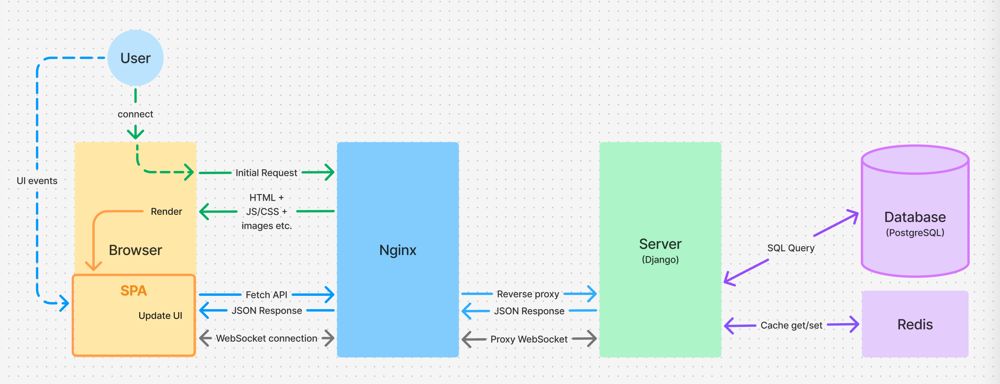
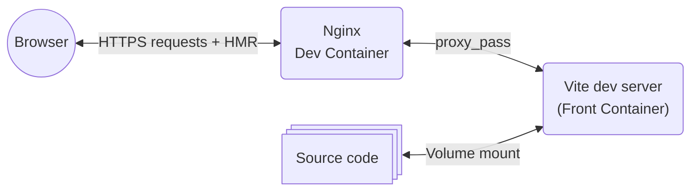

# Front-End Overview

This document summarizes the front-end setup and structure of the project.   

## Single Page Application

The frontend operates entirely as a **Single Page Application (SPA)**.  
Routing, state management, and view rendering are handled client-side, with the backend providing API and WebSocket endpoints.



</br>

## Front-End Stack

### Language

[](#)

The frontend is written in modern **JavaScript (ES6+)**, using native modules with `import` and `export` syntax. This allows code to be organized into separate files while keeping dependencies explicit and maintainable.

### UI Tools

[](#)

**[Bootstrap v5.3](https://getbootstrap.com/docs/5.3/getting-started/introduction/)** provides a responsive layout system and prebuilt UI components, ensuring consistent styling across browsers without writing custom CSS for basic elements.

### 3D

[](#)

Interactive 3D scenes and physics simulations are implemented using **[Three.js](https://threejs.org/)**.  
This allows complex 3D interactions and animations to run efficiently in the browser.

### UI Components

The application uses **custom [Web Components](https://developer.mozilla.org/en-US/docs/Web/API/Web_components)** for reusable UI elements.  
These components encapsulate markup, styles, and behavior, allowing consistent and maintainable UI construction across the application.  
Detailed documentation is found in [COMPONENT.md](./COMPONENT.md).

### State & Routing

Client-side state management and routing rely on a custom [`router`](./ROUTER.md) and a singleton [`socketManager`](./SOCKET_MANAGER.md).  
The router controls which views are displayed based on the URL, and the `socketManager` manages WebSocket connections with the backend for real-time updates.

### Data Visualization

Real-time data is displayed using **custom [SVG](https://en.wikipedia.org/wiki/SVG)-based charts**.  
This approach provides precise control over visuals without relying on third-party chart libraries.

### Build Tool & Dev Server

[](#)

**[Vite](https://vite.dev/)** handles both development and production workflows. In development, it serves the application with a fast local server and Hot Module Replacement (HMR) for instant updates. For production, it bundles and optimizes the code into static assets ready to be served by a web server.

### Testing

[](#)

The project uses **[Vitest](https://vitest.dev/)** for unit testing.
It runs tests natively in the Vite environment and supports modern JavaScript syntax.

</br>

## Directory Structure

```
app/
├── index.html   
├── public/                  # Static assets (images, fonts, 3D models, filters)
├── src/
│   ├── css/style.css
│   ├── main.js              # Application entry point
│   └── js/
│       ├── components/      # Custom HTML elements used in the UI
│       │   ├── navbar/        # Navbar components
│       │   └── pages/         # Page-level components
│       ├── router.js        # Client-side routing logic
│       ├── sockets/         # WebSocket manager and handlers
│       ├── api/             # Handles HTTP requests to the backend
│       ├── auth/            # Manages authentication-related logic
│       └── utils/           # General-purpose helper functions
├── __tests__/               # Vitest test files 
├── Dockerfile 
├── package.json             # NPM scripts and dependencies
├── package-lock.json        # Exact versions of dependencies for consistent installs
├── vite.config.js
├── vitest.config.js
├── eslint.config.js
└── .prettierrc
```

</br>

## Frontend Development and Deployment with Docker

The frontend runs in **development** mode using [Vite](#about-vite)'s development server, which serves the application and updates modules instantly via [Hot Module Replacement (HMR)](#hot-module-replacement-hmr).    
For production, the frontend is not served by a Node container. Instead, it’s built into optimized static assets using Vite, which internally leverages [Rollup](https://rollupjs.org/) to apply tree‑shaking, code splitting, and asset hashing, and then served via the shared Nginx proxy.

### Development

- **Base image:** `node:22-alpine`
- **Process:** Installs dependencies and starts the Vite dev server (`npm run dev`) on port `5173`, exposed to `0.0.0.0` for container access.
- **Volume mount:** `./front/app/src:/app/src` enabling HMR so that code changes take effect immediately without rebuilding

### Production

- **Build stage:**  
  - Uses `node:22-alpine` to install dependencies and run `npm run build`  
  - Outputs static assets in the `dist/` directory

- **Runtime stage:**  
  - The static `dist/` files are copied into the **Nginx container**.  
  - This Nginx container is the main entry point for the entire application. It serves the frontend at `/` and also proxies API requests to the backend.

### About Vite

Vite is a modern build tool that focuses on speed and simplicity. It offers the following benefits:

- **Instant startup**: Uses native ES modules to avoid bundling during development.
- **Hot Module Replacement (HMR)**: Updates modules in the browser instantly on save.
- **Optimized production builds**: Delegates to Rollup to generate fast, minimized bundles.
- **Out-of-the-box support**: Works seamlessly with modern JavaScript and many libraries.

Vite handles both the development server and the production build process, minimizing configuration and improving efficiency.

### Hot Module Replacement (HMR)

HMR allows frontend code changes to be applied instantly in the browser without requiring a rebuild.
This improves development efficiency and preserves the application state while updating modules.



</br>

## Browser Compatibility

The frontend is confirmed to work and visually consistent on both **Google Chrome** and **Mozilla Firefox**.
- Both browsers support ES6+, so the modern JavaScript syntax used in the project runs without issues.  
- Only Web APIs compatible with both browsers are used.
- Bootstrap handles most CSS compatibility across browsers.  
- Some custom styles use `-webkit-` prefixed properties (for Chrome, Safari, Edge). Equivalent properties for Firefox are included where needed.

</br>

## Testing

- **Unit Tests**: Vitest covers router logic, socket manager, and utility functions under `__tests__/`.
- **Coverage Goal**: All critical modules (routing, sockets, utilities) and utility functions are unit-tested.

</br>

## Detailed documentations

- [API Request](./API_REQUEST.md)
- [Auth Manager](./AUTH_MANAGER.md)
- [Component](./COMPONENT.md)
- [Router](./ROUTER.md)
- [Socket Manager](./SOCKET_MANAGER.md)
- [Data visualization](./DATA_VISUALIZATION.md)
