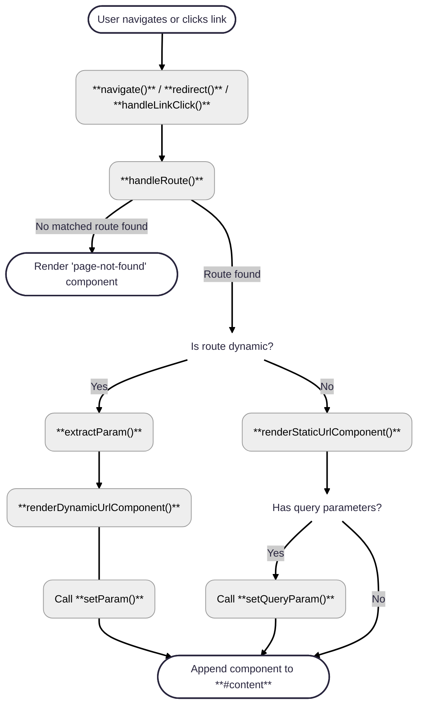

# Router module

The router is implemented as a singleton using an Immediately Invoked Function Expression (IIFE), ensuring consistent routing behavior across the entire application.
It provides a client-side routing system for single-page applications (SPA), mapping URL paths to custom HTML components, supporting dynamic routes with parameters, and managing navigation through the browser’s History API.

## Overview

- Maps URL paths to components.
- Supports both static (e.g., `/home`) and dynamic routes (e.g., `/profile/:id`).
- Dynamically renders components.
- Updates browser history using `pushState` and `replaceState`.
- Supports browser back/forward navigation.

## Router Flow: From Navigation to Component Rendering



## Methods

### 👉 addRoute

`addRoute(path, componentTag, isDynamic = false)`   
Adds a new route to the router.

| Parameter      | Type     | Description                                                      |
|----------------|----------|------------------------------------------------------------------|
| `path`         | `string` | The URL path for the route |
| `componentTag` | `string` | The custom HTML tag for the component to render  |
| `isDynamic`    | `boolean`| Indicates if the route is dynamic (includes a parameter)  |


#### Example

```js
router.addRoute('/home', 'user-home');
router.addRoute('/profile/:id', 'user-profile', true);
```
</br>

---

### 👉 init

`init()`   
Initializes the router by setting up the necessary event listeners.

#### Behavior

- Listens for the `popstate event` to handle back/forward navigation.
- Intercepts click events on internal links to perform client-side navigation.

</br>

---

### 👉 navigate

`navigate(path = window.location.pathname, queryParams = '', redirect = false)`   
Performs navigation by updating the browser history and rendering the corresponding component.

| Parameter      | Type     | Description                                                      |
|----------------|----------|------------------------------------------------------------------|
| `path`         |`string`  | The destination URL path |
| `queryParams`  |`string\|object` _(optional)_  | Query parameters to include during navigation  |
| `redirect`     |`boolean` _(optional)_  | Whether to replace the current history entry  |

#### Behavior

- Uses `window.history.pushState` or `replaceState`	 to update the URL.
- Calls `handleRoute` to render the appropriate component.

</br>

### 👉 redirect

`redirect(path = window.location.pathname, queryParams = '')`   
Redirects to the specified path, replacing the current history entry.

| Parameter      | Type     | Description                                                      |
|----------------|----------|------------------------------------------------------------------|
| `path`         |`string`  | The destination URL path |
| `queryParams`  |`string\|object` _(optional)_  | Query parameters to include during navigation  |

#### Behavior

Internally calls navigate(path, queryParams, true).

</br>

### 👉 handleLinkClick

`handleLinkClick(event)`   
Handles click events on internal links to enable seamless navigation without a full page reload.

| Parameter      | Type     | Description                                                      |
|----------------|----------|------------------------------------------------------------------|
| `event`        |`Event`   |The click event triggered on an internal link.  |

#### Behavior

- If the event target is an anchor `<a>` with an href starting with `/`, the default browser behavior is prevented, and navigate() is called.

</br>

---

### 👉 handleRoute

`handleRoute(queryParams = '')`   
Handles route changes and renders the correct component based on the current URL.

| Parameter      | Type     | Description                                                      |
|----------------|----------|------------------------------------------------------------------|
| `queryParams`  |`URLSearchParams object` | Query parameters from the URL

</br>

---

### 👉 matchDynamicRoute

`matchDynamicRoute(path)`  
Attempts to match a dynamic route by checking registered dynamic routes.

| Parameter      | Type     | Description                                                      |
|----------------|----------|------------------------------------------------------------------|
| `path`         |`string`  | The current URL path

#### Behavior

Returns an object containing the following if a match is found, else `null`.
- componentTag
- isDynamic
- param (the extracted parameter(s))

</br>

### 👉 extractParam

`extractParam(routePath, path)`   
Extracts parameters from the URL based on a defined dynamic route.

| Parameter      | Type     | Description                                                      |
|----------------|----------|------------------------------------------------------------------|
|`routePath`     |`string`  | Defined dynamic route (e.g., /reset-password/:token)  |
|`path`          |`string`  | Actual URL (e.g., /reset-password/abc123) |

#### Behavior

Returns an object with key-value pairs of extracted parameters, or null if not matched.

</br>

---

### 👉 renderStaticUrlComponent

`renderStaticUrlComponent(componentTag, queryParams = '')`   
Renders a static URL component.

| Parameter      | Type     | Description                                                      |
|----------------|----------|------------------------------------------------------------------|
|`componentTag`  |`string`  | The custom HTML tag of the component.  |
|`queryParams`   |`URLSearchParams` _(optional)_ | Query parameters to pass to the component.  |

#### Behavior

- Removes the current component if it exists.
- Creates the component using `document.createElement(componentTag)`.
- Appends it to the `#content` element.

</br>

### 👉 renderDynamicUrlComponent

`renderDynamicUrlComponent(componentTag, param)`   
Renders a dynamic component using extracted parameters.

| Parameter      | Type     | Description                       |
|----------------|----------|-----------------------------------|
|`componentTag`  |`string`  | Custom HTML tag of the component  |
|`param`         |`Object`  | Parameters extracted from the URL |

#### Behavior

- Removes the current component if it exists.
- Creates the component and, if available, calls its `setParam` method with the extracted parameters.
- Appends the component to the `#content` element.

</br>

## Initialization

When the DOM is fully loaded (DOMContentLoaded event), the app performs the following steps:

### ✅ Theme-Based Styling

Sets the background image based on the data-bs-theme attribute:
- Light theme: warm gradient with clouds
- Dark theme: night gradient with stars

### ✅ Authentication

Calls `auth.fetchAuthStatus()` to determine the user's session state.

### ✅ Navbar rendering

Appends a `<navbar-component>` inside the `#navbar-container` emlement based on auth status.

### ✅ Router initialization

Initializes the router by calling `router.init()`, which sets up history and link event listeners.

### ✅ Alert Dismissal

Activates alert dismissal functionality by calling `addDissmissAlertListener()`.

### ✅ Initial navigation

Retrieves the current URL path and query parameters and calls `router.navigate()` to render the correct component.

</br>

## Example usage

The module exports a singleton instance of `router`.
```js
import { router } from './router.js';

// Add a new route for the About page
router.addRoute('/home', 'user-home');

// Navigate to the About page
router.navigate('/home');
```