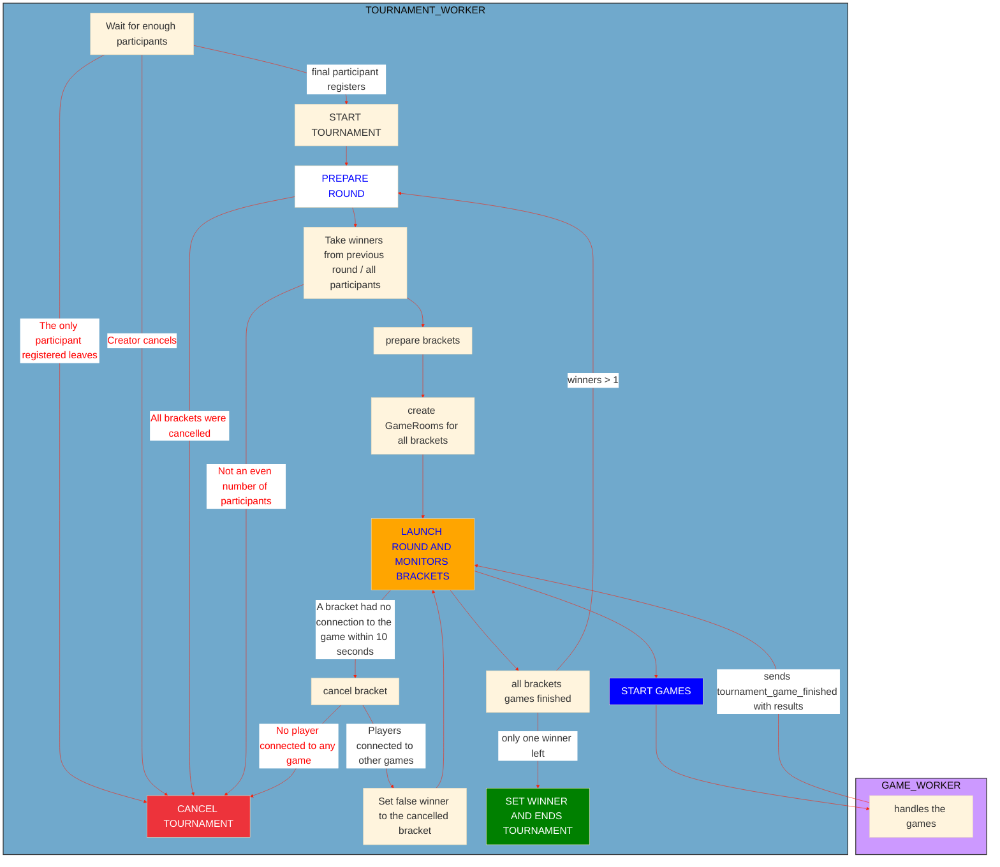
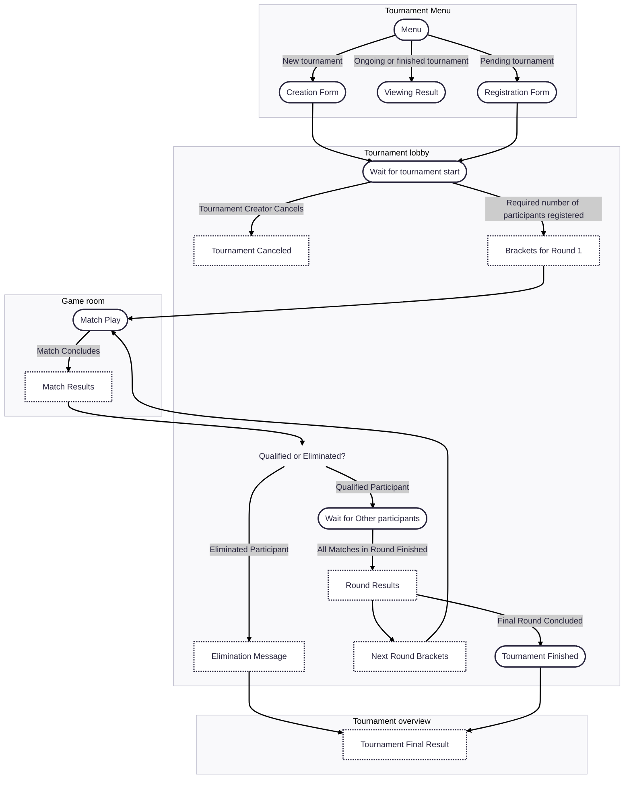

# Tournament App

The Tournament app handles the full lifecycle of tournaments, from creation and registration to real-time match updates and result reporting. It integrates with Django Channels for live interactions and provides both REST and WebSocket APIs.

## Table of contents

- [Key features](#key-features)
- [Backend Workflow](#backend-workflow)
- [Core Models](#core-models)
- [API Endpoints](#api-endpoints)
- [WebSocket Architecture](#websocket-architecture)
- [Validation, Security & Integrity](#validation-security--integrity)
- [UI Flow](#ui-flow)
- [Contributors](#contributors)

## Key Features

- **Tournament lifecycle management**:   
	Handles the creation, organization, live progression, and completion of tournaments.
- **Real-time communication**:   
	Manages all live interactions using Django Channels and WebSocket connections.
- **User flow coverage**   
	Supports registration, matchmaking, match result submission, and tournament notifications.
- **Secure APIs**:   
	Provides REST and WebSocket endpoints with built-in validation and security mechanisms.

## Backend Workflow

The diagram below illustrates the internal workflow of the Tournament and Game backend workers, showing how tournaments progress from registration to completion, including all possible cancellation paths.



## Core Models

The tournament system is built around four core models: `Tournament`, `Round`, `Bracket`, and `Participant`. Each model captures a different aspect of organizing and running a tournament.

- `Tournament`:
  - Represents a tournament instance  
  - Fields: `id`, `name`, `status`, `required_participants`, `creator`, `winner`, `settings`

    <details>
      <summary>See Fields details</summary>

      -  `id` (UUID): Unique tournament ID  
      -  `name` (string): Tournament name  
      -  `date` (DateTime): Tournament date  
      -  `status` (enum): Current status of the tournament (`pending`, `ongoing`, `finished`,   `cancelled`)  
      -  `required_participants` (int): Number of participants needed to start  
      -  `creator` (Participant): Participant who created the tournament  
      -  `winner` (Participant): Tournament champion  
      -  `settings` (Settings): Game settings chosen by the creator  
    </details>

- `Round`:
  - Represents a tournament round  
  - Fields: `number`, `status`, `tournament`, `brackets`

    <details>
      <summary>See Fields details</summary>

      -  `number` (unsigned int): Round number  
      -  `status` (enum): Current status of the round (`pending`, `ongoing`, `finished`)  
      -  `tournament` (Tournament): Parent tournament reference  
      -  `brackets` (Array of Bracket): Brackets in this round  
    </details>

- `Bracket`:
  - Represents a match between two participants  
  - Fields: `match_id`, `participant1`, `participant2`, `winner`, `score_p1`, `score_p2`, `status`

    <details>
      <summary>See Fields details</summary>

      -  `match_id` — Game room ID for this bracket  
      -  `participant1` — Player 1 info (profile, alias)  
      -  `participant2` — Player 2 info (profile, alias)  
      -  `winner` — Winner participant or null if ongoing  
      -  `score_p1` — Player 1 score  
      -  `score_p2` — Player 2 score  
      -  `status` — Current status (`pending`, `ongoing`, `finished`, `cancelled`)  
    </details>

- `Participant`:
  - Represents a user in a tournament  
  - Fields: `profile`, `alias`, `tournament`, `status`, `current_round`, `excluded`

    <details>
      <summary>See Fields Details</summary>

      -  `profile` ([Profile](../server/USERS.md#core-models)): Linked user profile  
      -  `alias` (string): Tournament alias  
      -  `tournament` (Tournament): Tournament reference  
      -  `status` (enum): Player status (`pending`, `playing`, `qualified`, `eliminated`, `winner`)  
      -  `current_round` (unsigned int): Current round number  
      -  `excluded` (boolean): Whether the participant is excluded from further matches  
    </details>


## API Endpoints

| Endpoint                       | Method | Description                               | Params/Body            | Response               |
| :----------------------------- | :----- | :---------------------------------------- | :--------------------- | :--------------------- |
| `/tournaments/`                | POST   | Create a tournament                       | TournamentCreateSchema | 201 TournamentSchema   |
| `/tournaments/`                | GET    | List tournaments (optional status filter) | status                 | 200 [TournamentSchema] |
| `/tournaments/{id}`            | GET    | Retrieve specific tournament              | -                      | 200/404                |
| `/tournaments/{id}`            | DELETE | Cancel tournament (pending/creator only)  | -                      | 204/403/404            |
| `/tournaments/{id}/register`   | POST   | Register by alias                         | alias                  | 204/403/404            |
| `/tournaments/{id}/unregister` | DELETE | Unregister from tournament (if open)      | -                      | 204/403/404            |


## WebSocket Architecture

### WebSockets (Django Channels)

  - Clients connect per tournament, identified via `tournament_{uuid}` group.
  - Private tournament events (defeat, kick...) use `tournament_user_{id}` group.
  - New tournaments announced site-wide by `tournament_global`.

### Channel Groups

  - `tournament_{uuid}`: all tournament participants.
  - `tournament_user_{id}`: individual user events (connection, defeat, exclusion).
  - `tournament_global`: broadcast site-wide tournament creation.

### Protocol

The Tournament WebSocket (`/ws/tournament/{id}`) handles real-time updates related to tournament lifecycle, user registrations, and round progress.
This socket is opened when a user subscribes to a tournament and remains active until the elimination or the tournament ends.

#### Format

```json
{
  "action":"<action name>",
  "data":{
    "<data content>"
  }
}
```

#### Registration Events

- ##### `new_registration`: Sent when a user registers for the tournament.

  <details>
  <summary>View fields and UI behavior</summary>

  | Field     | Type       | Description        |
  |-----------|------------|--------------------|
  | `alias`   | `string`   | Alias of the user  |
  | `avatar`  | `string`   | Avatar URL         |

  *UI Behavior:*  
  *Add the newly registered participant’s alias to the pending tournament lobby view.*

  </details>

- ##### `registration_canceled`: Sent when a user unregisters from the tournament.

  <details>
  <summary>View fields and UI behavior</summary>

  | Field   | Type     | Description       |
  |---------|----------|-------------------|
  | `alias` | `string` | Alias of the user |

  *UI Behavior:*  
  *Remove unregistered participant's alias from pending tournament lobby view.*

  </details>

- ##### `tournament_canceled`: Sent to participants when the tournament is canceled by its creator.

  <details>
  <summary>View fields and UI behavior</summary>

  | Field             | Type     | Description            |
  |-------------------|----------|------------------------|
  | `tournament_id`   | `string` | ID of the tournament   |
  | `tournament_name` | `string` | Name of the tournament |

  *UI Behavior:*  
  *Show a message notifying participants that the tournament has been canceled.*

  </details>

#### Tournament Progress

- ##### `tournament_start`: Sent when the tournament begins.

  <details>
  <summary>View fields and UI behavior</summary>

  | Field             | Type     | Description            |
  |-------------------|----------|------------------------|
  | `tournament_id`   | `string` | Tournament ID          |
  | `tournament_name` | `string` | Tournament name        |
  | `round`           | `ROUND`  | First round bracket data|

  *UI Behavior:*  
  *Display tournament starting message, then the bracket of round 1. After 2 seconds, redirect to   `multiplayer-game` page.*

  </details>

- ##### `round_start`: Sent when a new round starts (excluding round 1).

  <details>
  <summary>View fields and UI behavior</summary>

  | Field             | Type     | Description           |
  |-------------------|----------|-----------------------|
  | `tournament_id`   | `string` | Tournament ID         |
  | `tournament_name` | `string` | Tournament name       |
  | `round`           | `ROUND`  | Bracket data of round |

  *UI Behavior:*  
  *Display the bracket of the next round, then redirect to `multiplayer-game` page.*

  </details>

- ##### `match_result`: Sent when a match finishes and its result becomes available.

  <details>
  <summary>View fields and UI behavior</summary>

  | Field           | Type      | Description           |
  |-----------------|-----------|-----------------------|
  | `tournament_id` | `string`  | Tournament ID         |
  | `round_number`  | `int`     | Round number          |
  | `bracket`       | `BRACKET` | Updated match bracket |

  *UI Behavior:*  
  *Display the result of finished match to participants waiting for others on the tournament page.*

  </details>

- ##### `round_end`: Sent when all matches in a round are completed.

  <details>
  <summary>View fields and UI behavior</summary>

  | Field           | Type     | Description           |
  |-----------------|----------|-----------------------|
  | `tournament_id` | `string` | Tournament ID         |

  *UI Behavior:*  
  *If the user is not on the tournament page, show a pop-up alert inviting them to return.*

  </details>

#### Match Completion

- ##### `user_won` / `player_resigned`: Sent from pong WebSocket.

  <details>
  <summary>View fields and UI behavior</summary>

  | Field           | Type               | Description                    |
  |-----------------|--------------------|-------------------------------|
  | `winner`        | `PLAYER`           | Winner of the match            |
  | `loser`         | `PLAYER`           | Loser of the match             |
  | `tournament_id` | `string` \| `null` | Tournament ID for the match    |

  *UI Behavior:*  
  *Display the match result, then redirect to the tournament page.*

  </details>

## Validation, Security & Integrity

- **REST/WS input validation**: required fields, types, valid status, alias uniqueness, users per tournament (4 or 8).
- **Registration constraints**: can't register if already participating or in a game.
- **Database protection**: atomic transactions during (un)registration, avoids duplicates/race conditions.
- **Security**: JWT required (header/WS), only legitimate users can perform actions.

## UI Flow

This document outlines the user interface flow for tournament-related features, from creation and registration to participation and result viewing.

### Basic UI Components

- [Tournament Menu](#tournament-menu) (`/tournament-menu`): The central hub for tournament creation, registration, and browsing.
- [Tournament Lobby](#tournament-lobby-id) (`/tournament-room/:id`): Real-time progress and status view for tournament participants.
- [Tournament Overview](#tournament-overview-id) (`/tournament-overview/:id`): Detailed results view for ongoing or finished tournaments.

---

### Tournament Menu

The Tournament Menu serves as the central hub for all tournament activities.

#### 👉 Creating a new tournament

Users can initiate the creation of a new tournament by clicking on a "Create Tournament" button. This action opens the Tournament Creation Form.

#### 👉 Viewing tournaments

The main screen of the Tournament Menu displays a list of available tournaments.

- ##### Pending tournament

  Clicking on a pending tournament in the list will open its Registration Form, allowing users to sign up for the tournament.

- ##### Ongoing and Finished tournament

  For ongoing or finished tournaments, clicking on the tournament entry will display an Modal. This modal provides a quick summary and includes a direct link to a more Detailed Results Page (`/tournament-overview/:id`).

---

### Tournament lobby

The Tournament Lobby is exclusively accessible to participants of a specific tournament and provides real-time updates on its progress.

#### 👉 Tournament Status updates

The lobby dynamically displays the current status of the tournament, which can include:
- **Pending**: The tournament is awaiting the required number of participants.
- **Tournament starting**: The tournament is about to begin, showing the brackets of the first round.
- **Round ongoing**: Matches in the current round are in progress. Displays the current status of the matches. 
- **Round finished**: All matches in the current round have concluded. Display the results
- **Round starting**: The next round is about to begin. Displays the brackets of the next round.

---

### Tournament overview

The Tournament Overview page presents the results of ongoing or finished tournaments.

#### 👉 Displaying results:

- Media wider than Break Point MD (768 by default): Results are displayed in a clear tree structure, making it easy to visualize the progression.
- Mobile (smaller than Break Point MD): For optimal viewing on smaller screens, results are presented in a table format.

---

### UI Flow during tournament



## Contributors

<table>
  <tr>
    <td align="center" style="padding: 8px; vertical-align: middle;">
      <a href="https://github.com/emuminov" style="text-decoration: none; color: inherit;">
        <br />
        <sub><b>emuminov</b></sub>
      </a>
    </td>
    <td style="padding-left: 16px; vertical-align: middle;">
      Tournaments HTTP API
    </td>
  </tr>

  <tr>
    <td align="center" style="padding: 8px; vertical-align: middle;">
      <a href="https://github.com/melobern" style="text-decoration: none; color: inherit;">
        <br />
        <sub><b>melobern</b></sub>
      </a>
    </td>
    <td style="padding-left: 16px; vertical-align: middle;">
      Tournaments HTTP API, WebSocket tournament layer, tournament worker and documentation
    </td>
  </tr>

  <tr>
    <td align="center" style="padding: 8px; vertical-align: middle;">
      <a href="https://github.com/ysengoku" style="text-decoration: none; color: inherit;">
        <br />
        <sub><b>ysengoku</b></sub>
      </a>
    </td>
    <td style="padding-left: 16px; vertical-align: middle;">
      Tournament UI design, frontend development and documentation
    </td>
  </tr>
</table>
