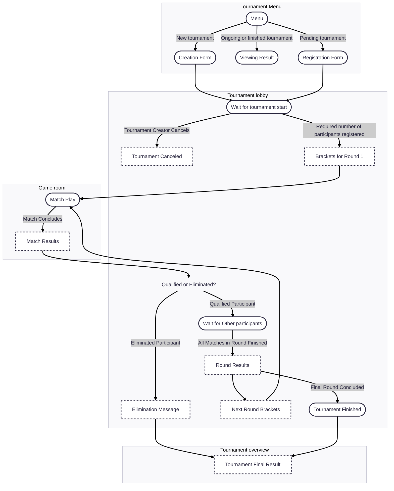

# Tournament UI

This document outlines the user interface flow for tournament-related features, from creation and registration to participation and result viewing.

## Tournament Menu: `/tournament-menu`

The Tournament Menu serves as the central hub for all tournament activities.

### 👉 Creating a new tournament

Users can initiate the creation of a new tournament by clicking on a "Create Tournament" button. This action opens the Tournament Creation Form.

### 👉 Viewing tournaments

The main screen of the Tournament Menu displays a list of available tournaments.

#### Pending tournament

Clicking on a pending tournament in the list will open its Registration Form, allowing users to sign up for the tournament.

#### Ongoing and Finished tournament

For ongoing or finished tournaments, clicking on the tournament entry will display an Modal. This modal provides a quick summary and includes a direct link to a more Detailed Results Page (`/tournament-overview/:id`).

## Tournament lobby: `/tournament-room/:id`

The Tournament Lobby is exclusively accessible to participants of a specific tournament and provides real-time updates on its progress.

### 👉 Tournament Status updates

The lobby dynamically displays the current status of the tournament, which can include:
- **Pending**: The tournament is awaiting the required number of participants.
- **Tournament starting**: The tournament is about to begin, showing the brackets of the first round.
- **Round ongoing**: Matches in the current round are in progress. Displays the current status of the matches. 
- **Round finished**: All matches in the current round have concluded. Display the results
- **Round starting**: The next round is about to begin. Displays the brackets of the next round.

## Tournament overview: `/tournament-overview/:id`

The Tournament Overview page presents the results of ongoing or finished tournaments.

### 👉 Displaying results:

- Media wider than Break Point MD (768 by default): Results are displayed in a clear tree structure, making it easy to visualize the progression.
- Mobile (smaller than Break Point MD): For optimal viewing on smaller screens, results are presented in a table format.

## UI Flow during tournament

