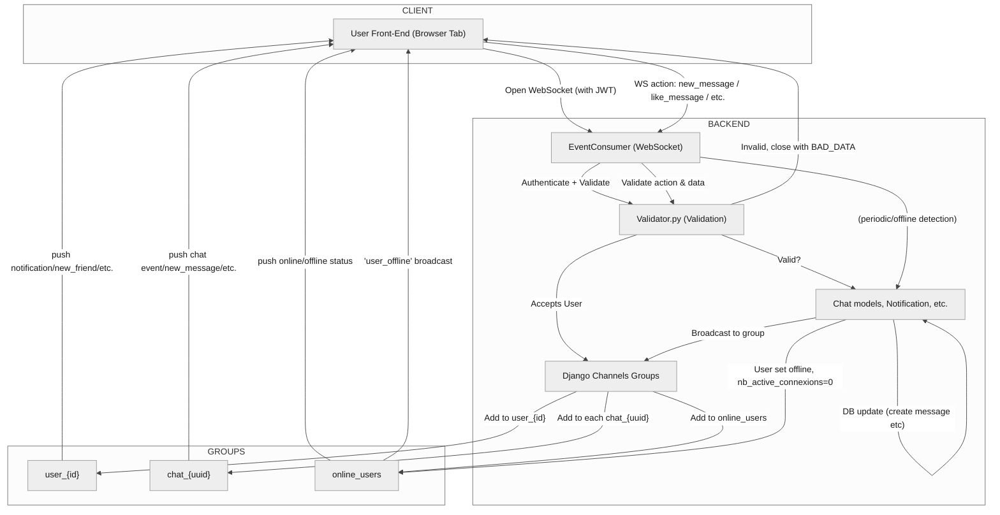

# CHAT.md

The `Chat` module manages :

- messaging
- notifications
- game invitations
- real-time presence within the application, primarily via WebSockets.
  This documentation covers the system architecture, flows, REST and WebSocket APIs, validation, security, and concrete usage examples.

## 1. Architecture \& Data Flow

- **WebSockets**: Chat relies on Django Channels.
  Each user establishes a WebSocket connection (one per browser tab), enabling:
  - Joining groups: `user_{id}`, `chat_{uuid}`, `online_users`
  - Receiving real-time messages, likes, notifications, game/tournament invites.
- **Channel Groups**:
  - `user_{id}`: private actions (notifications, friend events)
  - `chat_{uuid}`: group chat messages for all members
  - `online_users`: presence broadcasts

> **Typical Flow**
>
> - Client opens WS → Auth via JWT → Joins groups → Exchanges protocol events
> - Backend validates each message, broadcasts to proper groups

## 2. UI / API Use Cases

**Core User Journey:**

- Open chat tab → WebSocket connects, joins groups.
- Send message → WS (`new_message`) → All chat users receive event.
- Like/unlike → WS action (`like_message` / `unlike_message`)
- Mark as read → WS (`read_message`)
- Real-time notifications via WS (friends, tournaments, game invites...)

**Sample WebSocket JSON Payload:**

```json
{
  "action": "new_message",
  "data": {
    "content": "Hello!",
    "chat_id": "5eafd8eb-5be1-4671-9ff8-ba8fbb798af7",
    "timestamp": "2025-07-28T09:00:00Z"
  }
}
```

## 3. REST Endpoints

| Endpoint                          | Method | Description                                     | Params            | Returns (Code)             |
| :-------------------------------- | :----- | :---------------------------------------------- | :---------------- | :------------------------- |
| `/chats/`                         | GET    | Paginated list of user's chats                  | `limit`, `offset` | 200 `[ChatPreviewSchema]`  |
| `/chats/{username}`               | PUT    | Open or create a chat, returns last 30 messages | -                 | 200/201 `ChatSchema`       |
| `/chats/{username}/messages`      | GET    | Retrieve chat messages (paginated)              | `limit`, `offset` | 200 `[ChatMessageSchema]`  |
| `/notifications/`                 | GET    | Paginated notification list                     | `limit`, `offset` | 200 `[NotificationSchema]` |
| `/notifications/mark_all_as_read` | POST   | Mark all notifications as read                  | -                 | 200                        |

## 4. WebSocket Protocol: Supported Actions

| Action               | Required `data` fields                               | Backend Response                                         | Description                           |
| :------------------- | :--------------------------------------------------- | :------------------------------------------------------- | :------------------------------------ |
| `new_message`        | `content`, `chat_id`, `timestamp`                    | `new_message` (to all)                                   | Send chat message                     |
| `like_message`       | `id`, `chat_id`                                      | `chat_like_update`                                       | Like message                          |
| `unlike_message`     | `id`, `chat_id`                                      | `chat_like_update`                                       | Unlike message                        |
| `read_message`       | `id`                                                 | None                                                     | Mark message read                     |
| `game_invite`        | `username`, `client_id`, `options` (dict, see below) | `game_invite`, `game_invite_canceled` or error           | Pong invite                           |
| `reply_game_invite`  | `username`, `accept`                                 | `game_accepted`, `game_declined`, `game_invite_canceled` | Reply (accept/decline) to Pong invite |
| `game_accepted`      | `username`                                           | `game_found`                                             | Pong invite accepted                  |
| `game_declined`      | `username`                                           | `game_declined`                                          | Pong invite declined                  |
| `add_new_friend`     | `sender_id`, `receiver_id`                           | `new_friend`                                             | Add friend                            |
| `new_tournament`     | `tournament_id`, `tournament_name`, `organizer_id`   | `new_tournament`                                         | Tournament invite                     |
| `read_notification`  | `id`                                                 | None                                                     | Mark notification as read             |
| `notification`       | `message`, `type`                                    | `notification`                                           | Generic notification                  |
| `user_online`        | `username`                                           | `user_online`                                            | Notify that user is online            |
| `user_offline`       | `username`                                           | `user_offline`                                           | Notify that user is offline           |
| `cancel_game_invite` | `username`                                           | `game_invite_canceled`                                   | Cancel sent Pong invite               |
| `join_chat`          | `chat_id`                                            | `join_chat`                                              | Explicitly join chat (WS group)       |
| `room_created`       | `chat_id`                                            | `room_created`                                           | Notify that a room was created        |

**Special note for `game_invite` `options` field:**

- `options` is a dictionary and may include:
  - `game_speed` (`"slow"`, `"medium"`, `"fast"`)
  - `ranked` (bool)
  - `cool_mode` (bool)
  - `score_to_win` (int, 3-20)
  - `time_limit` (int, 1-5)

> All fields are strictly validated for type and contents. Most responses have events pushed to the relevant WebSocket group or user; errors or protocol issues trigger a WS close with appropriate code.

## 5. Validation \& Security

- **Strict schema validation** for all incoming WebSocket data (fields, types, valid UUIDs).
  → Invalid data immediately triggers WebSocket closure with `BAD_DATA`.
  → Reasons for rejection: missing fields, wrong types, invalid UUID, unknown action.
- **Business logic constraints:**
  - Cannot self-invite/self-chat or like own messages.
  - No multiple invites for users already engaged in a game.
- **Backend protections:**
  - JWT auth is mandatory.
  - Resource access checked at every API/WS action.

## 6. Presence System (Online/Offline)

- **Multiple connection handling:**
  - `nb_active_connexions` tracked on profile and incremented or decremented at connect/disconnect.
  - When `nb_active_connexions == 0`, user is considered offline (both DB and Redis).
  - Presence state is broadcast in real-time (`online_users` group).
- **Inactivity detection:**
  - Cronjob every 30min: any user with no activity is forced offline, connection counter reset.
  - Each meaningful API/WS request refreshes user `last_activity`.

## 7. Notifications / Integrations

- **Notification types:**
  - `game_invite`: Pong game invitation
  - `new_tournament`: Tournament invitation
  - `new_friend`: Friend added
- **Delivery:**
  - Real-time push via WebSocket (`user_{id}` group)
  - REST API for notification history and marking as read

## 8. Data Schemas

- **Main models:** `Chat`, `ChatMessage`, `Notification` (defined in `chat/schemas.py`)
- **ChatMessageSchema** example:

```json
{
  "id": "a13c68f0-9358-49b7-8fe0-ac288a793e6c",
  "content": "Hi there!",
  "date": "2025-07-28T09:13:00Z",
  "sender": "user42",
  "is_read": false,
  "is_liked": false
}
```

- **NotificationSchema** fields:
  - `id`, `action`, `data` (typed per notification kind), `is_read`

## 9. Unit \& WebSocket Testing

- **Security tests:** malformed messages, unauthorized attempts, invalid UUIDs, attempts to self-like, etc.
- **Workflow tests:** chat/message creation, invitation/decline, notification creation, `is_read` update.

## 10. Usage \& Sequence Examples

**Opening a chat:**

1. Frontend calls `PUT /chats/{username}` (open or create chat)
2. WS auto-connects, gets `join.chat` event
3. UI updates chat list

**Receiving a real-time message:**

- User sends `new_message` WS event → all connected clients receive `new_message` object.

**Sequence (text version):**

1. User A sends message via front (WS: `new_message`)
2. Backend validates, creates message resource
3. Backend broadcasts event to all chat members


