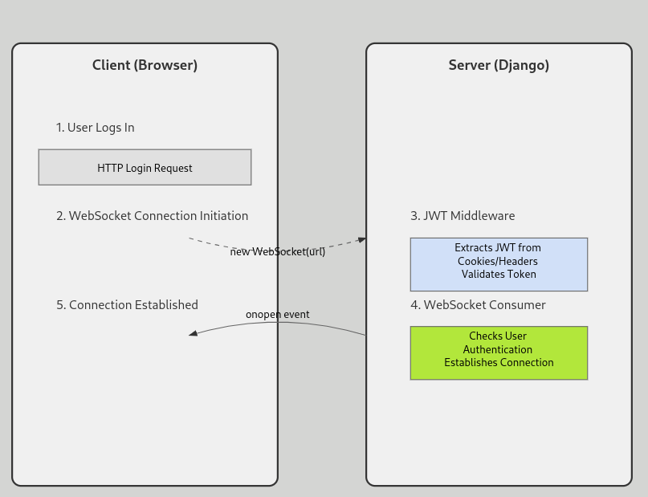

# MFA
https://docs.emnify.com/how-tos/multi-factor-authentication

L utilisateur va dans les settings et enable le MFA
Le backend génère un secret et le stocke dans la db
Le backend envoie le secret à l'utilisateur

Prochain login: 
L'utilisateur entre son code MFA
Le backend le vérifie avec le secret stocké
Si le code est correct, l'authentification est complétée

Lutilisateur disable son mfa dans les settings
Le backend supprime le secret stocké

### send email with gmail

1. create an app password
```
https://myaccount.google.com/apppasswords
```

2. enter in settings the required information
EMAIL_BACKEND = "django.core.mail.backends.smtp.EmailBackend"
EMAIL_HOST = "smtp.gmail.com"
EMAIL_PORT = 587
EMAIL_USE_TLS = True
EMAIL_USE_SSL = False
EMAIL_HOST_USER = "peacemakers9999@gmail.com"  # Votre adresse Gmail
EMAIL_HOST_PASSWORD = "wnig qcis jklp spcy"  # Mot de passe d'application Gmail
DEFAULT_FROM_EMAIL = "peacemakers9999@gmail.com"

app created: 
```
https://myaccount.google.com/apppasswords?
```
