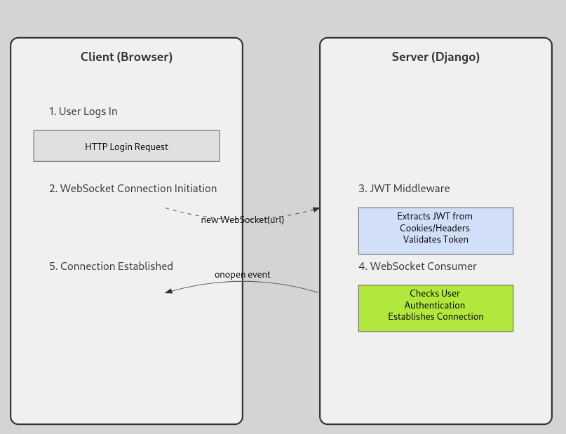

WebSocket Configuration for User Online Status with JWT Authentication


1. User logs in: initial http login request
2. WebSocket Connection Initiation: Client creates WebSocket connection
``` this.socket = new WebSocket(url)```
-> the 3 handshake steps are done automatically by the navigator



3. JWT Middleware: Server extracts and validates JWT token. 

Flow for middleware:
When a WebSocket connection arrives, it first passes through your JWTAuthMiddleware
This middleware extracts and verifies the JWT token from cookies/headers and sets scope["user"]
In your consumer, you can access self.user (which comes from scope["user"])
You can then check self.user.is_authenticated to determine if the user is authenticated
This approach is elegant because it:

4. WebSocket Consumer: Checks user authentication: class OnlineStatusConsumer(WebsocketConsumer)
Connection Established: onopen event triggered

5. routing; call the consumer (OnlineStatusConsumer) in the routing system to handle the different WebSocket patterns (routing.py file). the route must be the same as the one in the front-end (ws/onlinestatus/)

4. asgi: the asgi file must be updated to include the routing system. this will be the server's entry point for the WebSocket connection
application = ProtocolTypeRouter(
    {
        "http": django_asgi_app,
        "websocket": JWTAuthMiddleware(
            AllowedHostsOriginValidator(URLRouter(combined_patterns)),
        ),
    },
)


Key points:

- Seamless authentication
- Token validation before connection
- Secure WebSocket establishment


With everything properly configured, users should appear in the online users list when they establish a WebSocket connection.

